# Results: BERT
|    |   imbalance_proportion |   Weighted F1 Score |   Weighted Precision Score |   Weighted Recall Score |   Accuracy |   Minority Class F1 Score |   Majority Class F1 Score |
|---:|-----------------------:|--------------------:|---------------------------:|------------------------:|-----------:|--------------------------:|--------------------------:|
|  0 |                   0.01 |            0.460844 |                   0.759732 |                 0.56296 |    0.56296 |                  0.226204 |                  0.695485 |
|  1 |                   0.05 |            0.684874 |                   0.802653 |                 0.7092  |    0.7092  |                  0.597319 |                  0.772428 |
|  2 |                   0.1  |            0.761841 |                   0.829851 |                 0.77224 |    0.77224 |                  0.712075 |                  0.811607 |
|  3 |                   0.25 |            0.852626 |                   0.865441 |                 0.8538  |    0.8538  |                  0.839475 |                  0.865778 |
|  4 |                   0.33 |            0.868724 |                   0.874132 |                 0.86916 |    0.86916 |                  0.861157 |                  0.876291 |
|  5 |                   0.5  |            0.88172  |                   0.881725 |                 0.88172 |    0.88172 |                  0.881933 |                  0.881507 |

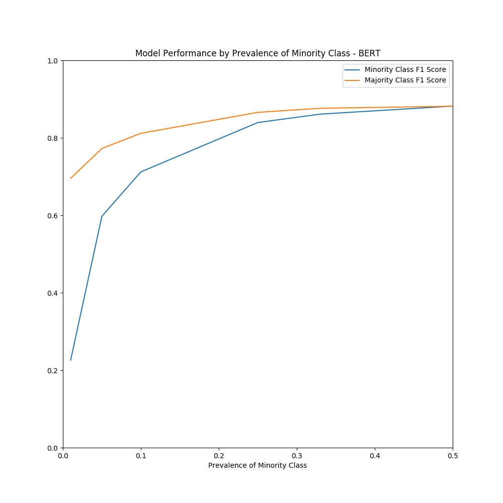
---
# Results: MTDNN
|    |   imbalance_proportion |   Weighted F1 Score |   Weighted Precision Score |   Weighted Recall Score |   Accuracy |   Minority Class F1 Score |   Majority Class F1 Score |
|---:|-----------------------:|--------------------:|---------------------------:|------------------------:|-----------:|--------------------------:|--------------------------:|
|  0 |                   0.01 |            0.514917 |                   0.772073 |                 0.5942  |    0.5942  |                  0.318807 |                  0.711026 |
|  1 |                   0.05 |            0.729578 |                   0.82128  |                 0.74552 |    0.74552 |                  0.66392  |                  0.795237 |
|  2 |                   0.1  |            0.806281 |                   0.849677 |                 0.81156 |    0.81156 |                  0.774302 |                  0.83826  |
|  3 |                   0.25 |            0.853252 |                   0.866297 |                 0.85444 |    0.85444 |                  0.840051 |                  0.866454 |
|  4 |                   0.33 |            0.868913 |                   0.873457 |                 0.86928 |    0.86928 |                  0.861982 |                  0.875845 |
|  5 |                   0.5  |            0.883435 |                   0.883508 |                 0.88344 |    0.88344 |                  0.882661 |                  0.884209 |
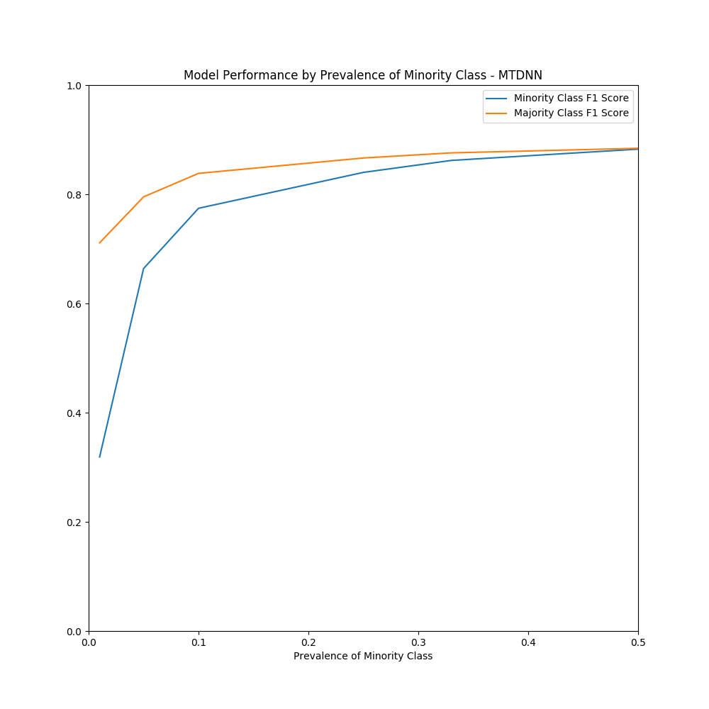
---
# Results: FastText
|    |   imbalance_proportion |   Weighted F1 Score |   Weighted Precision Score |   Weighted Recall Score |   Accuracy |   Minority Class F1 Score |   Majority Class F1 Score |
|---:|-----------------------:|--------------------:|---------------------------:|------------------------:|-----------:|--------------------------:|--------------------------:|
|  0 |                   0.01 |            0.333333 |                   0.25     |                 0.5     |    0.5     |                  0        |                  0.666667 |
|  1 |                   0.05 |            0.586303 |                   0.783703 |                 0.63904 |    0.63904 |                  0.438596 |                  0.734009 |
|  2 |                   0.1  |            0.723779 |                   0.817785 |                 0.74056 |    0.74056 |                  0.655696 |                  0.791862 |
|  3 |                   0.25 |            0.853318 |                   0.868819 |                 0.85472 |    0.85472 |                  0.838979 |                  0.867658 |
|  4 |                   0.33 |            0.873252 |                   0.879321 |                 0.87372 |    0.87372 |                  0.865551 |                  0.880953 |
|  5 |                   0.5  |            0.89008  |                   0.89008  |                 0.89008 |    0.89008 |                  0.890054 |                  0.890106 |
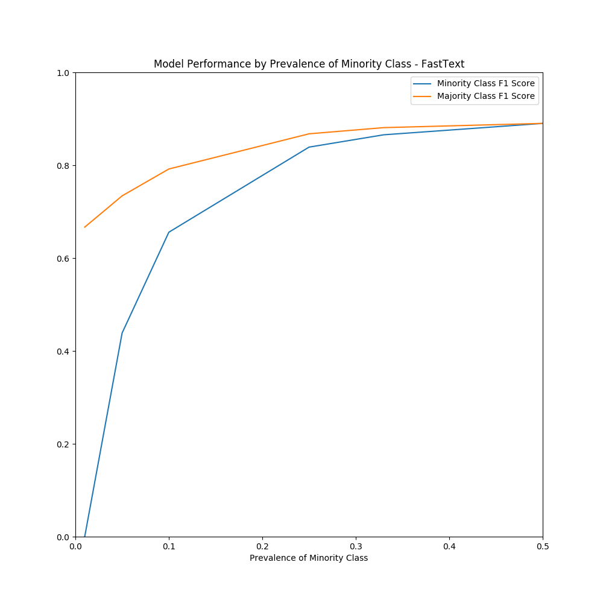
---
# Results: XLM
|    |   imbalance_proportion |   Weighted F1 Score |   Weighted Precision Score |   Weighted Recall Score |   Accuracy |   Minority Class F1 Score |   Majority Class F1 Score |
|---:|-----------------------:|--------------------:|---------------------------:|------------------------:|-----------:|--------------------------:|--------------------------:|
|  0 |                   0.01 |            0.333333 |                   0.25     |                 0.5     |    0.5     |                  0        |                  0.666667 |
|  1 |                   0.05 |            0.502425 |                   0.744373 |                 0.58404 |    0.58404 |                  0.300908 |                  0.703943 |
|  2 |                   0.1  |            0.333333 |                   0.25     |                 0.5     |    0.5     |                  0        |                  0.666667 |
|  3 |                   0.25 |            0.583932 |                   0.674197 |                 0.61768 |    0.61768 |                  0.465436 |                  0.702428 |
|  4 |                   0.33 |            0.81156  |                   0.815876 |                 0.81212 |    0.81212 |                  0.801286 |                  0.821834 |
|  5 |                   0.5  |            0.333333 |                   0.25     |                 0.5     |    0.5     |                  0.666667 |                  0        |
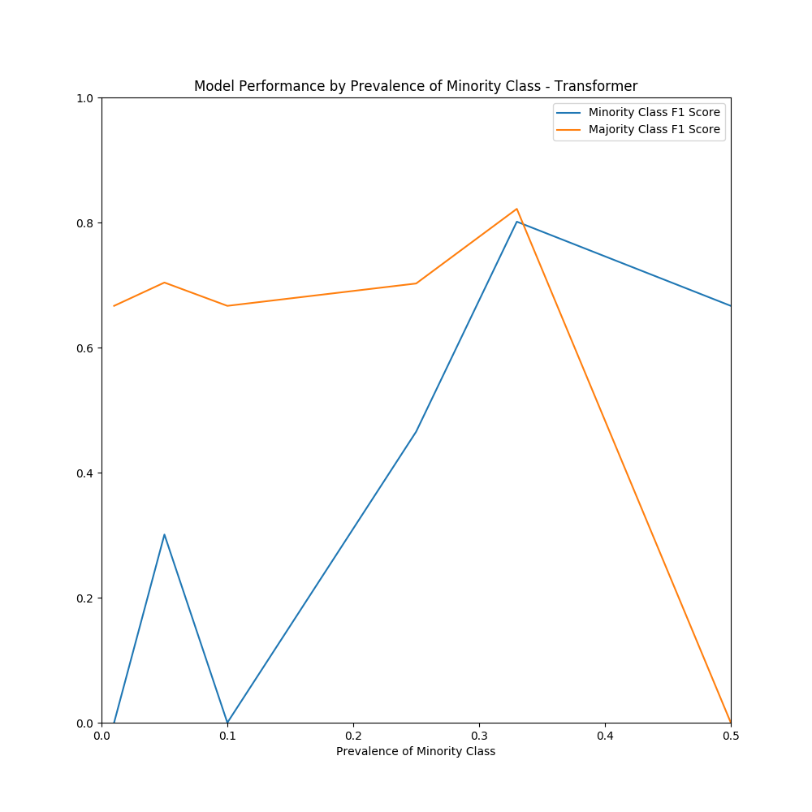
---
# Results: XLNet
|    |   imbalance_proportion |   Weighted F1 Score |   Weighted Precision Score |   Weighted Recall Score |   Accuracy |   Minority Class F1 Score |   Majority Class F1 Score |
|---:|-----------------------:|--------------------:|---------------------------:|------------------------:|-----------:|--------------------------:|--------------------------:|
|  0 |                   0.01 |            0.333333 |                   0.25     |                 0.5     |    0.5     |                  0        |                  0.666667 |
|  1 |                   0.05 |            0.333333 |                   0.25     |                 0.5     |    0.5     |                  0        |                  0.666667 |
|  2 |                   0.1  |            0.785112 |                   0.842044 |                 0.79284 |    0.79284 |                  0.744361 |                  0.825863 |
|  3 |                   0.25 |            0.868935 |                   0.878797 |                 0.86972 |    0.86972 |                  0.85879  |                  0.879079 |
|  4 |                   0.33 |            0.878497 |                   0.882614 |                 0.8788  |    0.8788  |                  0.872432 |                  0.884563 |
|  5 |                   0.5  |            0.891879 |                   0.891891 |                 0.89188 |    0.89188 |                  0.89216  |                  0.891598 |
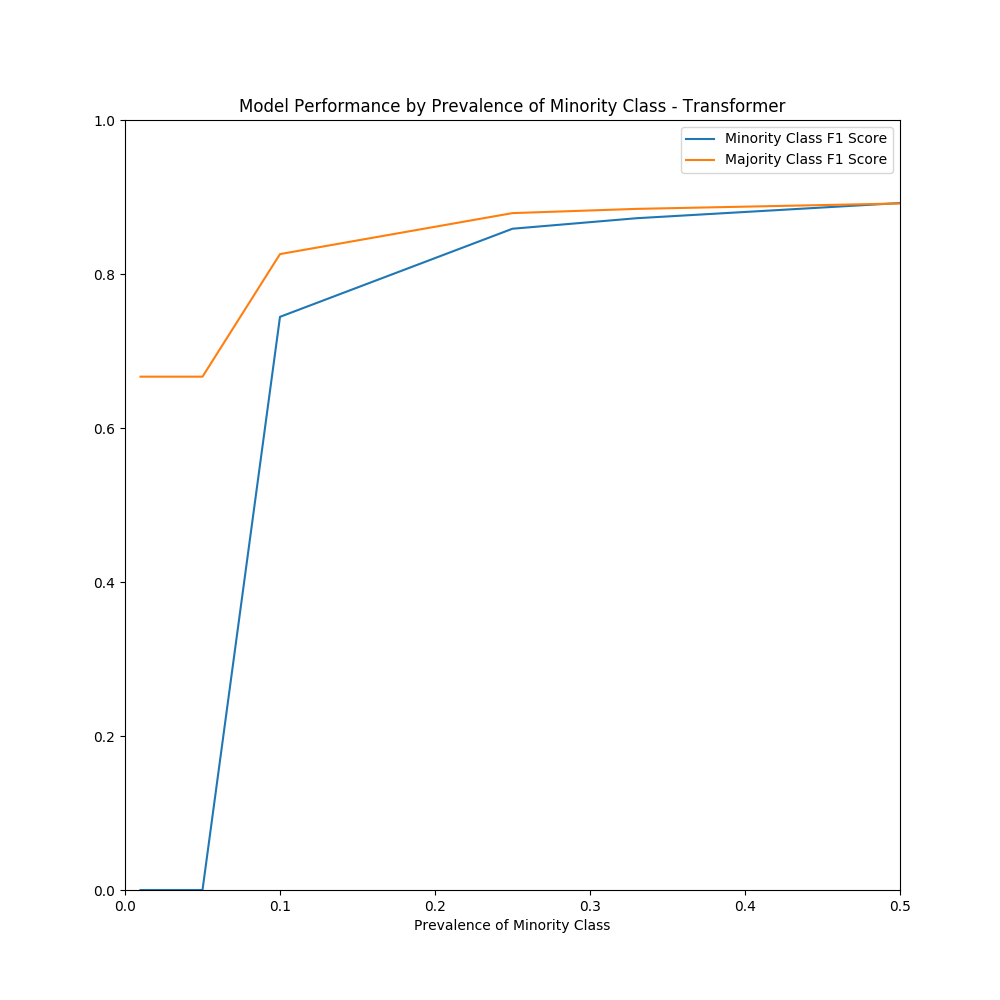
---
# Results: RoBERTa
|    |   imbalance_proportion |   Weighted F1 Score |   Weighted Precision Score |   Weighted Recall Score |   Accuracy |   Minority Class F1 Score |   Majority Class F1 Score |
|---:|-----------------------:|--------------------:|---------------------------:|------------------------:|-----------:|--------------------------:|--------------------------:|
|  0 |                   0.01 |            0.333333 |                   0.25     |                 0.5     |    0.5     |                  0        |                  0.666667 |
|  1 |                   0.05 |            0.333333 |                   0.25     |                 0.5     |    0.5     |                  0        |                  0.666667 |
|  2 |                   0.1  |            0.333333 |                   0.25     |                 0.5     |    0.5     |                  0        |                  0.666667 |
|  3 |                   0.25 |            0.865232 |                   0.876027 |                 0.86612 |    0.86612 |                  0.854295 |                  0.87617  |
|  4 |                   0.33 |            0.333333 |                   0.25     |                 0.5     |    0.5     |                  0        |                  0.666667 |
|  5 |                   0.5  |            0.8874   |                   0.8874   |                 0.8874  |    0.8874  |                  0.887341 |                  0.887459 |
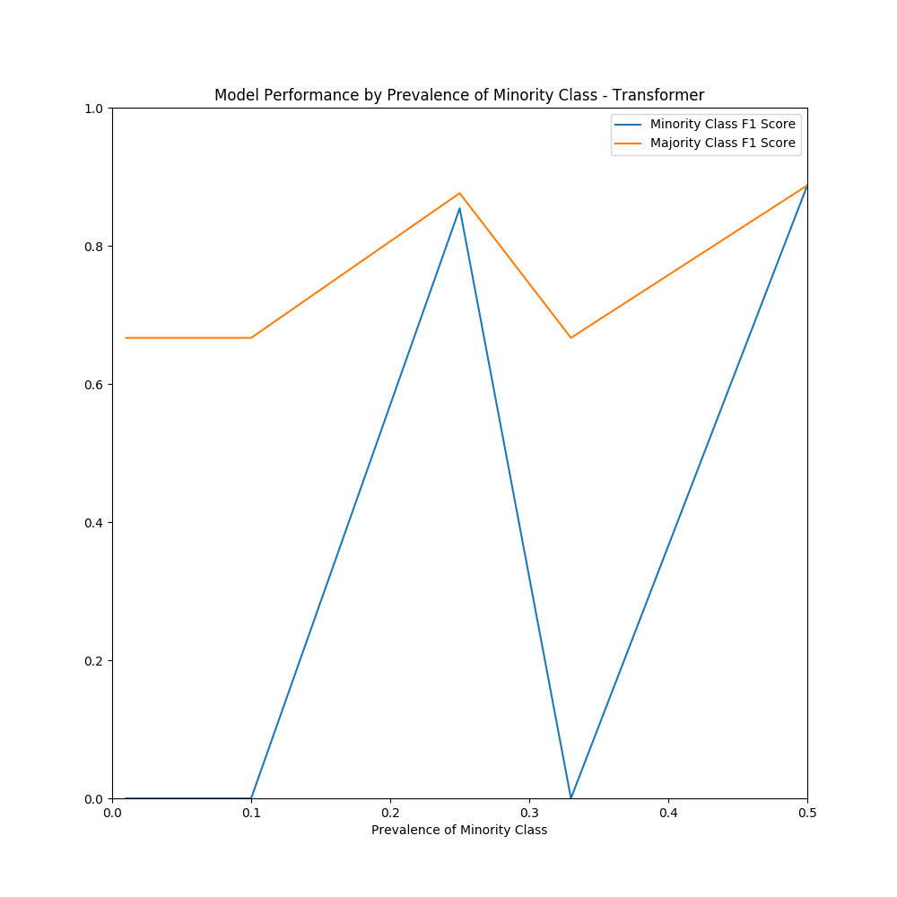
---
# Results: DistilBERT
|    |   imbalance_proportion |   Weighted F1 Score |   Weighted Precision Score |   Weighted Recall Score |   Accuracy |   Minority Class F1 Score |   Majority Class F1 Score |
|---:|-----------------------:|--------------------:|---------------------------:|------------------------:|-----------:|--------------------------:|--------------------------:|
|  0 |                   0.01 |            0.442551 |                   0.754912 |                 0.55296 |    0.55296 |                  0.194464 |                  0.690638 |
|  1 |                   0.05 |            0.666977 |                   0.795581 |                 0.69524 |    0.69524 |                  0.569961 |                  0.763993 |
|  2 |                   0.1  |            0.766211 |                   0.825528 |                 0.77524 |    0.77524 |                  0.720267 |                  0.812155 |
|  3 |                   0.25 |            0.83463  |                   0.852239 |                 0.83648 |    0.83648 |                  0.817141 |                  0.85212  |
|  4 |                   0.33 |            0.851158 |                   0.85668  |                 0.85168 |    0.85168 |                  0.842347 |                  0.85997  |
|  5 |                   0.5  |            0.865635 |                   0.865692 |                 0.86564 |    0.86564 |                  0.864834 |                  0.866436 |
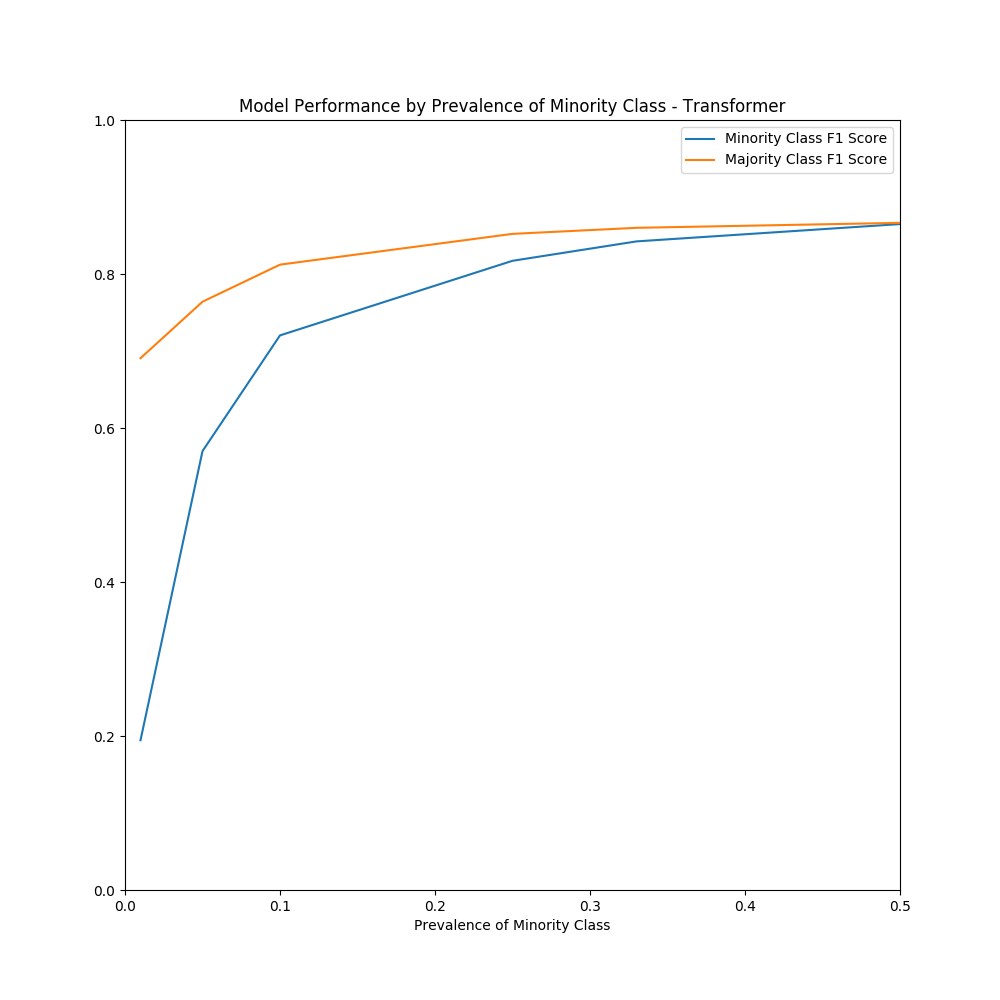
---
# Results: ALBERT
|    |   imbalance_proportion |   Weighted F1 Score |   Weighted Precision Score |   Weighted Recall Score |   Accuracy |   Minority Class F1 Score |   Majority Class F1 Score |
|---:|-----------------------:|--------------------:|---------------------------:|------------------------:|-----------:|--------------------------:|--------------------------:|
|  0 |                   0.01 |            0.333333 |                   0.25     |                 0.5     |    0.5     |                  0        |                  0.666667 |
|  1 |                   0.05 |            0.333333 |                   0.25     |                 0.5     |    0.5     |                  0        |                  0.666667 |
|  2 |                   0.1  |            0.737548 |                   0.807997 |                 0.74992 |    0.74992 |                  0.680564 |                  0.794531 |
|  3 |                   0.25 |            0.820206 |                   0.837869 |                 0.82228 |    0.82228 |                  0.800896 |                  0.839516 |
|  4 |                   0.33 |            0.847492 |                   0.851868 |                 0.84792 |    0.84792 |                  0.839415 |                  0.855569 |
|  5 |                   0.5  |            0.856016 |                   0.856278 |                 0.85604 |    0.85604 |                  0.854156 |                  0.857876 |
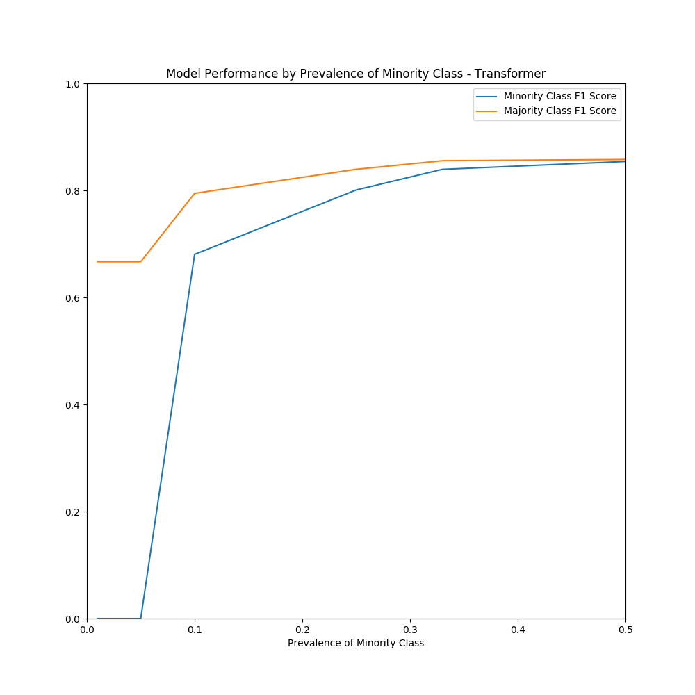
---
# Results: XLM-RoBERTa
|    |   imbalance_proportion |   Weighted F1 Score |   Weighted Precision Score |   Weighted Recall Score |   Accuracy |   Minority Class F1 Score |   Majority Class F1 Score |
|---:|-----------------------:|--------------------:|---------------------------:|------------------------:|-----------:|--------------------------:|--------------------------:|
|  0 |                   0.01 |            0.333333 |                   0.25     |                 0.5     |    0.5     |                  0        |                  0.666667 |
|  1 |                   0.05 |            0.333333 |                   0.25     |                 0.5     |    0.5     |                  0        |                  0.666667 |
|  2 |                   0.1  |            0.333333 |                   0.25     |                 0.5     |    0.5     |                  0        |                  0.666667 |
|  3 |                   0.25 |            0.835274 |                   0.854145 |                 0.83724 |    0.83724 |                  0.81728  |                  0.853269 |
|  4 |                   0.33 |            0.849965 |                   0.85965  |                 0.85088 |    0.85088 |                  0.838251 |                  0.86168  |
|  5 |                   0.5  |            0.869491 |                   0.870338 |                 0.86956 |    0.86956 |                  0.8665   |                  0.872483 |
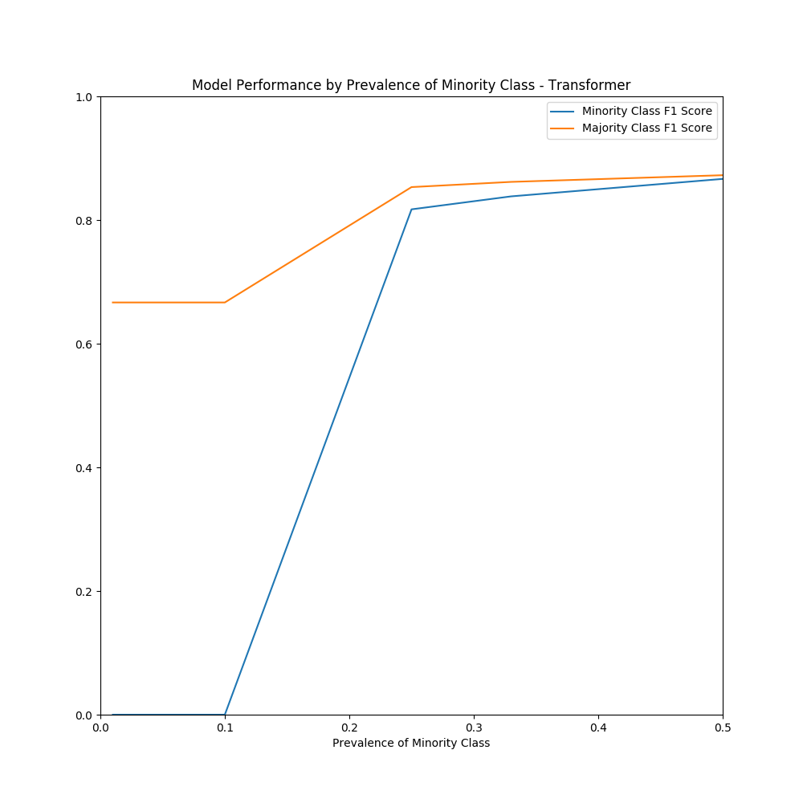
---
# Results: SKLearn
|    |   imbalance_proportion |   Weighted F1 Score |   Weighted Precision Score |   Weighted Recall Score |   Accuracy |   Minority Class F1 Score |   Majority Class F1 Score |
|---:|-----------------------:|--------------------:|---------------------------:|------------------------:|-----------:|--------------------------:|--------------------------:|
|  0 |                   0.01 |            0.333333 |                   0.25     |                 0.5     |    0.5     |                 0         |                  0.666667 |
|  1 |                   0.05 |            0.35963  |                   0.753057 |                 0.51208 |    0.51208 |                 0.0471801 |                  0.672079 |
|  2 |                   0.1  |            0.493072 |                   0.77027  |                 0.58156 |    0.58156 |                 0.281278  |                  0.704867 |
|  3 |                   0.25 |            0.766716 |                   0.832396 |                 0.77652 |    0.77652 |                 0.718893  |                  0.814539 |
|  4 |                   0.33 |            0.830675 |                   0.855935 |                 0.83336 |    0.83336 |                 0.809354  |                  0.851997 |
|  5 |                   0.5  |            0.88048  |                   0.880483 |                 0.88048 |    0.88048 |                 0.880317  |                  0.880642 |
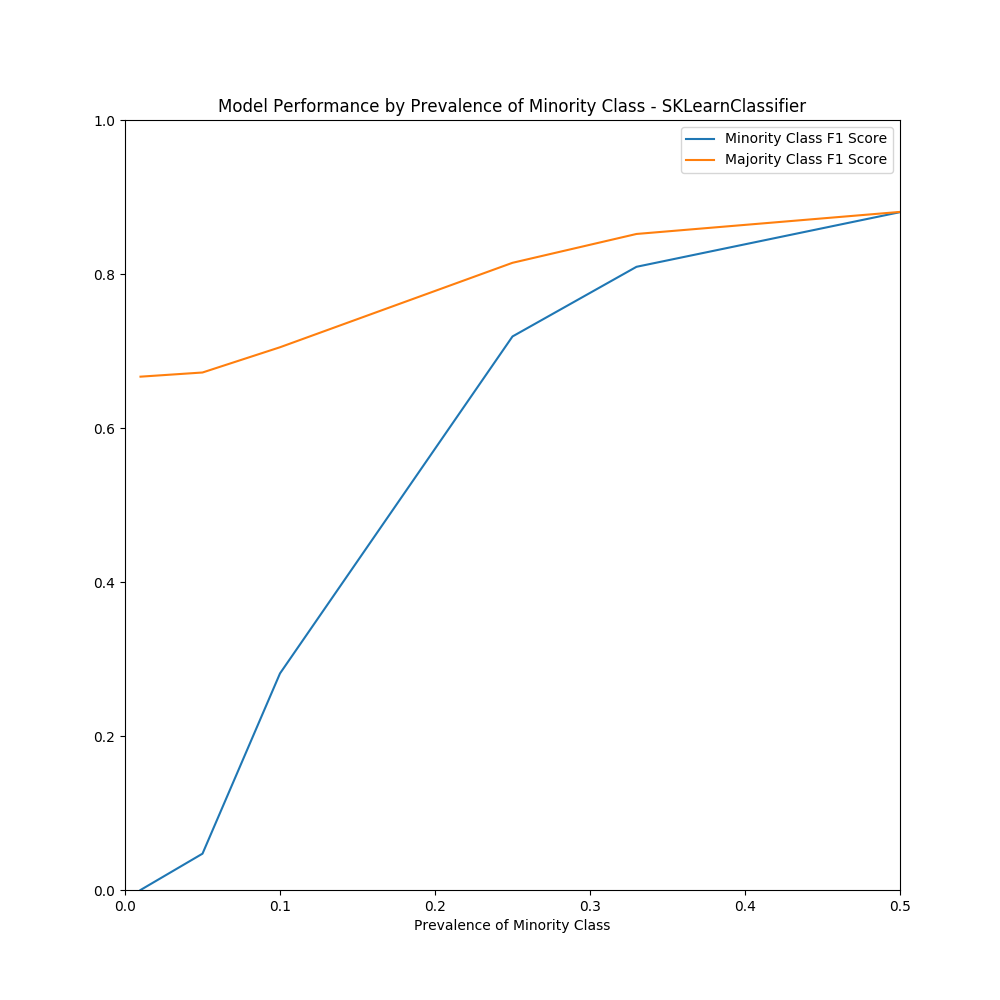
---
# Results: spaCy
|    |   imbalance_proportion |   Weighted F1 Score |   Weighted Precision Score |   Weighted Recall Score |   Accuracy |   Minority Class F1 Score |   Majority Class F1 Score |
|---:|-----------------------:|--------------------:|---------------------------:|------------------------:|-----------:|--------------------------:|--------------------------:|
|  0 |                   0.01 |            0.340035 |                   0.744259 |                 0.503   |    0.503   |                 0.0120856 |                  0.667985 |
|  1 |                   0.05 |            0.643363 |                   0.788313 |                 0.6776  |    0.6776  |                 0.532862  |                  0.753863 |
|  2 |                   0.1  |            0.740206 |                   0.82189  |                 0.75392 |    0.75392 |                 0.680515  |                  0.799896 |
|  3 |                   0.25 |            0.860444 |                   0.86873  |                 0.86116 |    0.86116 |                 0.850446  |                  0.870442 |
|  4 |                   0.33 |            0.883307 |                   0.888066 |                 0.88364 |    0.88364 |                 0.877076  |                  0.889539 |
|  5 |                   0.5  |            0.89692  |                   0.896925 |                 0.89692 |    0.89692 |                 0.897105  |                  0.896734 |
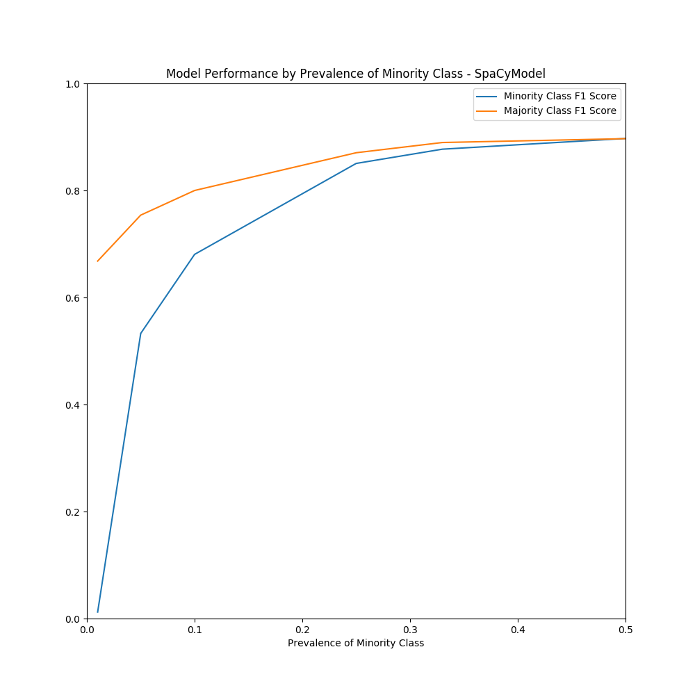
---
# Results: spacy-transformers
|    |   imbalance_proportion |   Weighted F1 Score |   Weighted Precision Score |   Weighted Recall Score |   Accuracy |   Minority Class F1 Score |   Majority Class F1 Score |
|---:|-----------------------:|--------------------:|---------------------------:|------------------------:|-----------:|--------------------------:|--------------------------:|
|  0 |                   0.01 |            0.333333 |                   0.25     |                 0.5     |    0.5     |                  0        |                  0.666667 |
|  1 |                   0.05 |            0.539247 |                   0.763022 |                 0.6074  |    0.6074  |                  0.362041 |                  0.716452 |
|  2 |                   0.1  |            0.662839 |                   0.792193 |                 0.6918  |    0.6918  |                  0.564024 |                  0.761654 |
|  3 |                   0.25 |            0.800328 |                   0.823934 |                 0.80348 |    0.80348 |                  0.775241 |                  0.825415 |
|  4 |                   0.33 |            0.820368 |                   0.830668 |                 0.8216  |    0.8216  |                  0.805495 |                  0.835242 |
|  5 |                   0.5  |            0.838622 |                   0.838789 |                 0.83864 |    0.83864 |                  0.840314 |                  0.836931 |
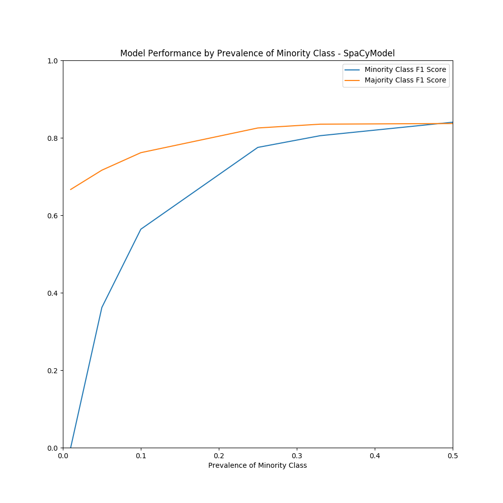
---
