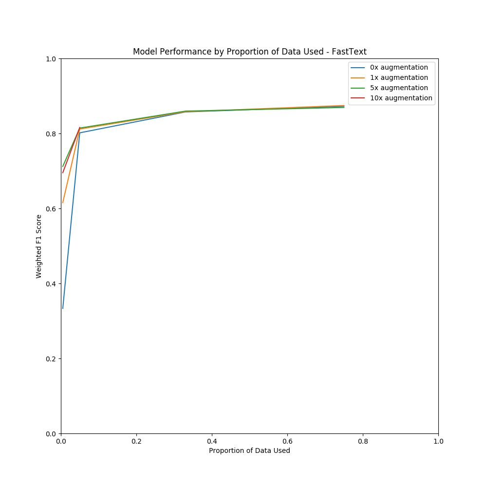
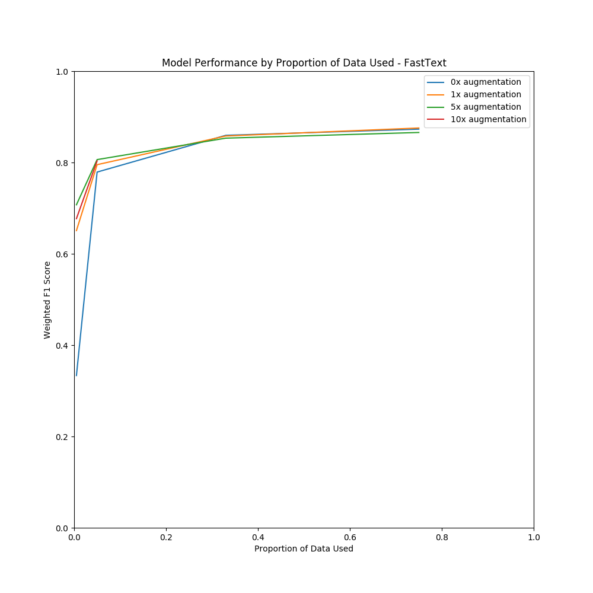
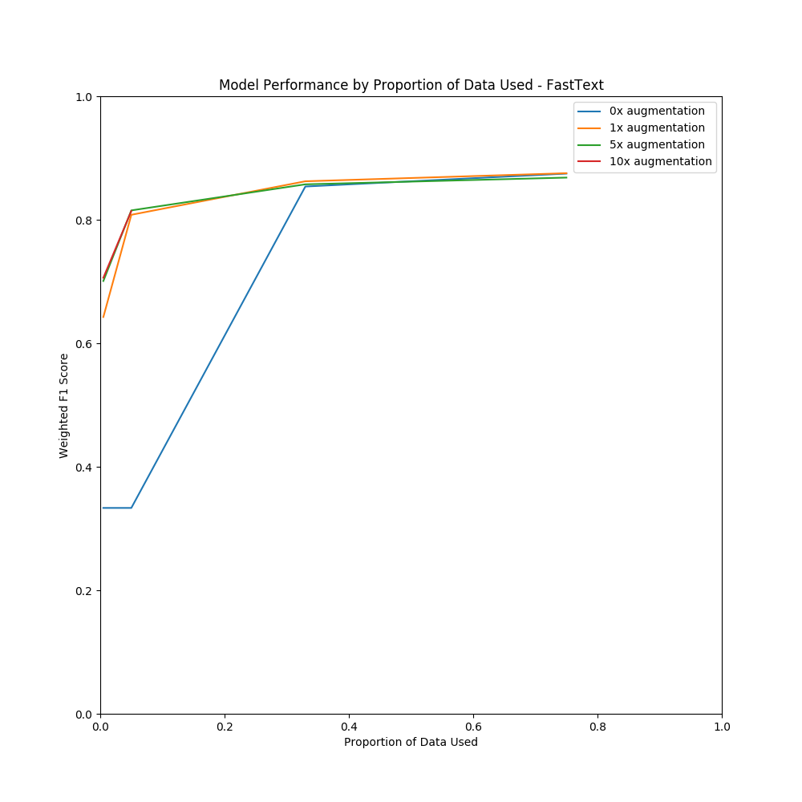

# Results: Word2Vec
|    |   percent |   multiplier |   Weighted F1 Score |   Weighted Precision Score |   Weighted Recall Score |   Accuracy |
|---:|----------:|-------------:|--------------------:|---------------------------:|------------------------:|-----------:|
|  0 |     0.005 |            0 |            0.333333 |                   0.25     |                 0.5     |    0.5     |
|  1 |     0.005 |            1 |            0.615251 |                   0.669323 |                 0.63484 |    0.63484 |
|  2 |     0.005 |            5 |            0.711989 |                   0.712191 |                 0.71204 |    0.71204 |
|  3 |     0.005 |           10 |            0.695156 |                   0.695169 |                 0.69516 |    0.69516 |
|  4 |     0.05  |            0 |            0.801613 |                   0.802089 |                 0.80168 |    0.80168 |
|  5 |     0.05  |            1 |            0.811721 |                   0.813553 |                 0.81196 |    0.81196 |
|  6 |     0.05  |            5 |            0.814299 |                   0.81446  |                 0.81432 |    0.81432 |
|  7 |     0.05  |           10 |            0.816025 |                   0.816146 |                 0.81604 |    0.81604 |
|  8 |     0.33  |            0 |            0.857272 |                   0.857361 |                 0.85728 |    0.85728 |
|  9 |     0.33  |            1 |            0.857917 |                   0.857955 |                 0.85792 |    0.85792 |
| 10 |     0.33  |            5 |            0.85955  |                   0.859666 |                 0.85956 |    0.85956 |
| 11 |     0.75  |            0 |            0.8724   |                   0.8724   |                 0.8724  |    0.8724  |
| 12 |     0.75  |            1 |            0.874479 |                   0.874492 |                 0.87448 |    0.87448 |
| 13 |     0.75  |            5 |            0.869273 |                   0.869364 |                 0.86928 |    0.86928 |

---
# Results: WordNet
|    |   percent |   multiplier |   Weighted F1 Score |   Weighted Precision Score |   Weighted Recall Score |   Accuracy |
|---:|----------:|-------------:|--------------------:|---------------------------:|------------------------:|-----------:|
|  0 |     0.005 |            0 |            0.333422 |                   0.75001  |                 0.50004 |    0.50004 |
|  1 |     0.005 |            1 |            0.650811 |                   0.660782 |                 0.65432 |    0.65432 |
|  2 |     0.005 |            5 |            0.707364 |                   0.71045  |                 0.70816 |    0.70816 |
|  3 |     0.005 |           10 |            0.677011 |                   0.679425 |                 0.67776 |    0.67776 |
|  4 |     0.05  |            0 |            0.778989 |                   0.779782 |                 0.77912 |    0.77912 |
|  5 |     0.05  |            1 |            0.795194 |                   0.796046 |                 0.79532 |    0.79532 |
|  6 |     0.05  |            5 |            0.806279 |                   0.806284 |                 0.80628 |    0.80628 |
|  7 |     0.05  |           10 |            0.803407 |                   0.803647 |                 0.80344 |    0.80344 |
|  8 |     0.33  |            0 |            0.859476 |                   0.859526 |                 0.85948 |    0.85948 |
|  9 |     0.33  |            1 |            0.858    |                   0.858004 |                 0.858   |    0.858   |
| 10 |     0.33  |            5 |            0.85328  |                   0.85328  |                 0.85328 |    0.85328 |
| 11 |     0.75  |            0 |            0.873038 |                   0.873058 |                 0.87304 |    0.87304 |
| 12 |     0.75  |            1 |            0.87552  |                   0.875523 |                 0.87552 |    0.87552 |
| 13 |     0.75  |            5 |            0.865713 |                   0.865798 |                 0.86572 |    0.86572 |

---
# Results: BERTMaskedLM
|    |   percent |   multiplier |   Weighted F1 Score |   Weighted Precision Score |   Weighted Recall Score |   Accuracy |
|---:|----------:|-------------:|--------------------:|---------------------------:|------------------------:|-----------:|
|  0 |     0.005 |            0 |            0.333333 |                   0.25     |                 0.5     |    0.5     |
|  1 |     0.005 |            1 |            0.642507 |                   0.676316 |                 0.65388 |    0.65388 |
|  2 |     0.005 |            5 |            0.700794 |                   0.700817 |                 0.7008  |    0.7008  |
|  3 |     0.005 |           10 |            0.706058 |                   0.708288 |                 0.70664 |    0.70664 |
|  4 |     0.05  |            0 |            0.333333 |                   0.25     |                 0.5     |    0.5     |
|  5 |     0.05  |            1 |            0.808025 |                   0.808138 |                 0.80804 |    0.80804 |
|  6 |     0.05  |            5 |            0.815149 |                   0.815232 |                 0.81516 |    0.81516 |
|  7 |     0.05  |           10 |            0.814197 |                   0.81422  |                 0.8142  |    0.8142  |
|  8 |     0.33  |            0 |            0.853817 |                   0.854066 |                 0.85384 |    0.85384 |
|  9 |     0.33  |            1 |            0.862312 |                   0.862404 |                 0.86232 |    0.86232 |
| 10 |     0.33  |            5 |            0.857357 |                   0.857387 |                 0.85736 |    0.85736 |
| 11 |     0.75  |            0 |            0.874757 |                   0.874797 |                 0.87476 |    0.87476 |
| 12 |     0.75  |            1 |            0.87536  |                   0.875365 |                 0.87536 |    0.87536 |
| 13 |     0.75  |            5 |            0.868264 |                   0.868944 |                 0.86832 |    0.86832 |

---