# Results: BERT
```
(pid=3321) INFO:gobbli.experiment.base:BERT initialized with data directory '/data/users/jnance/gobbli/benchmark/benchmark_data/model/BERT/b4a974d0cbf84a26a13d943f1313a663'
(pid=3321) INFO:gobbli.experiment.base:Starting build.
(pid=3321) INFO:gobbli.experiment.base:Build finished in 0.31 sec.
(pid=3321) INFO:gobbli.experiment.base:Starting training.
(pid=3321) INFO:gobbli.experiment.base:Training finished in 1697.72 sec.
(pid=3321) INFO:gobbli.experiment.base:RESULTS:
(pid=3321) INFO:gobbli.experiment.base:  Validation loss: 0.5770399
(pid=3321) INFO:gobbli.experiment.base:  Validation accuracy: 0.883
(pid=3321) INFO:gobbli.experiment.base:  Training loss: 0.5787165
(pid=3321) INFO:gobbli.experiment.base:BERT initialized with data directory '/data/users/jnance/gobbli/benchmark/benchmark_data/model/BERT/947ec7f4d6c648afabc639aff4d44732'
(pid=3321) INFO:gobbli.experiment.base:Starting build.
(pid=3321) INFO:gobbli.experiment.base:Build finished in 0.28 sec.
(pid=3321) INFO:gobbli.experiment.base:Starting training.
(pid=3321) INFO:gobbli.experiment.base:Training finished in 1692.98 sec.
(pid=3321) INFO:gobbli.experiment.base:RESULTS:
(pid=3321) INFO:gobbli.experiment.base:  Validation loss: 0.63589144
(pid=3321) INFO:gobbli.experiment.base:  Validation accuracy: 0.8734
(pid=3321) INFO:gobbli.experiment.base:  Training loss: 0.6371434
(pid=3321) INFO:gobbli.experiment.base:BERT initialized with data directory '/data/users/jnance/gobbli/benchmark/benchmark_data/model/BERT/7280affc90ee4d18aeea25fabe3808eb'
(pid=3321) INFO:gobbli.experiment.base:Starting build.
(pid=3321) INFO:gobbli.experiment.base:Build finished in 0.34 sec.
(pid=3321) INFO:gobbli.experiment.base:Starting training.
(pid=3321) INFO:gobbli.experiment.base:Training finished in 1699.80 sec.
(pid=3321) INFO:gobbli.experiment.base:RESULTS:
(pid=3321) INFO:gobbli.experiment.base:  Validation loss: 0.7240024
(pid=3321) INFO:gobbli.experiment.base:  Validation accuracy: 0.854
(pid=3321) INFO:gobbli.experiment.base:  Training loss: 0.7260194
(pid=3321) INFO:gobbli.experiment.base:BERT initialized with data directory '/data/users/jnance/gobbli/benchmark/benchmark_data/model/BERT/b9b55a3e2a224e3993d9fbeab85a6833'
(pid=3321) INFO:gobbli.experiment.base:Starting build.
(pid=3321) INFO:gobbli.experiment.base:Build finished in 0.40 sec.
(pid=3321) INFO:gobbli.experiment.base:Starting prediction.
(pid=3321) INFO:gobbli.experiment.base:Prediction finished in 217.82 sec.
(pid=3321) /usr/local/lib/python3.7/site-packages/ray/pyarrow_files/pyarrow/serialization.py:165: FutureWarning: The SparseDataFrame class is removed from pandas. Accessing it from the top-level namespace will also be removed in the next version
(pid=3321)   if isinstance(obj, pd.SparseDataFrame):

```
|    |   valid_loss |   valid_accuracy |   train_loss | multilabel   | labels         | checkpoint                                                                                                                                                   | node_ip_address   | model_params                                               |
|---:|-------------:|-----------------:|-------------:|:-------------|:---------------|:-------------------------------------------------------------------------------------------------------------------------------------------------------------|:------------------|:-----------------------------------------------------------|
|  0 |     0.57704  |           0.883  |     0.578716 | False        | ['neg', 'pos'] | /data/users/jnance/gobbli/benchmark/benchmark_data/model/BERT/b4a974d0cbf84a26a13d943f1313a663/train/de9b0777535341e1abbdc6b54f6c497a/output/model.ckpt-3125 | 172.80.10.2       | {'bert_model': 'bert-base-uncased', 'max_seq_length': 128} |
|  1 |     0.635891 |           0.8734 |     0.637143 | False        | ['neg', 'pos'] | /data/users/jnance/gobbli/benchmark/benchmark_data/model/BERT/947ec7f4d6c648afabc639aff4d44732/train/db4df22fa3e6451abd76964dfdab0cae/output/model.ckpt-3125 | 172.80.10.2       | {'bert_model': 'bert-base-cased', 'max_seq_length': 128}   |
|  2 |     0.724002 |           0.854  |     0.726019 | False        | ['neg', 'pos'] | /data/users/jnance/gobbli/benchmark/benchmark_data/model/BERT/7280affc90ee4d18aeea25fabe3808eb/train/bad61cd577a44744a48787586da65c9c/output/model.ckpt-3125 | 172.80.10.2       | {'bert_model': 'scibert-uncased', 'max_seq_length': 128}   |
```
Metrics:
--------
Weighted F1 Score: 0.8819691767698491
Weighted Precision Score: 0.8823994477328716
Weighted Recall Score: 0.882
Accuracy: 0.882

Classification Report:
----------------------
              precision    recall  f1-score   support

         neg       0.00      0.00      0.00         0
         pos       0.00      0.00      0.00         0

   micro avg       0.00      0.00      0.00         0
   macro avg       0.00      0.00      0.00         0
weighted avg       0.00      0.00      0.00         0


```

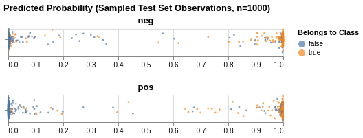
---
# Results: MTDNN
```
(pid=3537) INFO:gobbli.experiment.base:MTDNN initialized with data directory '/data/users/jnance/gobbli/benchmark/benchmark_data/model/MTDNN/97bd914c45964562810bc65fbb005958'
(pid=3537) INFO:gobbli.experiment.base:Starting build.
(pid=3537) INFO:gobbli.experiment.base:Build finished in 0.27 sec.
(pid=3537) INFO:gobbli.experiment.base:Starting training.
(pid=3537) /code/gobbli/model/mtdnn/model.py:204: UserWarning: MT-DNN model does not support separate validation batch size; using train batch size '16' for both training and validation.
(pid=3537)   "MT-DNN model does not support separate validation batch size; "
(pid=3537) INFO:gobbli.experiment.base:Training finished in 2691.56 sec.
(pid=3537) INFO:gobbli.experiment.base:RESULTS:
(pid=3537) INFO:gobbli.experiment.base:  Validation loss: 0.4333544969558716
(pid=3537) INFO:gobbli.experiment.base:  Validation accuracy: 0.8782
(pid=3537) INFO:gobbli.experiment.base:  Training loss: 0.3258266746997833
(pid=3537) INFO:gobbli.experiment.base:MTDNN initialized with data directory '/data/users/jnance/gobbli/benchmark/benchmark_data/model/MTDNN/2400ab65a9b1404a893cb9e3e6c18f0b'
(pid=3537) INFO:gobbli.experiment.base:Starting build.
(pid=3537) INFO:gobbli.experiment.base:Build finished in 0.31 sec.
(pid=3537) INFO:gobbli.experiment.base:Starting prediction.
(pid=3537) INFO:gobbli.experiment.base:Prediction finished in 187.28 sec.
(pid=3537) /usr/local/lib/python3.7/site-packages/ray/pyarrow_files/pyarrow/serialization.py:165: FutureWarning: The SparseDataFrame class is removed from pandas. Accessing it from the top-level namespace will also be removed in the next version
(pid=3537)   if isinstance(obj, pd.SparseDataFrame):

```
|    |   valid_loss |   valid_accuracy |   train_loss | multilabel   | labels         | checkpoint                                                                                                                                               | node_ip_address   | model_params                                          |
|---:|-------------:|-----------------:|-------------:|:-------------|:---------------|:---------------------------------------------------------------------------------------------------------------------------------------------------------|:------------------|:------------------------------------------------------|
|  0 |     0.433354 |           0.8782 |     0.325827 | False        | ['neg', 'pos'] | /data/users/jnance/gobbli/benchmark/benchmark_data/model/MTDNN/97bd914c45964562810bc65fbb005958/train/a64ab92d26334450b788b96d243fba71/output/model_4.pt | 172.80.10.2       | {'max_seq_length': 128, 'mtdnn_model': 'mt-dnn-base'} |
```
Metrics:
--------
Weighted F1 Score: 0.8816735903057176
Weighted Precision Score: 0.8817627197352919
Weighted Recall Score: 0.88168
Accuracy: 0.88168

Classification Report:
----------------------
              precision    recall  f1-score   support

         neg       0.00      0.00      0.00         0
         pos       0.00      0.00      0.00         0

   micro avg       0.00      0.00      0.00         0
   macro avg       0.00      0.00      0.00         0
weighted avg       0.00      0.00      0.00         0


```

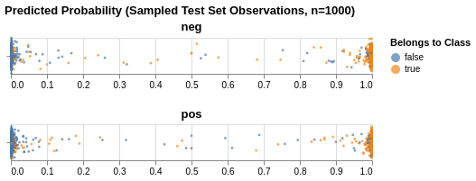
---
# Results: FastText
```
(pid=3754) INFO:gobbli.experiment.base:FastText initialized with data directory '/data/users/jnance/gobbli/benchmark/benchmark_data/model/FastText/cd128674518a40f188195fed86512184'
(pid=3754) INFO:gobbli.experiment.base:Starting build.
(pid=3751) INFO:gobbli.experiment.base:FastText initialized with data directory '/data/users/jnance/gobbli/benchmark/benchmark_data/model/FastText/ac0e2c59ee944c07af0f7d5b6ad9ffd1'
(pid=3751) INFO:gobbli.experiment.base:Starting build.
(pid=3752) INFO:gobbli.experiment.base:FastText initialized with data directory '/data/users/jnance/gobbli/benchmark/benchmark_data/model/FastText/7b21e9fb6ee64d4bb7d210a47784c094'
(pid=3752) INFO:gobbli.experiment.base:Starting build.
(pid=3753) INFO:gobbli.experiment.base:FastText initialized with data directory '/data/users/jnance/gobbli/benchmark/benchmark_data/model/FastText/053a11ae86a446ffaee8fa7f11dc81df'
(pid=3753) INFO:gobbli.experiment.base:Starting build.
(pid=3754) INFO:gobbli.experiment.base:Build finished in 0.30 sec.
(pid=3754) INFO:gobbli.experiment.base:Starting training.
(pid=3751) INFO:gobbli.experiment.base:Build finished in 0.34 sec.
(pid=3751) INFO:gobbli.experiment.base:Starting training.
(pid=3752) INFO:gobbli.experiment.base:Build finished in 0.28 sec.
(pid=3752) INFO:gobbli.experiment.base:Starting training.
(pid=3753) INFO:gobbli.experiment.base:Build finished in 0.28 sec.
(pid=3753) INFO:gobbli.experiment.base:Starting training.
(pid=3754) INFO:gobbli.experiment.base:Training finished in 312.29 sec.
(pid=3754) INFO:gobbli.experiment.base:RESULTS:
(pid=3754) INFO:gobbli.experiment.base:  Validation loss: -0.883
(pid=3754) INFO:gobbli.experiment.base:  Validation accuracy: 0.883
(pid=3754) INFO:gobbli.experiment.base:  Training loss: 0.329469
(pid=3754) INFO:gobbli.experiment.base:FastText initialized with data directory '/data/users/jnance/gobbli/benchmark/benchmark_data/model/FastText/be56fe65ba39471d83df1cbc6a41a11b'
(pid=3754) INFO:gobbli.experiment.base:Starting build.
(pid=3754) INFO:gobbli.experiment.base:Build finished in 0.33 sec.
(pid=3754) INFO:gobbli.experiment.base:Starting training.
(pid=3752) INFO:gobbli.experiment.base:Training finished in 312.65 sec.
(pid=3752) INFO:gobbli.experiment.base:RESULTS:
(pid=3752) INFO:gobbli.experiment.base:  Validation loss: -0.888
(pid=3752) INFO:gobbli.experiment.base:  Validation accuracy: 0.888
(pid=3752) INFO:gobbli.experiment.base:  Training loss: 0.31366
(pid=3752) INFO:gobbli.experiment.base:FastText initialized with data directory '/data/users/jnance/gobbli/benchmark/benchmark_data/model/FastText/c57044730473433d82cdc342918a5606'
(pid=3752) INFO:gobbli.experiment.base:Starting build.
(pid=3752) INFO:gobbli.experiment.base:Build finished in 0.28 sec.
(pid=3752) INFO:gobbli.experiment.base:Starting training.
(pid=3753) INFO:gobbli.experiment.base:Training finished in 312.95 sec.
(pid=3753) INFO:gobbli.experiment.base:RESULTS:
(pid=3753) INFO:gobbli.experiment.base:  Validation loss: -0.897
(pid=3753) INFO:gobbli.experiment.base:  Validation accuracy: 0.897
(pid=3753) INFO:gobbli.experiment.base:  Training loss: 0.277508
(pid=3753) INFO:gobbli.experiment.base:FastText initialized with data directory '/data/users/jnance/gobbli/benchmark/benchmark_data/model/FastText/de53d34b14f74c66abe97283f6c8d92c'
(pid=3753) INFO:gobbli.experiment.base:Starting build.
(pid=3753) INFO:gobbli.experiment.base:Build finished in 0.30 sec.
(pid=3753) INFO:gobbli.experiment.base:Starting training.
(pid=3751) INFO:gobbli.experiment.base:Training finished in 316.22 sec.
(pid=3751) INFO:gobbli.experiment.base:RESULTS:
(pid=3751) INFO:gobbli.experiment.base:  Validation loss: -0.8976
(pid=3751) INFO:gobbli.experiment.base:  Validation accuracy: 0.8976
(pid=3751) INFO:gobbli.experiment.base:  Training loss: 0.257975
(pid=3751) INFO:gobbli.experiment.base:FastText initialized with data directory '/data/users/jnance/gobbli/benchmark/benchmark_data/model/FastText/292548946e204b6e9859f79d718634df'
(pid=3751) INFO:gobbli.experiment.base:Starting build.
(pid=3751) INFO:gobbli.experiment.base:Build finished in 0.45 sec.
(pid=3751) INFO:gobbli.experiment.base:Starting training.
(pid=3754) INFO:gobbli.experiment.base:Training finished in 319.10 sec.
(pid=3754) INFO:gobbli.experiment.base:RESULTS:
(pid=3754) INFO:gobbli.experiment.base:  Validation loss: -0.888
(pid=3754) INFO:gobbli.experiment.base:  Validation accuracy: 0.888
(pid=3754) INFO:gobbli.experiment.base:  Training loss: 0.362867
(pid=3753) INFO:gobbli.experiment.base:Training finished in 319.25 sec.
(pid=3753) INFO:gobbli.experiment.base:RESULTS:
(pid=3753) INFO:gobbli.experiment.base:  Validation loss: -0.8912
(pid=3753) INFO:gobbli.experiment.base:  Validation accuracy: 0.8912
(pid=3753) INFO:gobbli.experiment.base:  Training loss: 0.309882
(pid=3752) INFO:gobbli.experiment.base:Training finished in 324.26 sec.
(pid=3752) INFO:gobbli.experiment.base:RESULTS:
(pid=3752) INFO:gobbli.experiment.base:  Validation loss: -0.8998
(pid=3752) INFO:gobbli.experiment.base:  Validation accuracy: 0.8998
(pid=3752) INFO:gobbli.experiment.base:  Training loss: 0.312032
(pid=3751) INFO:gobbli.experiment.base:Training finished in 321.45 sec.
(pid=3751) INFO:gobbli.experiment.base:RESULTS:
(pid=3751) INFO:gobbli.experiment.base:  Validation loss: -0.9004
(pid=3751) INFO:gobbli.experiment.base:  Validation accuracy: 0.9004
(pid=3751) INFO:gobbli.experiment.base:  Training loss: 0.29699
(pid=3751) INFO:gobbli.experiment.base:FastText initialized with data directory '/data/users/jnance/gobbli/benchmark/benchmark_data/model/FastText/9a7abdc6832743269eb34cd36db34aa3'
(pid=3751) INFO:gobbli.experiment.base:Starting build.
(pid=3751) INFO:gobbli.experiment.base:Build finished in 0.30 sec.
(pid=3751) INFO:gobbli.experiment.base:Starting prediction.
(pid=3751) INFO:gobbli.experiment.base:Prediction finished in 5.15 sec.
(pid=3751) /usr/local/lib/python3.7/site-packages/ray/pyarrow_files/pyarrow/serialization.py:165: FutureWarning: The SparseDataFrame class is removed from pandas. Accessing it from the top-level namespace will also be removed in the next version
(pid=3751)   if isinstance(obj, pd.SparseDataFrame):

```
|    |   valid_loss |   valid_accuracy |   train_loss | multilabel   | labels         | checkpoint                                                                                                                                             | node_ip_address   | model_params                              |
|---:|-------------:|-----------------:|-------------:|:-------------|:---------------|:-------------------------------------------------------------------------------------------------------------------------------------------------------|:------------------|:------------------------------------------|
|  0 |      -0.883  |           0.883  |     0.329469 | False        | ['neg', 'pos'] | /data/users/jnance/gobbli/benchmark/benchmark_data/model/FastText/cd128674518a40f188195fed86512184/train/e68480643e744624978ffd5a4bf373f7/output/model | 172.80.10.2       | {'dim': 100, 'lr': 0.5, 'word_ngrams': 1} |
|  1 |      -0.8976 |           0.8976 |     0.257975 | False        | ['neg', 'pos'] | /data/users/jnance/gobbli/benchmark/benchmark_data/model/FastText/ac0e2c59ee944c07af0f7d5b6ad9ffd1/train/8c0b4c217c4441c98446023e3aee5a15/output/model | 172.80.10.2       | {'dim': 100, 'lr': 0.5, 'word_ngrams': 2} |
|  2 |      -0.888  |           0.888  |     0.31366  | False        | ['neg', 'pos'] | /data/users/jnance/gobbli/benchmark/benchmark_data/model/FastText/7b21e9fb6ee64d4bb7d210a47784c094/train/540bf38999424506a1619c0da46d80e8/output/model | 172.80.10.2       | {'dim': 100, 'lr': 1.0, 'word_ngrams': 1} |
|  3 |      -0.897  |           0.897  |     0.277508 | False        | ['neg', 'pos'] | /data/users/jnance/gobbli/benchmark/benchmark_data/model/FastText/053a11ae86a446ffaee8fa7f11dc81df/train/25b72bd83196489e891c3bc204e976e9/output/model | 172.80.10.2       | {'dim': 100, 'lr': 1.0, 'word_ngrams': 2} |
|  4 |      -0.888  |           0.888  |     0.362867 | False        | ['neg', 'pos'] | /data/users/jnance/gobbli/benchmark/benchmark_data/model/FastText/be56fe65ba39471d83df1cbc6a41a11b/train/a2e43f09612642e7a039fc4f9d9f39f6/output/model | 172.80.10.2       | {'dim': 300, 'lr': 0.5, 'word_ngrams': 1} |
|  5 |      -0.8998 |           0.8998 |     0.312032 | False        | ['neg', 'pos'] | /data/users/jnance/gobbli/benchmark/benchmark_data/model/FastText/c57044730473433d82cdc342918a5606/train/364f850e9b7f41258710ec9cfb508768/output/model | 172.80.10.2       | {'dim': 300, 'lr': 0.5, 'word_ngrams': 2} |
|  6 |      -0.8912 |           0.8912 |     0.309882 | False        | ['neg', 'pos'] | /data/users/jnance/gobbli/benchmark/benchmark_data/model/FastText/de53d34b14f74c66abe97283f6c8d92c/train/839eb49b93384153be401e693b9253a2/output/model | 172.80.10.2       | {'dim': 300, 'lr': 1.0, 'word_ngrams': 1} |
|  7 |      -0.9004 |           0.9004 |     0.29699  | False        | ['neg', 'pos'] | /data/users/jnance/gobbli/benchmark/benchmark_data/model/FastText/292548946e204b6e9859f79d718634df/train/f940017802dd457bbfc6ecf58e62e397/output/model | 172.80.10.2       | {'dim': 300, 'lr': 1.0, 'word_ngrams': 2} |
```
Metrics:
--------
Weighted F1 Score: 0.8860921370432054
Weighted Precision Score: 0.8864981646458191
Weighted Recall Score: 0.88612
Accuracy: 0.88612

Classification Report:
----------------------
              precision    recall  f1-score   support

         neg       0.00      0.00      0.00         0
         pos       0.00      0.00      0.00         0

   micro avg       0.00      0.00      0.00         0
   macro avg       0.00      0.00      0.00         0
weighted avg       0.00      0.00      0.00         0


```

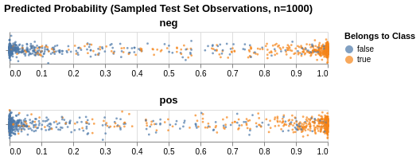
---
# Results: XLM
```
(pid=47) INFO:gobbli.experiment.base:Transformer initialized with data directory '/data/users/jnance/gobbli/benchmark/benchmark_data/model/Transformer/7639ffbb39824aa28957eed8d4d9a415'
(pid=47) INFO:gobbli.experiment.base:Starting build.
(pid=47) INFO:gobbli.experiment.base:Build finished in 0.21 sec.
(pid=47) INFO:gobbli.experiment.base:Starting training.
(pid=47) INFO:gobbli.experiment.base:Training finished in 3092.26 sec.
(pid=47) INFO:gobbli.experiment.base:RESULTS:
(pid=47) INFO:gobbli.experiment.base:  Validation loss: 0.02176959261894226
(pid=47) INFO:gobbli.experiment.base:  Validation accuracy: 0.4988
(pid=47) INFO:gobbli.experiment.base:  Training loss: 0.04383168312013149
(pid=47) INFO:gobbli.experiment.base:Transformer initialized with data directory '/data/users/jnance/gobbli/benchmark/benchmark_data/model/Transformer/5fb64087d96240efbb34656165bb0fb0'
(pid=47) INFO:gobbli.experiment.base:Starting build.
(pid=47) INFO:gobbli.experiment.base:Build finished in 0.21 sec.
(pid=47) INFO:gobbli.experiment.base:Starting training.
(pid=47) INFO:gobbli.experiment.base:Training finished in 1831.32 sec.
(pid=47) INFO:gobbli.experiment.base:RESULTS:
(pid=47) INFO:gobbli.experiment.base:  Validation loss: 0.025225455497577785
(pid=47) INFO:gobbli.experiment.base:  Validation accuracy: 0.831
(pid=47) INFO:gobbli.experiment.base:  Training loss: 0.008801721643656493
(pid=47) INFO:gobbli.experiment.base:Transformer initialized with data directory '/data/users/jnance/gobbli/benchmark/benchmark_data/model/Transformer/98ca5aa511804431bb75586f5c439618'
(pid=47) INFO:gobbli.experiment.base:Starting build.
(pid=47) INFO:gobbli.experiment.base:Build finished in 0.17 sec.
(pid=47) INFO:gobbli.experiment.base:Starting prediction.
(pid=47) INFO:gobbli.experiment.base:Prediction finished in 232.73 sec.
(pid=47) /usr/local/lib/python3.7/site-packages/ray/pyarrow_files/pyarrow/serialization.py:165: FutureWarning: The SparseDataFrame class is removed from pandas. Accessing it from the top-level namespace will also be removed in the next version
(pid=47)   if isinstance(obj, pd.SparseDataFrame):

```
|    |   valid_loss |   valid_accuracy |   train_loss | multilabel   | labels         | checkpoint                                                                                                                                                     | node_ip_address   | model_params                                                                   |
|---:|-------------:|-----------------:|-------------:|:-------------|:---------------|:---------------------------------------------------------------------------------------------------------------------------------------------------------------|:------------------|:-------------------------------------------------------------------------------|
|  0 |    0.0217696 |           0.4988 |   0.0438317  | False        | ['neg', 'pos'] | /data/users/jnance/gobbli/benchmark/benchmark_data/model/Transformer/7639ffbb39824aa28957eed8d4d9a415/train/1325c2f951274b08b14f883c3f03707a/output/checkpoint | 172.80.10.2       | {'transformer_model': 'XLM', 'transformer_weights': 'xlm-mlm-tlm-xnli15-1024'} |
|  1 |    0.0252255 |           0.831  |   0.00880172 | False        | ['neg', 'pos'] | /data/users/jnance/gobbli/benchmark/benchmark_data/model/Transformer/5fb64087d96240efbb34656165bb0fb0/train/a29d53b00ad84d26aa2e2bd6915d1fcf/output/checkpoint | 172.80.10.2       | {'transformer_model': 'XLM', 'transformer_weights': 'xlm-clm-ende-1024'}       |
```
Metrics:
--------
Weighted F1 Score: 0.33333333333333326
Weighted Precision Score: 0.25
Weighted Recall Score: 0.5
Accuracy: 0.5

Classification Report:
----------------------
              precision    recall  f1-score   support

         neg       0.00      0.00      0.00         0
         pos       0.00      0.00      0.00         0

   micro avg       0.00      0.00      0.00         0
   macro avg       0.00      0.00      0.00         0
weighted avg       0.00      0.00      0.00         0


```

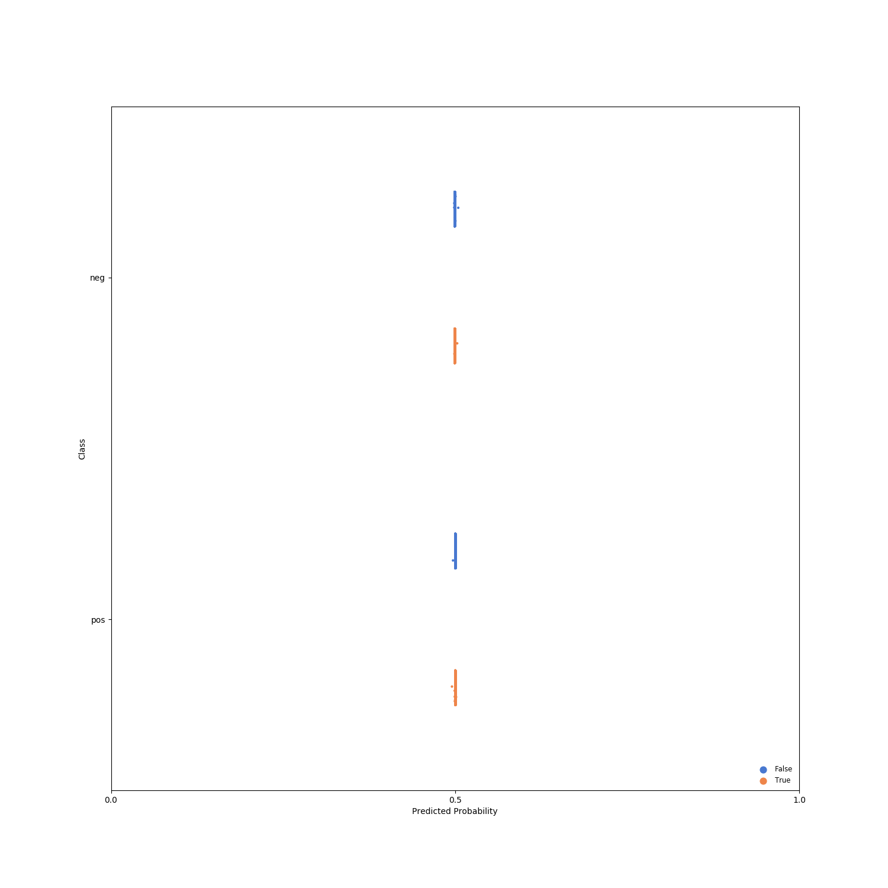
---
# Results: XLNet
```
(pid=45) INFO:gobbli.experiment.base:Transformer initialized with data directory '/data/users/jnance/gobbli/benchmark/benchmark_data/model/Transformer/bcc8a9b71b50460abf8789b013c978d5'
(pid=45) INFO:gobbli.experiment.base:Starting build.
(pid=45) INFO:gobbli.experiment.base:Build finished in 0.16 sec.
(pid=45) INFO:gobbli.experiment.base:Starting training.
(pid=45) INFO:gobbli.experiment.base:Training finished in 2385.69 sec.
(pid=45) INFO:gobbli.experiment.base:RESULTS:
(pid=45) INFO:gobbli.experiment.base:  Validation loss: 0.019337966107577084
(pid=45) INFO:gobbli.experiment.base:  Validation accuracy: 0.8936
(pid=45) INFO:gobbli.experiment.base:  Training loss: 0.0028089337879791854
(pid=45) INFO:gobbli.experiment.base:Transformer initialized with data directory '/data/users/jnance/gobbli/benchmark/benchmark_data/model/Transformer/b4a59e2c2e724e4481b2a139c32cfdab'
(pid=45) INFO:gobbli.experiment.base:Starting build.
(pid=45) INFO:gobbli.experiment.base:Build finished in 0.17 sec.
(pid=45) INFO:gobbli.experiment.base:Starting prediction.
(pid=45) INFO:gobbli.experiment.base:Prediction finished in 204.68 sec.
(pid=45) /usr/local/lib/python3.7/site-packages/ray/pyarrow_files/pyarrow/serialization.py:165: FutureWarning: The SparseDataFrame class is removed from pandas. Accessing it from the top-level namespace will also be removed in the next version
(pid=45)   if isinstance(obj, pd.SparseDataFrame):

```
|    |   valid_loss |   valid_accuracy |   train_loss | multilabel   | labels         | checkpoint                                                                                                                                                     | node_ip_address   | model_params                                                              |
|---:|-------------:|-----------------:|-------------:|:-------------|:---------------|:---------------------------------------------------------------------------------------------------------------------------------------------------------------|:------------------|:--------------------------------------------------------------------------|
|  0 |     0.019338 |           0.8936 |   0.00280893 | False        | ['neg', 'pos'] | /data/users/jnance/gobbli/benchmark/benchmark_data/model/Transformer/bcc8a9b71b50460abf8789b013c978d5/train/559d8078f84e4fa4b8f33f9c950110af/output/checkpoint | 172.80.10.2       | {'transformer_model': 'XLNet', 'transformer_weights': 'xlnet-base-cased'} |
```
Metrics:
--------
Weighted F1 Score: 0.8896881198666413
Weighted Precision Score: 0.8901710377196039
Weighted Recall Score: 0.88972
Accuracy: 0.88972

Classification Report:
----------------------
              precision    recall  f1-score   support

         neg       0.00      0.00      0.00         0
         pos       0.00      0.00      0.00         0

   micro avg       0.00      0.00      0.00         0
   macro avg       0.00      0.00      0.00         0
weighted avg       0.00      0.00      0.00         0


```

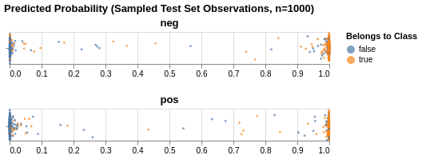
---
# Results: RoBERTa
```
(pid=271) INFO:gobbli.experiment.base:Transformer initialized with data directory '/data/users/jnance/gobbli/benchmark/benchmark_data/model/Transformer/08a2251f036a4899b6613602d62acf64'
(pid=271) INFO:gobbli.experiment.base:Starting build.
(pid=271) INFO:gobbli.experiment.base:Build finished in 0.21 sec.
(pid=271) INFO:gobbli.experiment.base:Starting training.
(pid=271) INFO:gobbli.experiment.base:Training finished in 1886.50 sec.
(pid=271) INFO:gobbli.experiment.base:RESULTS:
(pid=271) INFO:gobbli.experiment.base:  Validation loss: 0.016859848795831203
(pid=271) INFO:gobbli.experiment.base:  Validation accuracy: 0.8932
(pid=271) INFO:gobbli.experiment.base:  Training loss: 0.005073892575781792
(pid=271) INFO:gobbli.experiment.base:Transformer initialized with data directory '/data/users/jnance/gobbli/benchmark/benchmark_data/model/Transformer/dd28d9d153a74318ad848edc19d8bf5f'
(pid=271) INFO:gobbli.experiment.base:Starting build.
(pid=271) INFO:gobbli.experiment.base:Build finished in 0.22 sec.
(pid=271) INFO:gobbli.experiment.base:Starting prediction.
(pid=271) INFO:gobbli.experiment.base:Prediction finished in 135.27 sec.
(pid=271) /usr/local/lib/python3.7/site-packages/ray/pyarrow_files/pyarrow/serialization.py:165: FutureWarning: The SparseDataFrame class is removed from pandas. Accessing it from the top-level namespace will also be removed in the next version
(pid=271)   if isinstance(obj, pd.SparseDataFrame):

```
|    |   valid_loss |   valid_accuracy |   train_loss | multilabel   | labels         | checkpoint                                                                                                                                                     | node_ip_address   | model_params                                                            |
|---:|-------------:|-----------------:|-------------:|:-------------|:---------------|:---------------------------------------------------------------------------------------------------------------------------------------------------------------|:------------------|:------------------------------------------------------------------------|
|  0 |    0.0168598 |           0.8932 |   0.00507389 | False        | ['neg', 'pos'] | /data/users/jnance/gobbli/benchmark/benchmark_data/model/Transformer/08a2251f036a4899b6613602d62acf64/train/e1b508abb8ed4967bedd757b43240b41/output/checkpoint | 172.80.10.2       | {'transformer_model': 'Roberta', 'transformer_weights': 'roberta-base'} |
```
Metrics:
--------
Weighted F1 Score: 0.8889997568650675
Weighted Precision Score: 0.8890034082922622
Weighted Recall Score: 0.889
Accuracy: 0.889

Classification Report:
----------------------
              precision    recall  f1-score   support

         neg       0.00      0.00      0.00         0
         pos       0.00      0.00      0.00         0

   micro avg       0.00      0.00      0.00         0
   macro avg       0.00      0.00      0.00         0
weighted avg       0.00      0.00      0.00         0


```

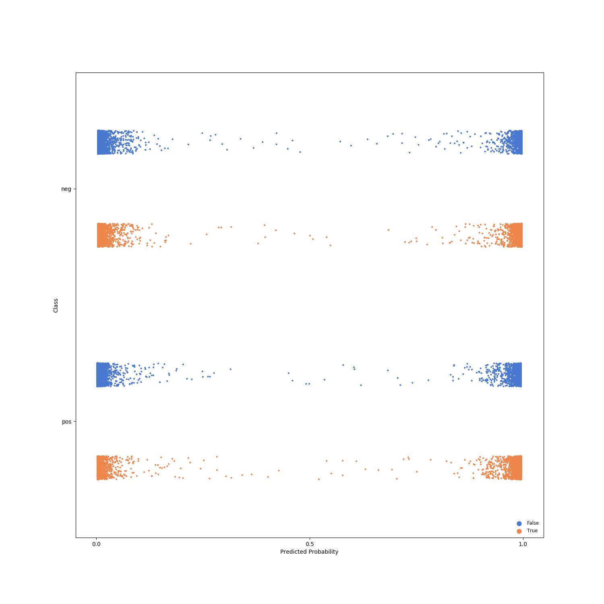
---
# Results: DistilBERT
```
(pid=483) INFO:gobbli.experiment.base:Transformer initialized with data directory '/data/users/jnance/gobbli/benchmark/benchmark_data/model/Transformer/58afa92d48d246768b760698ed6f9f8c'
(pid=483) INFO:gobbli.experiment.base:Starting build.
(pid=483) INFO:gobbli.experiment.base:Build finished in 0.24 sec.
(pid=483) INFO:gobbli.experiment.base:Starting training.
(pid=483) INFO:gobbli.experiment.base:Training finished in 1309.59 sec.
(pid=483) INFO:gobbli.experiment.base:RESULTS:
(pid=483) INFO:gobbli.experiment.base:  Validation loss: 0.021510520422831178
(pid=483) INFO:gobbli.experiment.base:  Validation accuracy: 0.8664
(pid=483) INFO:gobbli.experiment.base:  Training loss: 0.0006958735693711787
(pid=483) INFO:gobbli.experiment.base:Transformer initialized with data directory '/data/users/jnance/gobbli/benchmark/benchmark_data/model/Transformer/2b6000a2aa8948328277ba2ede2199e3'
(pid=483) INFO:gobbli.experiment.base:Starting build.
(pid=483) INFO:gobbli.experiment.base:Build finished in 0.20 sec.
(pid=483) INFO:gobbli.experiment.base:Starting training.
(pid=483) INFO:gobbli.experiment.base:Training finished in 1271.24 sec.
(pid=483) INFO:gobbli.experiment.base:RESULTS:
(pid=483) INFO:gobbli.experiment.base:  Validation loss: 0.023426591290533542
(pid=483) INFO:gobbli.experiment.base:  Validation accuracy: 0.8548
(pid=483) INFO:gobbli.experiment.base:  Training loss: 0.00114441422293894
(pid=483) INFO:gobbli.experiment.base:Transformer initialized with data directory '/data/users/jnance/gobbli/benchmark/benchmark_data/model/Transformer/519e54c2b59c4285b70585392b125613'
(pid=483) INFO:gobbli.experiment.base:Starting build.
(pid=483) INFO:gobbli.experiment.base:Build finished in 0.23 sec.
(pid=483) INFO:gobbli.experiment.base:Starting prediction.
(pid=483) INFO:gobbli.experiment.base:Prediction finished in 132.28 sec.
(pid=483) /usr/local/lib/python3.7/site-packages/ray/pyarrow_files/pyarrow/serialization.py:165: FutureWarning: The SparseDataFrame class is removed from pandas. Accessing it from the top-level namespace will also be removed in the next version
(pid=483)   if isinstance(obj, pd.SparseDataFrame):

```
|    |   valid_loss |   valid_accuracy |   train_loss | multilabel   | labels         | checkpoint                                                                                                                                                     | node_ip_address   | model_params                                                                                          |
|---:|-------------:|-----------------:|-------------:|:-------------|:---------------|:---------------------------------------------------------------------------------------------------------------------------------------------------------------|:------------------|:------------------------------------------------------------------------------------------------------|
|  0 |    0.0215105 |           0.8664 |  0.000695874 | False        | ['neg', 'pos'] | /data/users/jnance/gobbli/benchmark/benchmark_data/model/Transformer/58afa92d48d246768b760698ed6f9f8c/train/cb6a2161339e46aca0b3f84e14ea8a54/output/checkpoint | 172.80.10.2       | {'transformer_model': 'DistilBert', 'transformer_weights': 'distilbert-base-uncased'}                 |
|  1 |    0.0234266 |           0.8548 |  0.00114441  | False        | ['neg', 'pos'] | /data/users/jnance/gobbli/benchmark/benchmark_data/model/Transformer/2b6000a2aa8948328277ba2ede2199e3/train/c9775a474a9a472db73bca2c88249ce6/output/checkpoint | 172.80.10.2       | {'transformer_model': 'DistilBert', 'transformer_weights': 'distilbert-base-uncased-distilled-squad'} |
```
Metrics:
--------
Weighted F1 Score: 0.8641388395699184
Weighted Precision Score: 0.8643870136925497
Weighted Recall Score: 0.86416
Accuracy: 0.86416

Classification Report:
----------------------
              precision    recall  f1-score   support

         neg       0.00      0.00      0.00         0
         pos       0.00      0.00      0.00         0

   micro avg       0.00      0.00      0.00         0
   macro avg       0.00      0.00      0.00         0
weighted avg       0.00      0.00      0.00         0


```

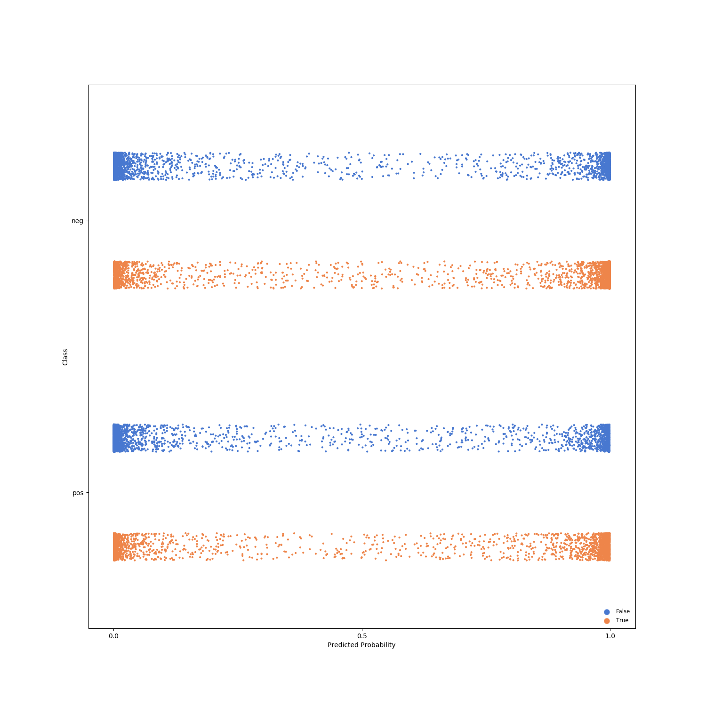
---
# Results: ALBERT
```
(pid=696) INFO:gobbli.experiment.base:Transformer initialized with data directory '/data/users/jnance/gobbli/benchmark/benchmark_data/model/Transformer/83cdde3f4ff34ce89ce6a83017a158db'
(pid=696) INFO:gobbli.experiment.base:Starting build.
(pid=696) INFO:gobbli.experiment.base:Build finished in 0.17 sec.
(pid=696) INFO:gobbli.experiment.base:Starting training.
(pid=696) INFO:gobbli.experiment.base:Training finished in 1537.64 sec.
(pid=696) INFO:gobbli.experiment.base:RESULTS:
(pid=696) INFO:gobbli.experiment.base:  Validation loss: 0.017922103345394135
(pid=696) INFO:gobbli.experiment.base:  Validation accuracy: 0.8568
(pid=696) INFO:gobbli.experiment.base:  Training loss: 0.0030251576885581017
(pid=696) INFO:gobbli.experiment.base:Transformer initialized with data directory '/data/users/jnance/gobbli/benchmark/benchmark_data/model/Transformer/0faea1cc752e4c6fb2b636611d87301a'
(pid=696) INFO:gobbli.experiment.base:Starting build.
(pid=696) INFO:gobbli.experiment.base:Build finished in 0.21 sec.
(pid=696) INFO:gobbli.experiment.base:Starting training.
(pid=696) INFO:gobbli.experiment.base:Training finished in 1564.51 sec.
(pid=696) INFO:gobbli.experiment.base:RESULTS:
(pid=696) INFO:gobbli.experiment.base:  Validation loss: 0.011985438811779022
(pid=696) INFO:gobbli.experiment.base:  Validation accuracy: 0.8344
(pid=696) INFO:gobbli.experiment.base:  Training loss: 0.01198964168727398
(pid=696) INFO:gobbli.experiment.base:Transformer initialized with data directory '/data/users/jnance/gobbli/benchmark/benchmark_data/model/Transformer/766f581291804f0480926d9ef37b5664'
(pid=696) INFO:gobbli.experiment.base:Starting build.
(pid=696) INFO:gobbli.experiment.base:Build finished in 0.18 sec.
(pid=696) INFO:gobbli.experiment.base:Starting prediction.
(pid=696) INFO:gobbli.experiment.base:Prediction finished in 135.32 sec.
(pid=696) /usr/local/lib/python3.7/site-packages/ray/pyarrow_files/pyarrow/serialization.py:165: FutureWarning: The SparseDataFrame class is removed from pandas. Accessing it from the top-level namespace will also be removed in the next version
(pid=696)   if isinstance(obj, pd.SparseDataFrame):

```
|    |   valid_loss |   valid_accuracy |   train_loss | multilabel   | labels         | checkpoint                                                                                                                                                     | node_ip_address   | model_params                                                             |
|---:|-------------:|-----------------:|-------------:|:-------------|:---------------|:---------------------------------------------------------------------------------------------------------------------------------------------------------------|:------------------|:-------------------------------------------------------------------------|
|  0 |    0.0179221 |           0.8568 |   0.00302516 | False        | ['neg', 'pos'] | /data/users/jnance/gobbli/benchmark/benchmark_data/model/Transformer/83cdde3f4ff34ce89ce6a83017a158db/train/811ffb962c834b51bf487f185c5db3a8/output/checkpoint | 172.80.10.2       | {'transformer_model': 'Albert', 'transformer_weights': 'albert-base-v1'} |
|  1 |    0.0119854 |           0.8344 |   0.0119896  | False        | ['neg', 'pos'] | /data/users/jnance/gobbli/benchmark/benchmark_data/model/Transformer/0faea1cc752e4c6fb2b636611d87301a/train/1341b3c880654804bd447e8d56fad5e9/output/checkpoint | 172.80.10.2       | {'transformer_model': 'Albert', 'transformer_weights': 'albert-base-v2'} |
```
Metrics:
--------
Weighted F1 Score: 0.8273984465860195
Weighted Precision Score: 0.8274117868243257
Weighted Recall Score: 0.8274
Accuracy: 0.8274

Classification Report:
----------------------
              precision    recall  f1-score   support

         neg       0.00      0.00      0.00         0
         pos       0.00      0.00      0.00         0

   micro avg       0.00      0.00      0.00         0
   macro avg       0.00      0.00      0.00         0
weighted avg       0.00      0.00      0.00         0


```

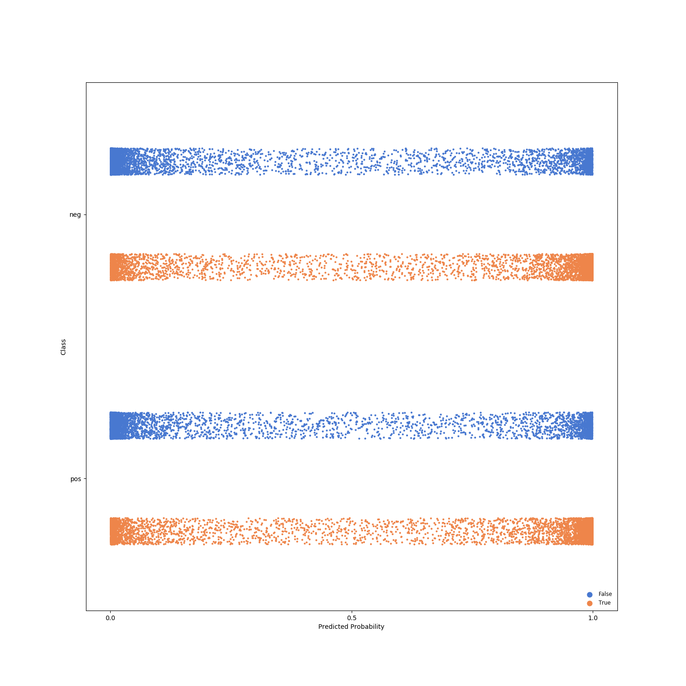
---
# Results: XLM-RoBERTa
```
(pid=911) INFO:gobbli.experiment.base:Transformer initialized with data directory '/data/users/jnance/gobbli/benchmark/benchmark_data/model/Transformer/5a35a362b75a477bbc3fa0f1d4b7b329'
(pid=911) INFO:gobbli.experiment.base:Starting build.
(pid=911) INFO:gobbli.experiment.base:Build finished in 0.16 sec.
(pid=911) INFO:gobbli.experiment.base:Starting training.
(pid=911) INFO:gobbli.experiment.base:Training finished in 1685.29 sec.
(pid=911) INFO:gobbli.experiment.base:RESULTS:
(pid=911) INFO:gobbli.experiment.base:  Validation loss: 0.02177449142932892
(pid=911) INFO:gobbli.experiment.base:  Validation accuracy: 0.4892
(pid=911) INFO:gobbli.experiment.base:  Training loss: 0.021700730556249617
(pid=910) INFO:gobbli.experiment.base:Transformer initialized with data directory '/data/users/jnance/gobbli/benchmark/benchmark_data/model/Transformer/6c89be08abf54bfc983d6809e469f44e'
(pid=910) INFO:gobbli.experiment.base:Starting build.
(pid=910) INFO:gobbli.experiment.base:Build finished in 0.23 sec.
(pid=910) INFO:gobbli.experiment.base:Starting prediction.
(pid=910) INFO:gobbli.experiment.base:Prediction finished in 132.11 sec.
(pid=910) /usr/local/lib/python3.7/site-packages/ray/pyarrow_files/pyarrow/serialization.py:165: FutureWarning: The SparseDataFrame class is removed from pandas. Accessing it from the top-level namespace will also be removed in the next version
(pid=910)   if isinstance(obj, pd.SparseDataFrame):

```
|    |   valid_loss |   valid_accuracy |   train_loss | multilabel   | labels         | checkpoint                                                                                                                                                     | node_ip_address   | model_params                                                                   |
|---:|-------------:|-----------------:|-------------:|:-------------|:---------------|:---------------------------------------------------------------------------------------------------------------------------------------------------------------|:------------------|:-------------------------------------------------------------------------------|
|  0 |    0.0217745 |           0.4892 |    0.0217007 | False        | ['neg', 'pos'] | /data/users/jnance/gobbli/benchmark/benchmark_data/model/Transformer/5a35a362b75a477bbc3fa0f1d4b7b329/train/fe8dfe640bf244ffab350176432dce17/output/checkpoint | 172.80.10.2       | {'transformer_model': 'XLMRoberta', 'transformer_weights': 'xlm-roberta-base'} |
```
Metrics:
--------
Weighted F1 Score: 0.33333333333333326
Weighted Precision Score: 0.25
Weighted Recall Score: 0.5
Accuracy: 0.5

Classification Report:
----------------------
              precision    recall  f1-score   support

         neg       0.00      0.00      0.00         0
         pos       0.00      0.00      0.00         0

   micro avg       0.00      0.00      0.00         0
   macro avg       0.00      0.00      0.00         0
weighted avg       0.00      0.00      0.00         0


```


---
# Results: SKLearn
```
(pid=1125) INFO:gobbli.experiment.base:SKLearnClassifier initialized with data directory '/data/users/jnance/gobbli/benchmark/benchmark_data/model/SKLearnClassifier/0e1cea5a30334471a64403e0a14af82b'
(pid=1125) INFO:gobbli.experiment.base:Starting build.
(pid=1125) INFO:gobbli.experiment.base:Build finished in 0.00 sec.
(pid=1125) INFO:gobbli.experiment.base:Starting training.
(pid=1125) INFO:gobbli.experiment.base:Training finished in 14.64 sec.
(pid=1125) INFO:gobbli.experiment.base:RESULTS:
(pid=1125) INFO:gobbli.experiment.base:  Validation loss: -0.8831828424147392
(pid=1125) INFO:gobbli.experiment.base:  Validation accuracy: 0.8832
(pid=1125) INFO:gobbli.experiment.base:  Training loss: -0.9301481917044141
(pid=1125) INFO:gobbli.experiment.base:SKLearnClassifier initialized with data directory '/data/users/jnance/gobbli/benchmark/benchmark_data/model/SKLearnClassifier/0437d1aa0f7f4095a6efdee1864759af'
(pid=1125) INFO:gobbli.experiment.base:Starting build.
(pid=1125) INFO:gobbli.experiment.base:Build finished in 0.00 sec.
(pid=1125) INFO:gobbli.experiment.base:Starting prediction.
(pid=1125) INFO:gobbli.experiment.base:Prediction finished in 7.29 sec.
(pid=1125) /usr/local/lib/python3.7/site-packages/ray/pyarrow_files/pyarrow/serialization.py:165: FutureWarning: The SparseDataFrame class is removed from pandas. Accessing it from the top-level namespace will also be removed in the next version
(pid=1125)   if isinstance(obj, pd.SparseDataFrame):

```
|    |   valid_loss |   valid_accuracy |   train_loss | multilabel   | labels         | checkpoint                                                                                                                                                                 | node_ip_address   | model_params   |
|---:|-------------:|-----------------:|-------------:|:-------------|:---------------|:---------------------------------------------------------------------------------------------------------------------------------------------------------------------------|:------------------|:---------------|
|  0 |    -0.883183 |           0.8832 |    -0.930148 | False        | ['neg', 'pos'] | /data/users/jnance/gobbli/benchmark/benchmark_data/model/SKLearnClassifier/0e1cea5a30334471a64403e0a14af82b/train/94255bd9aed1427b943c6bcae9b47090/output/estimator.joblib | 172.80.10.2       | {}             |
```
Metrics:
--------
Weighted F1 Score: 0.8781994931150106
Weighted Precision Score: 0.8782062957732819
Weighted Recall Score: 0.8782
Accuracy: 0.8782

Classification Report:
----------------------
              precision    recall  f1-score   support

         neg       0.00      0.00      0.00         0
         pos       0.00      0.00      0.00         0

   micro avg       0.00      0.00      0.00         0
   macro avg       0.00      0.00      0.00         0
weighted avg       0.00      0.00      0.00         0


```

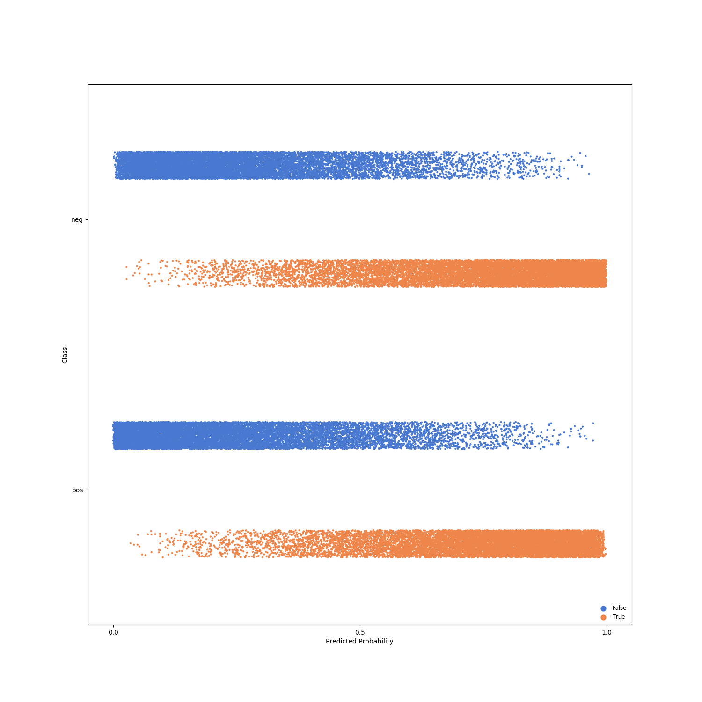
---
# Results: spaCy
```
(pid=1338) INFO:gobbli.experiment.base:SpaCyModel initialized with data directory '/data/users/jnance/gobbli/benchmark/benchmark_data/model/SpaCyModel/d820d71083f6444b8c6e872a9202d60d'
(pid=1338) INFO:gobbli.experiment.base:Starting build.
(pid=1338) INFO:gobbli.experiment.base:Build finished in 0.27 sec.
(pid=1338) INFO:gobbli.experiment.base:Starting training.
(pid=1338) /code/gobbli/model/spacy/model.py:176: UserWarning: The spaCy model doesn't batch validation data, so the validation batch size parameter will be ignored.
(pid=1338)   "The spaCy model doesn't batch validation data, so the validation "
(pid=1338) INFO:gobbli.experiment.base:Training finished in 497.69 sec.
(pid=1338) INFO:gobbli.experiment.base:RESULTS:
(pid=1338) INFO:gobbli.experiment.base:  Validation loss: 1.514052705431368e-12
(pid=1338) INFO:gobbli.experiment.base:  Validation accuracy: 0.8767999999991232
(pid=1338) INFO:gobbli.experiment.base:  Training loss: 2.5458573666213624e-06
(pid=1338) INFO:gobbli.experiment.base:SpaCyModel initialized with data directory '/data/users/jnance/gobbli/benchmark/benchmark_data/model/SpaCyModel/967e970f21e84bfaacb64586b1cd54f0'
(pid=1338) INFO:gobbli.experiment.base:Starting build.
(pid=1338) INFO:gobbli.experiment.base:Build finished in 0.29 sec.
(pid=1338) INFO:gobbli.experiment.base:Starting training.
(pid=1338) INFO:gobbli.experiment.base:Training finished in 355.70 sec.
(pid=1338) INFO:gobbli.experiment.base:RESULTS:
(pid=1338) INFO:gobbli.experiment.base:  Validation loss: 1.464429555397828e-12
(pid=1338) INFO:gobbli.experiment.base:  Validation accuracy: 0.8805999999991193
(pid=1338) INFO:gobbli.experiment.base:  Training loss: 2.4804763286397245e-06
(pid=1338) INFO:gobbli.experiment.base:SpaCyModel initialized with data directory '/data/users/jnance/gobbli/benchmark/benchmark_data/model/SpaCyModel/44fcc0f4c2ac4ea2a447be386b89b2be'
(pid=1338) INFO:gobbli.experiment.base:Starting build.
(pid=1338) INFO:gobbli.experiment.base:Build finished in 0.28 sec.
(pid=1338) INFO:gobbli.experiment.base:Starting training.
(pid=1338) INFO:gobbli.experiment.base:Training finished in 612.76 sec.
(pid=1338) INFO:gobbli.experiment.base:RESULTS:
(pid=1338) INFO:gobbli.experiment.base:  Validation loss: 1.4999768538359603e-12
(pid=1338) INFO:gobbli.experiment.base:  Validation accuracy: 0.8765999999991233
(pid=1338) INFO:gobbli.experiment.base:  Training loss: 3.3720109899491034e-06
(pid=1338) INFO:gobbli.experiment.base:SpaCyModel initialized with data directory '/data/users/jnance/gobbli/benchmark/benchmark_data/model/SpaCyModel/3dc2e292bec84eb1a5f30746b712c7c9'
(pid=1338) INFO:gobbli.experiment.base:Starting build.
(pid=1338) INFO:gobbli.experiment.base:Build finished in 0.33 sec.
(pid=1338) INFO:gobbli.experiment.base:Starting training.
(pid=1338) INFO:gobbli.experiment.base:Training finished in 503.30 sec.
(pid=1338) INFO:gobbli.experiment.base:RESULTS:
(pid=1338) INFO:gobbli.experiment.base:  Validation loss: 1.2618286859833461e-12
(pid=1338) INFO:gobbli.experiment.base:  Validation accuracy: 0.8945999999991053
(pid=1338) INFO:gobbli.experiment.base:  Training loss: 2.94094138047285e-06
(pid=1338) INFO:gobbli.experiment.base:SpaCyModel initialized with data directory '/data/users/jnance/gobbli/benchmark/benchmark_data/model/SpaCyModel/4611dca9050e4c9caa7158d44698c2dd'
(pid=1338) INFO:gobbli.experiment.base:Starting build.
(pid=1338) INFO:gobbli.experiment.base:Build finished in 0.40 sec.
(pid=1338) INFO:gobbli.experiment.base:Starting training.
(pid=1338) INFO:gobbli.experiment.base:Training finished in 631.05 sec.
(pid=1338) INFO:gobbli.experiment.base:RESULTS:
(pid=1338) INFO:gobbli.experiment.base:  Validation loss: 1.2499411283783957e-12
(pid=1338) INFO:gobbli.experiment.base:  Validation accuracy: 0.8945999999991053
(pid=1338) INFO:gobbli.experiment.base:  Training loss: 1.927604680491868e-06
(pid=1338) INFO:gobbli.experiment.base:SpaCyModel initialized with data directory '/data/users/jnance/gobbli/benchmark/benchmark_data/model/SpaCyModel/4a7e424948124b80bdbf09794debddba'
(pid=1338) INFO:gobbli.experiment.base:Starting build.
(pid=1338) INFO:gobbli.experiment.base:Build finished in 0.31 sec.
(pid=1338) INFO:gobbli.experiment.base:Starting training.
(pid=1338) INFO:gobbli.experiment.base:Training finished in 512.05 sec.
(pid=1338) INFO:gobbli.experiment.base:RESULTS:
(pid=1338) INFO:gobbli.experiment.base:  Validation loss: 1.2148907657660856e-12
(pid=1338) INFO:gobbli.experiment.base:  Validation accuracy: 0.9015999999990983
(pid=1338) INFO:gobbli.experiment.base:  Training loss: 2.0593311421521322e-06
(pid=1338) INFO:gobbli.experiment.base:SpaCyModel initialized with data directory '/data/users/jnance/gobbli/benchmark/benchmark_data/model/SpaCyModel/cc4ec419a05147428f495e2090f4ff08'
(pid=1338) INFO:gobbli.experiment.base:Starting build.
(pid=1338) INFO:gobbli.experiment.base:Build finished in 0.28 sec.
(pid=1338) INFO:gobbli.experiment.base:Starting prediction.
(pid=1338) INFO:gobbli.experiment.base:Prediction finished in 58.89 sec.
(pid=1338) /usr/local/lib/python3.7/site-packages/ray/pyarrow_files/pyarrow/serialization.py:165: FutureWarning: The SparseDataFrame class is removed from pandas. Accessing it from the top-level namespace will also be removed in the next version
(pid=1338)   if isinstance(obj, pd.SparseDataFrame):

```
|    |   valid_loss |   valid_accuracy |   train_loss | multilabel   | labels         | checkpoint                                                                                                                                                    | node_ip_address   | model_params                                              |
|---:|-------------:|-----------------:|-------------:|:-------------|:---------------|:--------------------------------------------------------------------------------------------------------------------------------------------------------------|:------------------|:----------------------------------------------------------|
|  0 |  1.51405e-12 |           0.8768 |  2.54586e-06 | False        | ['neg', 'pos'] | /data/users/jnance/gobbli/benchmark/benchmark_data/model/SpaCyModel/d820d71083f6444b8c6e872a9202d60d/train/beb1652d409e4704a5d099529ef1f36f/output/checkpoint | 172.80.10.2       | {'architecture': 'bow', 'model': 'en_core_web_sm'}        |
|  1 |  1.46443e-12 |           0.8806 |  2.48048e-06 | False        | ['neg', 'pos'] | /data/users/jnance/gobbli/benchmark/benchmark_data/model/SpaCyModel/967e970f21e84bfaacb64586b1cd54f0/train/8bc49a908eb04b50ab49d1b45a051685/output/checkpoint | 172.80.10.2       | {'architecture': 'bow', 'model': 'en_core_web_lg'}        |
|  2 |  1.49998e-12 |           0.8766 |  3.37201e-06 | False        | ['neg', 'pos'] | /data/users/jnance/gobbli/benchmark/benchmark_data/model/SpaCyModel/44fcc0f4c2ac4ea2a447be386b89b2be/train/d1ea8b4a0c6248c9be838d90ca889030/output/checkpoint | 172.80.10.2       | {'architecture': 'simple_cnn', 'model': 'en_core_web_sm'} |
|  3 |  1.26183e-12 |           0.8946 |  2.94094e-06 | False        | ['neg', 'pos'] | /data/users/jnance/gobbli/benchmark/benchmark_data/model/SpaCyModel/3dc2e292bec84eb1a5f30746b712c7c9/train/ba0b0954d8a74327ab1f3fa87964b144/output/checkpoint | 172.80.10.2       | {'architecture': 'simple_cnn', 'model': 'en_core_web_lg'} |
|  4 |  1.24994e-12 |           0.8946 |  1.9276e-06  | False        | ['neg', 'pos'] | /data/users/jnance/gobbli/benchmark/benchmark_data/model/SpaCyModel/4611dca9050e4c9caa7158d44698c2dd/train/dbe4e49acf804922bbebadfb150c34a5/output/checkpoint | 172.80.10.2       | {'architecture': 'ensemble', 'model': 'en_core_web_sm'}   |
|  5 |  1.21489e-12 |           0.9016 |  2.05933e-06 | False        | ['neg', 'pos'] | /data/users/jnance/gobbli/benchmark/benchmark_data/model/SpaCyModel/4a7e424948124b80bdbf09794debddba/train/c2b1b7e41bf3474a944f77430a445b0f/output/checkpoint | 172.80.10.2       | {'architecture': 'ensemble', 'model': 'en_core_web_lg'}   |
```
Metrics:
--------
Weighted F1 Score: 0.8953599330303571
Weighted Precision Score: 0.8953610121241911
Weighted Recall Score: 0.89536
Accuracy: 0.89536

Classification Report:
----------------------
              precision    recall  f1-score   support

         neg       0.00      0.00      0.00         0
         pos       0.00      0.00      0.00         0

   micro avg       0.00      0.00      0.00         0
   macro avg       0.00      0.00      0.00         0
weighted avg       0.00      0.00      0.00         0


```

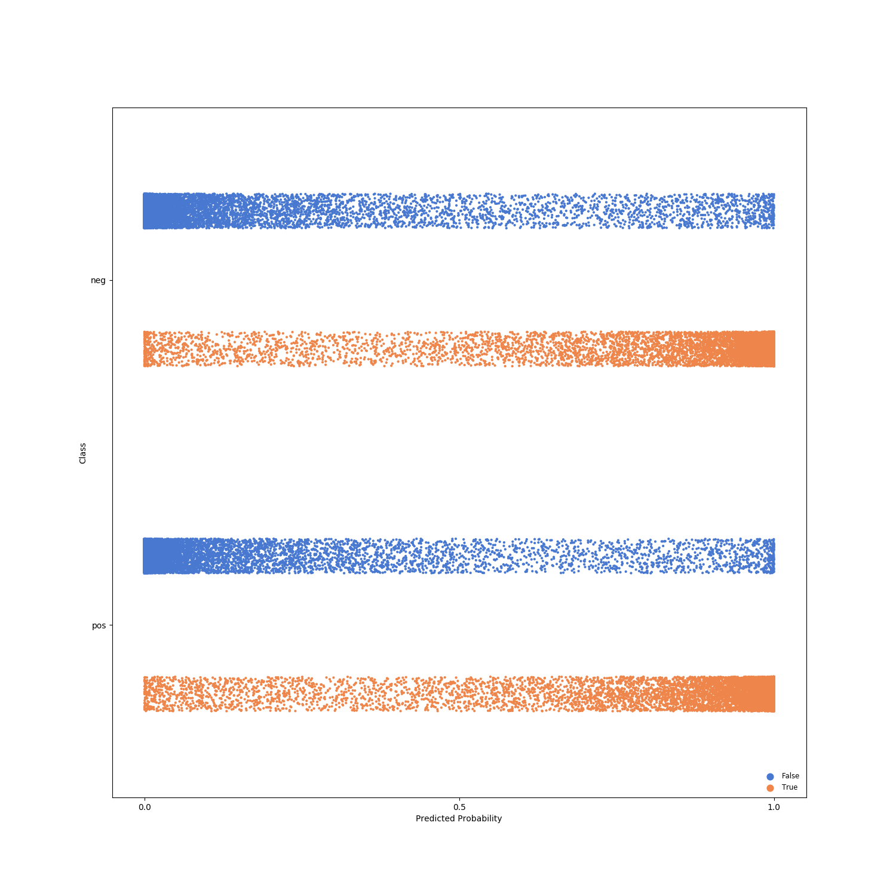
---
# Results: spacy-transformers
```
(pid=1550) INFO:gobbli.experiment.base:SpaCyModel initialized with data directory '/data/users/jnance/gobbli/benchmark/benchmark_data/model/SpaCyModel/4c7c27aff9f14cc294b36e82453bb228'
(pid=1550) INFO:gobbli.experiment.base:Starting build.
(pid=1550) INFO:gobbli.experiment.base:Build finished in 0.25 sec.
(pid=1550) INFO:gobbli.experiment.base:Starting training.
(pid=1550) /code/gobbli/model/spacy/model.py:176: UserWarning: The spaCy model doesn't batch validation data, so the validation batch size parameter will be ignored.
(pid=1550)   "The spaCy model doesn't batch validation data, so the validation "
(pid=1550) INFO:gobbli.experiment.base:Training finished in 7927.30 sec.
(pid=1550) INFO:gobbli.experiment.base:RESULTS:
(pid=1550) INFO:gobbli.experiment.base:  Validation loss: 2.3743533361653136e-12
(pid=1550) INFO:gobbli.experiment.base:  Validation accuracy: 0.8043999999991955
(pid=1550) INFO:gobbli.experiment.base:  Training loss: 2.278554696628703e-05
(pid=1550) INFO:gobbli.experiment.base:SpaCyModel initialized with data directory '/data/users/jnance/gobbli/benchmark/benchmark_data/model/SpaCyModel/465b45ef238f480991aa09c078888cff'
(pid=1550) INFO:gobbli.experiment.base:Starting build.
(pid=1550) INFO:gobbli.experiment.base:Build finished in 0.35 sec.
(pid=1550) INFO:gobbli.experiment.base:Starting training.
(pid=1550) INFO:gobbli.experiment.base:Training finished in 9247.67 sec.
(pid=1550) INFO:gobbli.experiment.base:RESULTS:
(pid=1550) INFO:gobbli.experiment.base:  Validation loss: 4.0018200309077656e-12
(pid=1550) INFO:gobbli.experiment.base:  Validation accuracy: 0.49799999999950195
(pid=1550) INFO:gobbli.experiment.base:  Training loss: 0.00012271622593980282
(pid=1550) INFO:gobbli.experiment.base:SpaCyModel initialized with data directory '/data/users/jnance/gobbli/benchmark/benchmark_data/model/SpaCyModel/e06e1e0ba7f74b51becb654ddcfb962e'
(pid=1550) INFO:gobbli.experiment.base:Starting build.
(pid=1550) INFO:gobbli.experiment.base:Build finished in 0.40 sec.
(pid=1550) INFO:gobbli.experiment.base:Starting training.
(pid=1550) INFO:gobbli.experiment.base:Training finished in 7814.58 sec.
(pid=1550) INFO:gobbli.experiment.base:RESULTS:
(pid=1550) INFO:gobbli.experiment.base:  Validation loss: 4.003729969781489e-12
(pid=1550) INFO:gobbli.experiment.base:  Validation accuracy: 0.49799999999950195
(pid=1550) INFO:gobbli.experiment.base:  Training loss: 0.00012297076051472687
(pid=1550) INFO:gobbli.experiment.base:SpaCyModel initialized with data directory '/data/users/jnance/gobbli/benchmark/benchmark_data/model/SpaCyModel/708a1a4b6d684b96b0f597b91e1947d5'
(pid=1550) INFO:gobbli.experiment.base:Starting build.
(pid=1550) INFO:gobbli.experiment.base:Build finished in 0.34 sec.
(pid=1550) INFO:gobbli.experiment.base:Starting training.
(pid=1550) INFO:gobbli.experiment.base:Training finished in 5899.18 sec.
(pid=1550) INFO:gobbli.experiment.base:RESULTS:
(pid=1550) INFO:gobbli.experiment.base:  Validation loss: 2.0054175209338608e-12
(pid=1550) INFO:gobbli.experiment.base:  Validation accuracy: 0.8479999999991519
(pid=1550) INFO:gobbli.experiment.base:  Training loss: 3.980713727162897e-06
(pid=1550) INFO:gobbli.experiment.base:SpaCyModel initialized with data directory '/data/users/jnance/gobbli/benchmark/benchmark_data/model/SpaCyModel/ce3aad4a5ca9499c909ac2e5883246a9'
(pid=1550) INFO:gobbli.experiment.base:Starting build.
(pid=1550) INFO:gobbli.experiment.base:Build finished in 0.27 sec.
(pid=1550) INFO:gobbli.experiment.base:Starting prediction.
(pid=1550) INFO:gobbli.experiment.base:Prediction finished in 708.64 sec.
(pid=1550) /usr/local/lib/python3.7/site-packages/ray/pyarrow_files/pyarrow/serialization.py:165: FutureWarning: The SparseDataFrame class is removed from pandas. Accessing it from the top-level namespace will also be removed in the next version
(pid=1550)   if isinstance(obj, pd.SparseDataFrame):

```
|    |   valid_loss |   valid_accuracy |   train_loss | multilabel   | labels         | checkpoint                                                                                                                                                    | node_ip_address   | model_params                                 |
|---:|-------------:|-----------------:|-------------:|:-------------|:---------------|:--------------------------------------------------------------------------------------------------------------------------------------------------------------|:------------------|:---------------------------------------------|
|  0 |  2.37435e-12 |           0.8044 |  2.27855e-05 | False        | ['neg', 'pos'] | /data/users/jnance/gobbli/benchmark/benchmark_data/model/SpaCyModel/4c7c27aff9f14cc294b36e82453bb228/train/f1c15f7b8f3b4789b7cc3d8509f813a4/output/checkpoint | 172.80.10.2       | {'model': 'en_trf_bertbaseuncased_lg'}       |
|  1 |  4.00182e-12 |           0.498  |  0.000122716 | False        | ['neg', 'pos'] | /data/users/jnance/gobbli/benchmark/benchmark_data/model/SpaCyModel/465b45ef238f480991aa09c078888cff/train/bf4d19786f2948638cadfdcc949d5093/output/checkpoint | 172.80.10.2       | {'model': 'en_trf_xlnetbasecased_lg'}        |
|  2 |  4.00373e-12 |           0.498  |  0.000122971 | False        | ['neg', 'pos'] | /data/users/jnance/gobbli/benchmark/benchmark_data/model/SpaCyModel/e06e1e0ba7f74b51becb654ddcfb962e/train/db858c5c264847478d486c850e9cd513/output/checkpoint | 172.80.10.2       | {'model': 'en_trf_robertabase_lg'}           |
|  3 |  2.00542e-12 |           0.848  |  3.98071e-06 | False        | ['neg', 'pos'] | /data/users/jnance/gobbli/benchmark/benchmark_data/model/SpaCyModel/708a1a4b6d684b96b0f597b91e1947d5/train/ab68b0282a6f4c84a61d8bde5a6bcb2e/output/checkpoint | 172.80.10.2       | {'model': 'en_trf_distilbertbaseuncased_lg'} |
```
Metrics:
--------
Weighted F1 Score: 0.8407997391662927
Weighted Precision Score: 0.8408022334815173
Weighted Recall Score: 0.8408
Accuracy: 0.8408

Classification Report:
----------------------
              precision    recall  f1-score   support

         neg       0.00      0.00      0.00         0
         pos       0.00      0.00      0.00         0

   micro avg       0.00      0.00      0.00         0
   macro avg       0.00      0.00      0.00         0
weighted avg       0.00      0.00      0.00         0


```

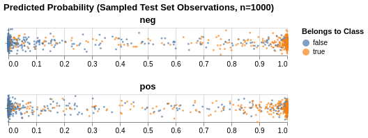
---