# Results: BERT
|    |   data_proportion |   num_documents |   Weighted F1 Score |   Weighted Precision Score |   Weighted Recall Score |   Accuracy |
|---:|------------------:|----------------:|--------------------:|---------------------------:|------------------------:|-----------:|
|  0 |             0.005 |             125 |            0.74607  |                   0.750071 |                 0.74688 |    0.74688 |
|  1 |             0.01  |             250 |            0.781651 |                   0.784314 |                 0.78208 |    0.78208 |
|  2 |             0.1   |            2500 |            0.838392 |                   0.838467 |                 0.8384  |    0.8384  |
|  3 |             0.25  |            6250 |            0.85648  |                   0.856917 |                 0.85652 |    0.85652 |
|  4 |             0.33  |            8250 |            0.862295 |                   0.86305  |                 0.86236 |    0.86236 |
|  5 |             0.5   |           12500 |            0.871105 |                   0.871296 |                 0.87112 |    0.87112 |
|  6 |             0.75  |           18750 |            0.879389 |                   0.879541 |                 0.8794  |    0.8794  |

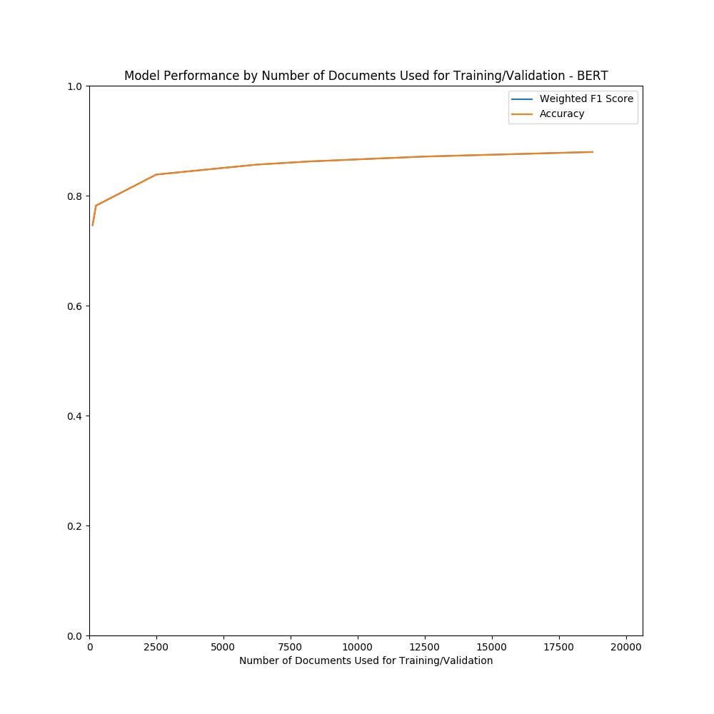
---
# Results: MTDNN
|    |   data_proportion |   num_documents |   Weighted F1 Score |   Weighted Precision Score |   Weighted Recall Score |   Accuracy |
|---:|------------------:|----------------:|--------------------:|---------------------------:|------------------------:|-----------:|
|  0 |             0.005 |             125 |            0.823739 |                   0.829687 |                 0.82444 |    0.82444 |
|  1 |             0.01  |             250 |            0.835166 |                   0.836581 |                 0.83532 |    0.83532 |
|  2 |             0.1   |            2500 |            0.858437 |                   0.858475 |                 0.85844 |    0.85844 |
|  3 |             0.25  |            6250 |            0.862921 |                   0.863841 |                 0.863   |    0.863   |
|  4 |             0.33  |            8250 |            0.866312 |                   0.866405 |                 0.86632 |    0.86632 |
|  5 |             0.5   |           12500 |            0.86768  |                   0.867684 |                 0.86768 |    0.86768 |
|  6 |             0.75  |           18750 |            0.87688  |                   0.876881 |                 0.87688 |    0.87688 |

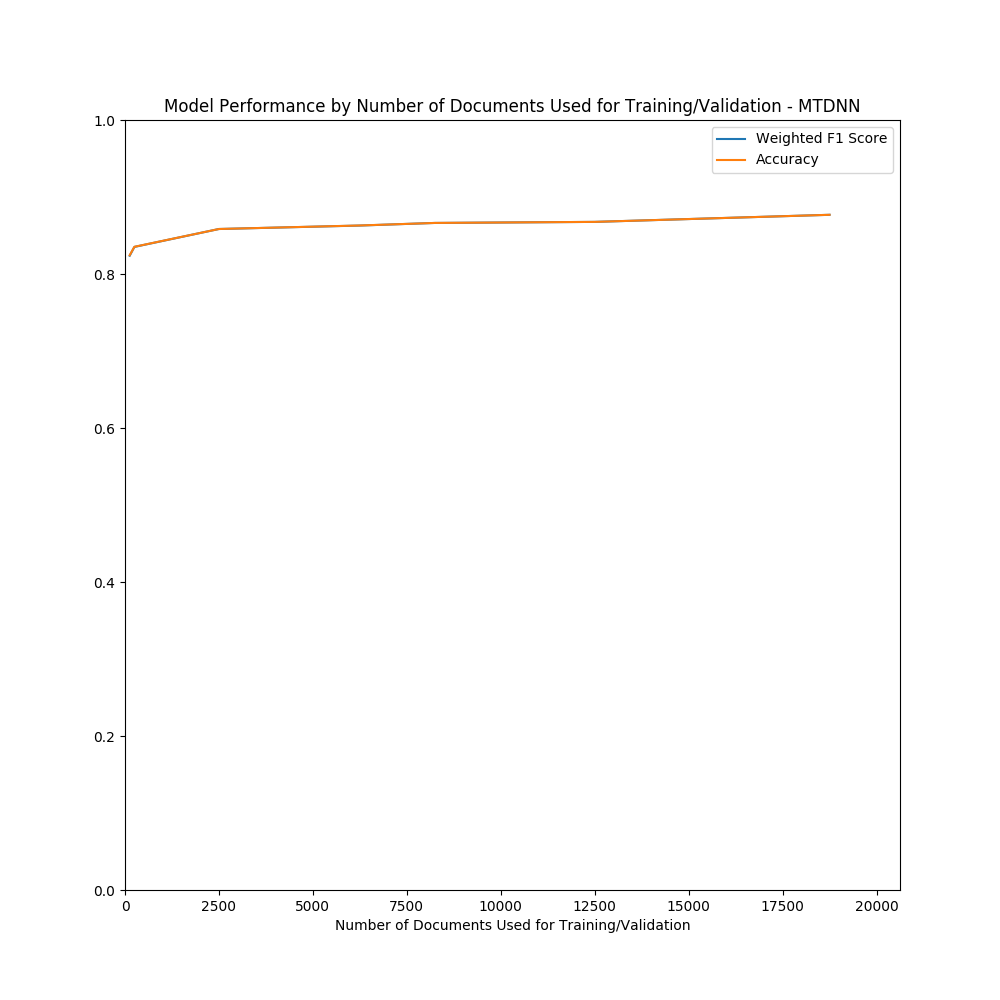
---
# Results: FastText
|    |   data_proportion |   num_documents |   Weighted F1 Score |   Weighted Precision Score |   Weighted Recall Score |   Accuracy |
|---:|------------------:|----------------:|--------------------:|---------------------------:|------------------------:|-----------:|
|  0 |             0.005 |             125 |            0.333422 |                   0.75001  |                 0.50004 |    0.50004 |
|  1 |             0.01  |             250 |            0.589766 |                   0.619454 |                 0.60348 |    0.60348 |
|  2 |             0.1   |            2500 |            0.800598 |                   0.800614 |                 0.8006  |    0.8006  |
|  3 |             0.25  |            6250 |            0.854741 |                   0.85495  |                 0.85476 |    0.85476 |
|  4 |             0.33  |            8250 |            0.8628   |                   0.8628   |                 0.8628  |    0.8628  |
|  5 |             0.5   |           12500 |            0.872959 |                   0.872967 |                 0.87296 |    0.87296 |
|  6 |             0.75  |           18750 |            0.88352  |                   0.883524 |                 0.88352 |    0.88352 |

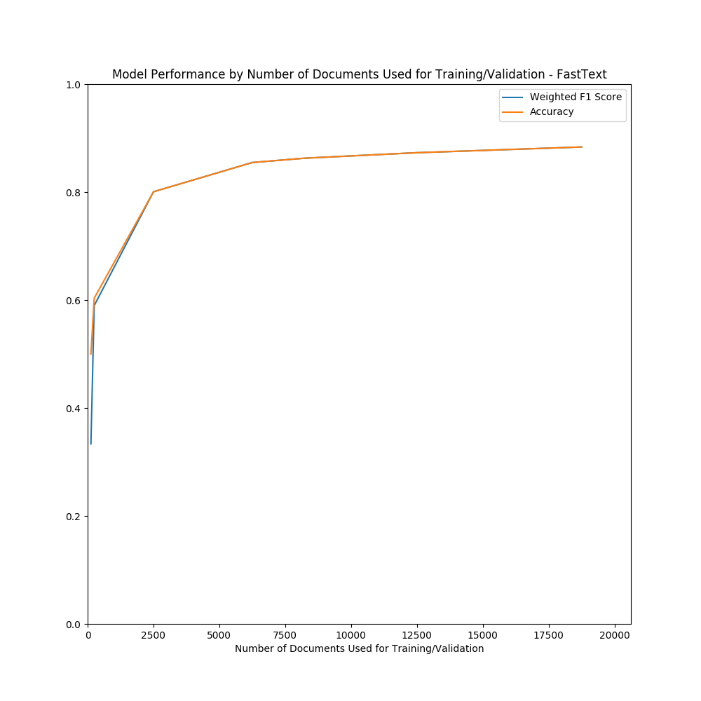
---
# Results: XLM
|    |   data_proportion |   num_documents |   Weighted F1 Score |   Weighted Precision Score |   Weighted Recall Score |   Accuracy |
|---:|------------------:|----------------:|--------------------:|---------------------------:|------------------------:|-----------:|
|  0 |             0.005 |             125 |            0.333333 |                   0.25     |                 0.5     |    0.5     |
|  1 |             0.01  |             250 |            0.453665 |                   0.571183 |                 0.53092 |    0.53092 |
|  2 |             0.1   |            2500 |            0.771882 |                   0.77233  |                 0.77196 |    0.77196 |
|  3 |             0.25  |            6250 |            0.333333 |                   0.25     |                 0.5     |    0.5     |
|  4 |             0.33  |            8250 |            0.333333 |                   0.25     |                 0.5     |    0.5     |
|  5 |             0.5   |           12500 |            0.333333 |                   0.25     |                 0.5     |    0.5     |
|  6 |             0.75  |           18750 |            0.333333 |                   0.25     |                 0.5     |    0.5     |

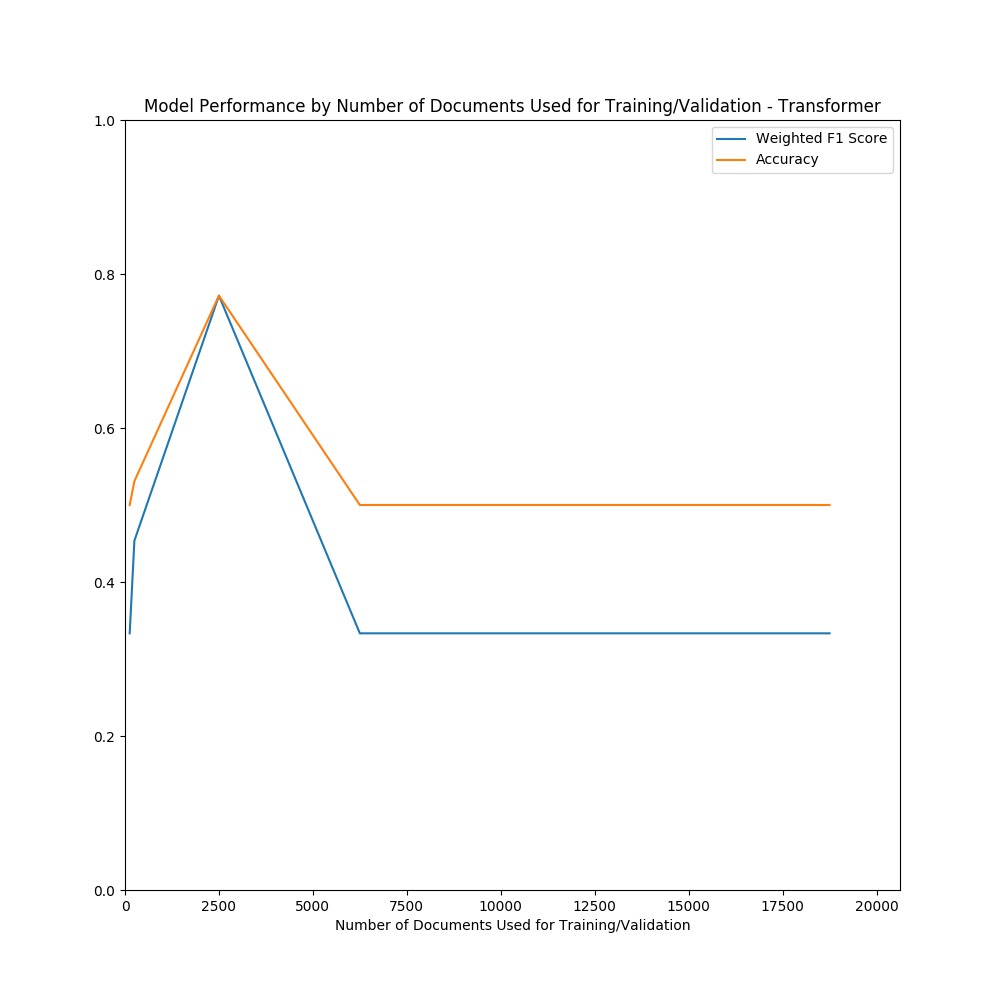
---
# Results: XLNet
|    |   data_proportion |   num_documents |   Weighted F1 Score |   Weighted Precision Score |   Weighted Recall Score |   Accuracy |
|---:|------------------:|----------------:|--------------------:|---------------------------:|------------------------:|-----------:|
|  0 |             0.005 |             125 |            0.805214 |                   0.814967 |                 0.80652 |    0.80652 |
|  1 |             0.01  |             250 |            0.843484 |                   0.844229 |                 0.84356 |    0.84356 |
|  2 |             0.1   |            2500 |            0.866762 |                   0.867215 |                 0.8668  |    0.8668  |
|  3 |             0.25  |            6250 |            0.880065 |                   0.880265 |                 0.88008 |    0.88008 |
|  4 |             0.33  |            8250 |            0.878197 |                   0.87824  |                 0.8782  |    0.8782  |
|  5 |             0.5   |           12500 |            0.88088  |                   0.88088  |                 0.88088 |    0.88088 |
|  6 |             0.75  |           18750 |            0.888433 |                   0.888538 |                 0.88844 |    0.88844 |

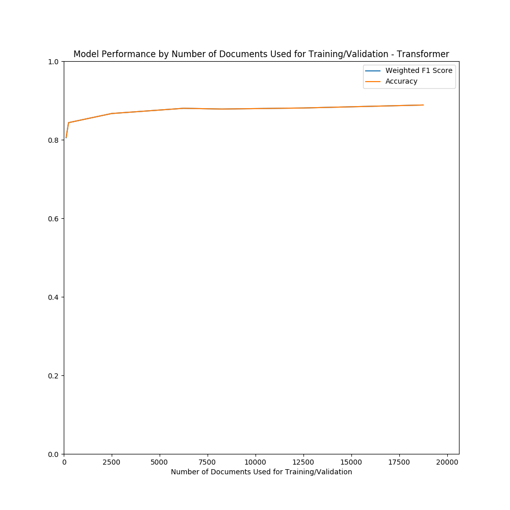
---
# Results: RoBERTa
|    |   data_proportion |   num_documents |   Weighted F1 Score |   Weighted Precision Score |   Weighted Recall Score |   Accuracy |
|---:|------------------:|----------------:|--------------------:|---------------------------:|------------------------:|-----------:|
|  0 |             0.005 |             125 |            0.338979 |                   0.742939 |                 0.50252 |    0.50252 |
|  1 |             0.01  |             250 |            0.833661 |                   0.833831 |                 0.83368 |    0.83368 |
|  2 |             0.1   |            2500 |            0.865881 |                   0.866342 |                 0.86592 |    0.86592 |
|  3 |             0.25  |            6250 |            0.875998 |                   0.87603  |                 0.876   |    0.876   |
|  4 |             0.33  |            8250 |            0.882438 |                   0.882467 |                 0.88244 |    0.88244 |
|  5 |             0.5   |           12500 |            0.333333 |                   0.25     |                 0.5     |    0.5     |
|  6 |             0.75  |           18750 |            0.888439 |                   0.88845  |                 0.88844 |    0.88844 |

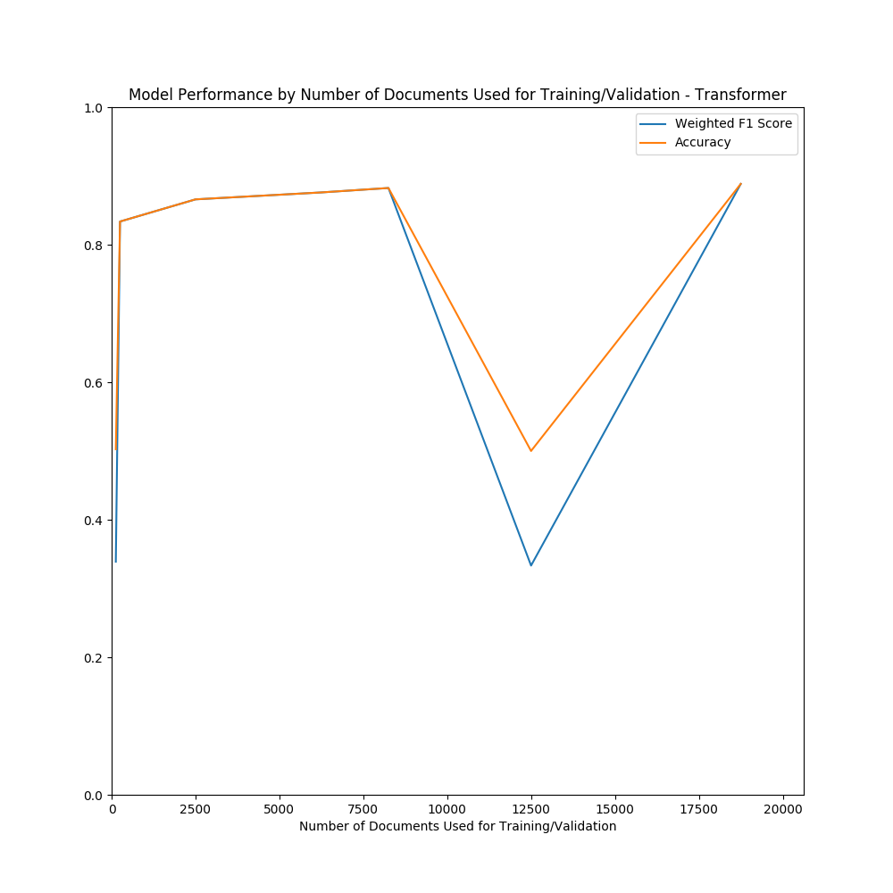
---
# Results: DistilBERT
|    |   data_proportion |   num_documents |   Weighted F1 Score |   Weighted Precision Score |   Weighted Recall Score |   Accuracy |
|---:|------------------:|----------------:|--------------------:|---------------------------:|------------------------:|-----------:|
|  0 |             0.005 |             125 |            0.378616 |                   0.740677 |                 0.52064 |    0.52064 |
|  1 |             0.01  |             250 |            0.754579 |                   0.755721 |                 0.7548  |    0.7548  |
|  2 |             0.1   |            2500 |            0.828095 |                   0.82831  |                 0.82812 |    0.82812 |
|  3 |             0.25  |            6250 |            0.843423 |                   0.843985 |                 0.84348 |    0.84348 |
|  4 |             0.33  |            8250 |            0.847057 |                   0.847292 |                 0.84708 |    0.84708 |
|  5 |             0.5   |           12500 |            0.854278 |                   0.854728 |                 0.85432 |    0.85432 |
|  6 |             0.75  |           18750 |            0.862146 |                   0.86231  |                 0.86216 |    0.86216 |

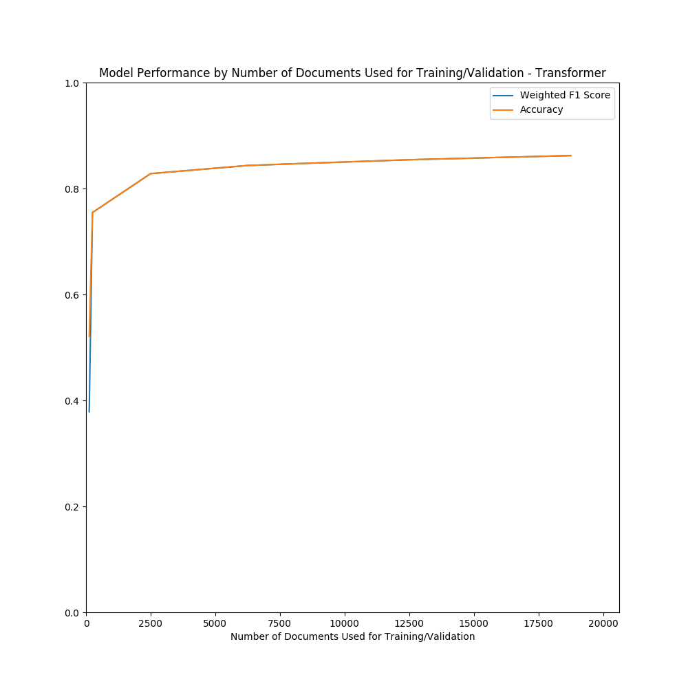
---
# Results: ALBERT
|    |   data_proportion |   num_documents |   Weighted F1 Score |   Weighted Precision Score |   Weighted Recall Score |   Accuracy |
|---:|------------------:|----------------:|--------------------:|---------------------------:|------------------------:|-----------:|
|  0 |             0.005 |             125 |            0.559743 |                   0.580711 |                 0.57184 |    0.57184 |
|  1 |             0.01  |             250 |            0.604522 |                   0.616544 |                 0.61004 |    0.61004 |
|  2 |             0.1   |            2500 |            0.811767 |                   0.813246 |                 0.81196 |    0.81196 |
|  3 |             0.25  |            6250 |            0.831873 |                   0.831936 |                 0.83188 |    0.83188 |
|  4 |             0.33  |            8250 |            0.847549 |                   0.847665 |                 0.84756 |    0.84756 |
|  5 |             0.5   |           12500 |            0.836695 |                   0.836927 |                 0.83672 |    0.83672 |
|  6 |             0.75  |           18750 |            0.852635 |                   0.853112 |                 0.85268 |    0.85268 |

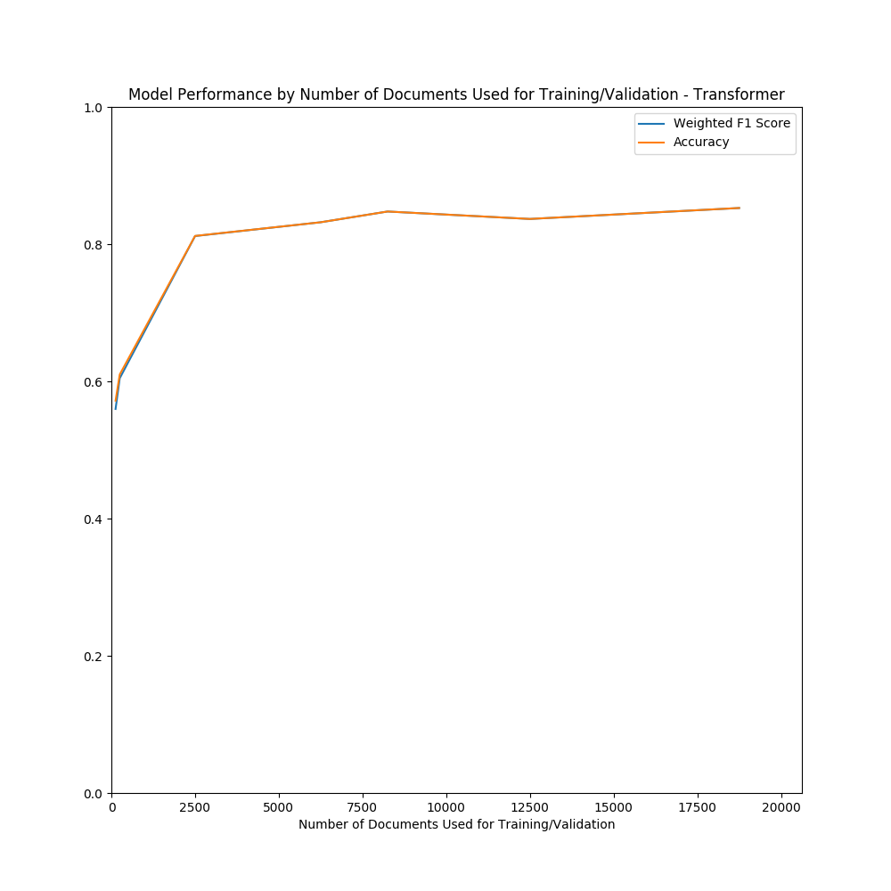
---
# Results: XLM-RoBERTa
|    |   data_proportion |   num_documents |   Weighted F1 Score |   Weighted Precision Score |   Weighted Recall Score |   Accuracy |
|---:|------------------:|----------------:|--------------------:|---------------------------:|------------------------:|-----------:|
|  0 |             0.005 |             125 |            0.333333 |                   0.25     |                 0.5     |    0.5     |
|  1 |             0.01  |             250 |            0.516406 |                   0.689123 |                 0.58376 |    0.58376 |
|  2 |             0.1   |            2500 |            0.7987   |                   0.799119 |                 0.79876 |    0.79876 |
|  3 |             0.25  |            6250 |            0.333333 |                   0.25     |                 0.5     |    0.5     |
|  4 |             0.33  |            8250 |            0.852605 |                   0.853402 |                 0.85268 |    0.85268 |
|  5 |             0.5   |           12500 |            0.855971 |                   0.856728 |                 0.85604 |    0.85604 |
|  6 |             0.75  |           18750 |            0.8442   |                   0.844201 |                 0.8442  |    0.8442  |

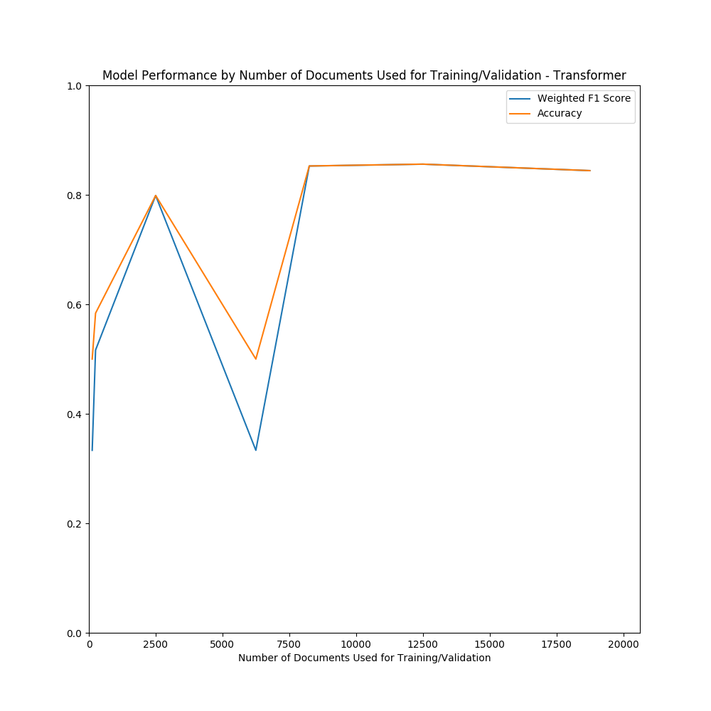
---
# Results: SKLearn
|    |   data_proportion |   num_documents |   Weighted F1 Score |   Weighted Precision Score |   Weighted Recall Score |   Accuracy |
|---:|------------------:|----------------:|--------------------:|---------------------------:|------------------------:|-----------:|
|  0 |             0.005 |             125 |            0.502502 |                   0.700345 |                 0.57828 |    0.57828 |
|  1 |             0.01  |             250 |            0.682961 |                   0.701672 |                 0.68824 |    0.68824 |
|  2 |             0.1   |            2500 |            0.825509 |                   0.825598 |                 0.82552 |    0.82552 |
|  3 |             0.25  |            6250 |            0.853119 |                   0.853132 |                 0.85312 |    0.85312 |
|  4 |             0.33  |            8250 |            0.857173 |                   0.857471 |                 0.8572  |    0.8572  |
|  5 |             0.5   |           12500 |            0.866067 |                   0.86622  |                 0.86608 |    0.86608 |
|  6 |             0.75  |           18750 |            0.874996 |                   0.87505  |                 0.875   |    0.875   |

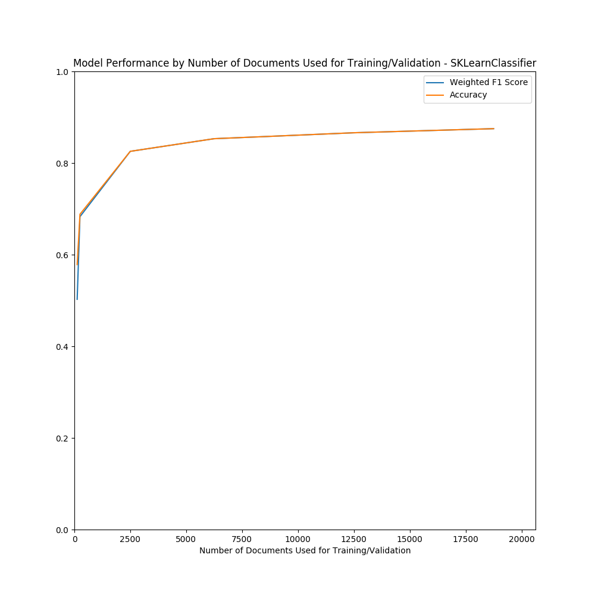
---
# Results: spaCy
|    |   data_proportion |   num_documents |   Weighted F1 Score |   Weighted Precision Score |   Weighted Recall Score |   Accuracy |
|---:|------------------:|----------------:|--------------------:|---------------------------:|------------------------:|-----------:|
|  0 |             0.005 |             125 |            0.651859 |                   0.69133  |                 0.6642  |    0.6642  |
|  1 |             0.01  |             250 |            0.729198 |                   0.729735 |                 0.72932 |    0.72932 |
|  2 |             0.1   |            2500 |            0.823233 |                   0.82329  |                 0.82324 |    0.82324 |
|  3 |             0.25  |            6250 |            0.852519 |                   0.852534 |                 0.85252 |    0.85252 |
|  4 |             0.33  |            8250 |            0.864112 |                   0.864205 |                 0.86412 |    0.86412 |
|  5 |             0.5   |           12500 |            0.87436  |                   0.87436  |                 0.87436 |    0.87436 |
|  6 |             0.75  |           18750 |            0.887432 |                   0.887551 |                 0.88744 |    0.88744 |

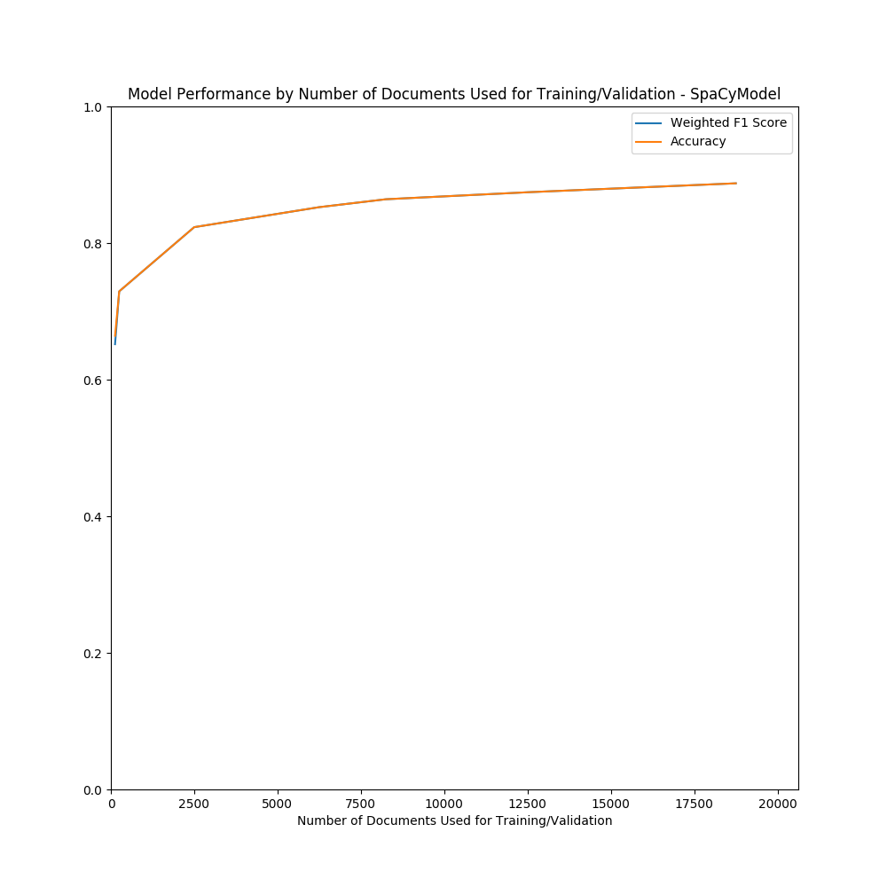
---
