# Results: BERT
```
(pid=516) INFO:gobbli.experiment.base:BERT initialized with data directory '/data/users/jnance/gobbli/benchmark/benchmark_data/model/BERT/9b476a087f9245d9a7aede442340941d'
(pid=516) INFO:gobbli.experiment.base:Starting build.
(pid=516) INFO:gobbli.experiment.base:Build finished in 0.39 sec.
(pid=516) INFO:gobbli.experiment.base:Starting training.
(pid=516) INFO:gobbli.experiment.base:Training finished in 822.68 sec.
(pid=516) INFO:gobbli.experiment.base:RESULTS:
(pid=516) INFO:gobbli.experiment.base:  Validation loss: 0.34764564
(pid=516) INFO:gobbli.experiment.base:  Validation accuracy: 0.9085285
(pid=516) INFO:gobbli.experiment.base:  Training loss: 0.34746882
(pid=516) INFO:gobbli.experiment.base:BERT initialized with data directory '/data/users/jnance/gobbli/benchmark/benchmark_data/model/BERT/ed48cea68ac44318ab7a3b83f72b3855'
(pid=516) INFO:gobbli.experiment.base:Starting build.
(pid=516) INFO:gobbli.experiment.base:Build finished in 0.22 sec.
(pid=516) INFO:gobbli.experiment.base:Starting training.
(pid=516) INFO:gobbli.experiment.base:Training finished in 796.80 sec.
(pid=516) INFO:gobbli.experiment.base:RESULTS:
(pid=516) INFO:gobbli.experiment.base:  Validation loss: 0.45498648
(pid=516) INFO:gobbli.experiment.base:  Validation accuracy: 0.8802475
(pid=516) INFO:gobbli.experiment.base:  Training loss: 0.4559938
(pid=516) INFO:gobbli.experiment.base:BERT initialized with data directory '/data/users/jnance/gobbli/benchmark/benchmark_data/model/BERT/7632a22eb93d45189dd67354e3688b74'
(pid=516) INFO:gobbli.experiment.base:Starting build.
(pid=516) INFO:gobbli.experiment.base:Build finished in 0.24 sec.
(pid=516) INFO:gobbli.experiment.base:Starting training.
(pid=516) INFO:gobbli.experiment.base:Training finished in 800.09 sec.
(pid=516) INFO:gobbli.experiment.base:RESULTS:
(pid=516) INFO:gobbli.experiment.base:  Validation loss: 0.38081968
(pid=516) INFO:gobbli.experiment.base:  Validation accuracy: 0.90499336
(pid=516) INFO:gobbli.experiment.base:  Training loss: 0.38104215
(pid=516) INFO:gobbli.experiment.base:BERT initialized with data directory '/data/users/jnance/gobbli/benchmark/benchmark_data/model/BERT/504d21088f0e4ffd920a7b29950a3672'
(pid=516) INFO:gobbli.experiment.base:Starting build.
(pid=516) INFO:gobbli.experiment.base:Build finished in 0.29 sec.
(pid=516) INFO:gobbli.experiment.base:Starting prediction.
(pid=516) INFO:gobbli.experiment.base:Prediction finished in 74.98 sec.
(pid=516) /usr/local/lib/python3.7/site-packages/ray/pyarrow_files/pyarrow/serialization.py:165: FutureWarning: The SparseDataFrame class is removed from pandas. Accessing it from the top-level namespace will also be removed in the next version
(pid=516)   if isinstance(obj, pd.SparseDataFrame):

```
|    |   valid_loss |   valid_accuracy |   train_loss | multilabel   | labels                                                                                                                                                                                                                                                                                                                                                                                                    | checkpoint                                                                                                                                                   | node_ip_address   | model_params                                               |
|---:|-------------:|-----------------:|-------------:|:-------------|:----------------------------------------------------------------------------------------------------------------------------------------------------------------------------------------------------------------------------------------------------------------------------------------------------------------------------------------------------------------------------------------------------------|:-------------------------------------------------------------------------------------------------------------------------------------------------------------|:------------------|:-----------------------------------------------------------|
|  0 |     0.347646 |         0.908528 |     0.347469 | False        | ['alt.atheism', 'comp.graphics', 'comp.os.ms-windows.misc', 'comp.sys.ibm.pc.hardware', 'comp.sys.mac.hardware', 'comp.windows.x', 'misc.forsale', 'rec.autos', 'rec.motorcycles', 'rec.sport.baseball', 'rec.sport.hockey', 'sci.crypt', 'sci.electronics', 'sci.med', 'sci.space', 'soc.religion.christian', 'talk.politics.guns', 'talk.politics.mideast', 'talk.politics.misc', 'talk.religion.misc'] | /data/users/jnance/gobbli/benchmark/benchmark_data/model/BERT/9b476a087f9245d9a7aede442340941d/train/1974eed027bf41cca2b443dd39329f48/output/model.ckpt-1414 | 172.80.10.2       | {'bert_model': 'bert-base-uncased', 'max_seq_length': 128} |
|  1 |     0.454986 |         0.880247 |     0.455994 | False        | ['alt.atheism', 'comp.graphics', 'comp.os.ms-windows.misc', 'comp.sys.ibm.pc.hardware', 'comp.sys.mac.hardware', 'comp.windows.x', 'misc.forsale', 'rec.autos', 'rec.motorcycles', 'rec.sport.baseball', 'rec.sport.hockey', 'sci.crypt', 'sci.electronics', 'sci.med', 'sci.space', 'soc.religion.christian', 'talk.politics.guns', 'talk.politics.mideast', 'talk.politics.misc', 'talk.religion.misc'] | /data/users/jnance/gobbli/benchmark/benchmark_data/model/BERT/ed48cea68ac44318ab7a3b83f72b3855/train/b426a39280674d0a8c80e4f5d8d38ccc/output/model.ckpt-1414 | 172.80.10.2       | {'bert_model': 'bert-base-cased', 'max_seq_length': 128}   |
|  2 |     0.38082  |         0.904993 |     0.381042 | False        | ['alt.atheism', 'comp.graphics', 'comp.os.ms-windows.misc', 'comp.sys.ibm.pc.hardware', 'comp.sys.mac.hardware', 'comp.windows.x', 'misc.forsale', 'rec.autos', 'rec.motorcycles', 'rec.sport.baseball', 'rec.sport.hockey', 'sci.crypt', 'sci.electronics', 'sci.med', 'sci.space', 'soc.religion.christian', 'talk.politics.guns', 'talk.politics.mideast', 'talk.politics.misc', 'talk.religion.misc'] | /data/users/jnance/gobbli/benchmark/benchmark_data/model/BERT/7632a22eb93d45189dd67354e3688b74/train/84ff95a81ead4e51bcd3796b95492186/output/model.ckpt-1414 | 172.80.10.2       | {'bert_model': 'scibert-uncased', 'max_seq_length': 128}   |
```
Metrics:
--------
Weighted F1 Score: 0.837437045888832
Weighted Precision Score: 0.8406616781349776
Weighted Recall Score: 0.8370950610727562
Accuracy: 0.8370950610727562

Classification Report:
----------------------
                          precision    recall  f1-score   support

             alt.atheism       0.00      0.00      0.00         0
           comp.graphics       0.00      0.00      0.00         0
 comp.os.ms-windows.misc       0.00      0.00      0.00         0
comp.sys.ibm.pc.hardware       0.00      0.00      0.00         0
   comp.sys.mac.hardware       0.00      0.00      0.00         0
          comp.windows.x       0.00      0.00      0.00         0
            misc.forsale       0.00      0.00      0.00         0
               rec.autos       0.00      0.00      0.00         0
         rec.motorcycles       0.00      0.00      0.00         0
      rec.sport.baseball       0.00      0.00      0.00         0
        rec.sport.hockey       0.00      0.00      0.00         0
               sci.crypt       0.00      0.00      0.00         0
         sci.electronics       0.00      0.00      0.00         0
                 sci.med       0.00      0.00      0.00         0
               sci.space       0.00      0.00      0.00         0
  soc.religion.christian       0.00      0.00      0.00         0
      talk.politics.guns       0.00      0.00      0.00         0
   talk.politics.mideast       0.00      0.00      0.00         0
      talk.politics.misc       0.00      0.00      0.00         0
      talk.religion.misc       0.00      0.00      0.00         0

               micro avg       0.00      0.00      0.00         0
               macro avg       0.00      0.00      0.00         0
            weighted avg       0.00      0.00      0.00         0


```

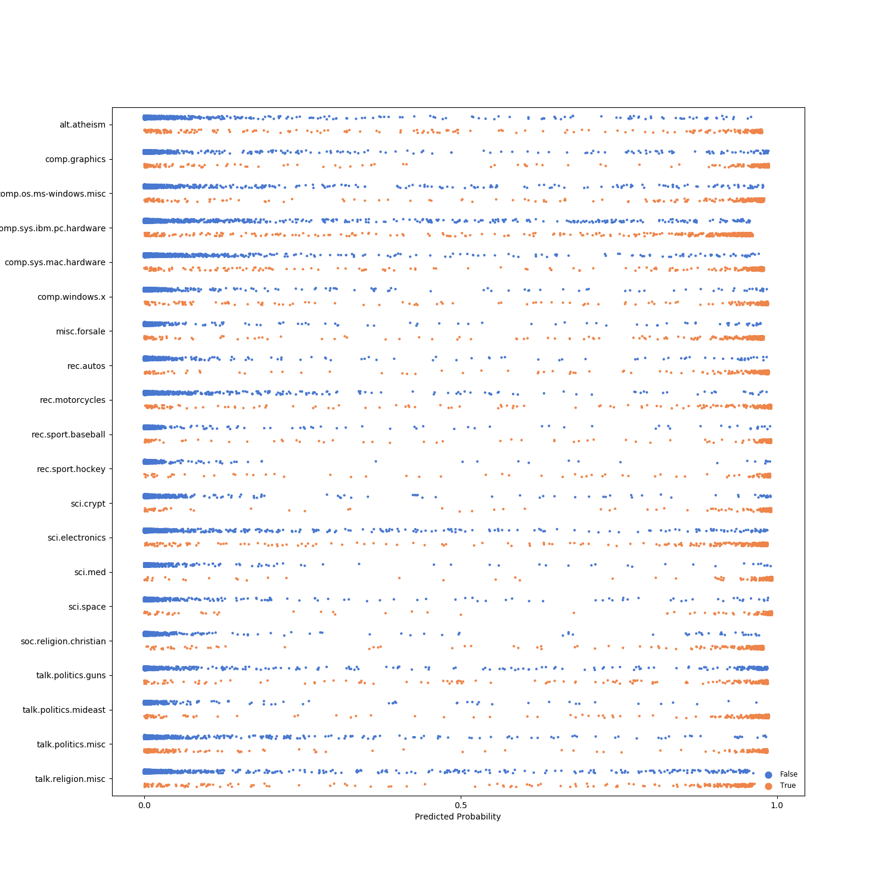
---
# Results: MTDNN
```
(pid=744) INFO:gobbli.experiment.base:MTDNN initialized with data directory '/data/users/jnance/gobbli/benchmark/benchmark_data/model/MTDNN/d95a253e7914436898e245fc418b1b05'
(pid=744) INFO:gobbli.experiment.base:Starting build.
(pid=744) INFO:gobbli.experiment.base:Build finished in 0.34 sec.
(pid=744) INFO:gobbli.experiment.base:Starting training.
(pid=744) /code/gobbli/model/mtdnn/model.py:204: UserWarning: MT-DNN model does not support separate validation batch size; using train batch size '16' for both training and validation.
(pid=744)   "MT-DNN model does not support separate validation batch size; "
(pid=744) INFO:gobbli.experiment.base:Training finished in 1226.39 sec.
(pid=744) INFO:gobbli.experiment.base:RESULTS:
(pid=744) INFO:gobbli.experiment.base:  Validation loss: 2.2677388191223145
(pid=744) INFO:gobbli.experiment.base:  Validation accuracy: 0.8753866548828988
(pid=744) INFO:gobbli.experiment.base:  Training loss: 2.188206434249878
(pid=744) INFO:gobbli.experiment.base:MTDNN initialized with data directory '/data/users/jnance/gobbli/benchmark/benchmark_data/model/MTDNN/c91d6323aed24d60aa46d49fa236c74f'
(pid=744) INFO:gobbli.experiment.base:Starting build.
(pid=744) INFO:gobbli.experiment.base:Build finished in 0.29 sec.
(pid=744) INFO:gobbli.experiment.base:Starting prediction.
(pid=744) INFO:gobbli.experiment.base:Prediction finished in 64.51 sec.
(pid=744) /usr/local/lib/python3.7/site-packages/ray/pyarrow_files/pyarrow/serialization.py:165: FutureWarning: The SparseDataFrame class is removed from pandas. Accessing it from the top-level namespace will also be removed in the next version
(pid=744)   if isinstance(obj, pd.SparseDataFrame):

```
|    |   valid_loss |   valid_accuracy |   train_loss | multilabel   | labels                                                                                                                                                                                                                                                                                                                                                                                                    | checkpoint                                                                                                                                               | node_ip_address   | model_params                                          |
|---:|-------------:|-----------------:|-------------:|:-------------|:----------------------------------------------------------------------------------------------------------------------------------------------------------------------------------------------------------------------------------------------------------------------------------------------------------------------------------------------------------------------------------------------------------|:---------------------------------------------------------------------------------------------------------------------------------------------------------|:------------------|:------------------------------------------------------|
|  0 |      2.26774 |         0.875387 |      2.18821 | False        | ['alt.atheism', 'comp.graphics', 'comp.os.ms-windows.misc', 'comp.sys.ibm.pc.hardware', 'comp.sys.mac.hardware', 'comp.windows.x', 'misc.forsale', 'rec.autos', 'rec.motorcycles', 'rec.sport.baseball', 'rec.sport.hockey', 'sci.crypt', 'sci.electronics', 'sci.med', 'sci.space', 'soc.religion.christian', 'talk.politics.guns', 'talk.politics.mideast', 'talk.politics.misc', 'talk.religion.misc'] | /data/users/jnance/gobbli/benchmark/benchmark_data/model/MTDNN/d95a253e7914436898e245fc418b1b05/train/26a64af73db04e1b900a0c6a6fb75269/output/model_4.pt | 172.80.10.2       | {'max_seq_length': 128, 'mtdnn_model': 'mt-dnn-base'} |
```
Metrics:
--------
Weighted F1 Score: 0.806590411063018
Weighted Precision Score: 0.8085680053148488
Weighted Recall Score: 0.806558682952735
Accuracy: 0.806558682952735

Classification Report:
----------------------
                          precision    recall  f1-score   support

             alt.atheism       0.00      0.00      0.00         0
           comp.graphics       0.00      0.00      0.00         0
 comp.os.ms-windows.misc       0.00      0.00      0.00         0
comp.sys.ibm.pc.hardware       0.00      0.00      0.00         0
   comp.sys.mac.hardware       0.00      0.00      0.00         0
          comp.windows.x       0.00      0.00      0.00         0
            misc.forsale       0.00      0.00      0.00         0
               rec.autos       0.00      0.00      0.00         0
         rec.motorcycles       0.00      0.00      0.00         0
      rec.sport.baseball       0.00      0.00      0.00         0
        rec.sport.hockey       0.00      0.00      0.00         0
               sci.crypt       0.00      0.00      0.00         0
         sci.electronics       0.00      0.00      0.00         0
                 sci.med       0.00      0.00      0.00         0
               sci.space       0.00      0.00      0.00         0
  soc.religion.christian       0.00      0.00      0.00         0
      talk.politics.guns       0.00      0.00      0.00         0
   talk.politics.mideast       0.00      0.00      0.00         0
      talk.politics.misc       0.00      0.00      0.00         0
      talk.religion.misc       0.00      0.00      0.00         0

               micro avg       0.00      0.00      0.00         0
               macro avg       0.00      0.00      0.00         0
            weighted avg       0.00      0.00      0.00         0


```

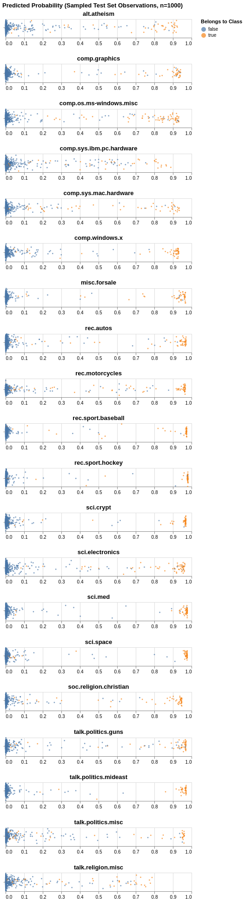
---
# Results: FastText
```
(pid=976) INFO:gobbli.experiment.base:FastText initialized with data directory '/data/users/jnance/gobbli/benchmark/benchmark_data/model/FastText/9e148e5671b7432ebe2e20d1f55e465a'
(pid=976) INFO:gobbli.experiment.base:Starting build.
(pid=975) INFO:gobbli.experiment.base:FastText initialized with data directory '/data/users/jnance/gobbli/benchmark/benchmark_data/model/FastText/13541a064a5344088ea0e74a5b6c52e6'
(pid=975) INFO:gobbli.experiment.base:Starting build.
(pid=977) INFO:gobbli.experiment.base:FastText initialized with data directory '/data/users/jnance/gobbli/benchmark/benchmark_data/model/FastText/8f14bec4cbe54549af7383866f04372f'
(pid=977) INFO:gobbli.experiment.base:Starting build.
(pid=978) INFO:gobbli.experiment.base:FastText initialized with data directory '/data/users/jnance/gobbli/benchmark/benchmark_data/model/FastText/2054f0f170bc416eb044a37e4e815acf'
(pid=978) INFO:gobbli.experiment.base:Starting build.
(pid=976) INFO:gobbli.experiment.base:Build finished in 0.43 sec.
(pid=976) INFO:gobbli.experiment.base:Starting training.
(pid=975) INFO:gobbli.experiment.base:Build finished in 0.46 sec.
(pid=975) INFO:gobbli.experiment.base:Starting training.
(pid=977) INFO:gobbli.experiment.base:Build finished in 0.42 sec.
(pid=977) INFO:gobbli.experiment.base:Starting training.
(pid=978) INFO:gobbli.experiment.base:Build finished in 0.42 sec.
(pid=978) INFO:gobbli.experiment.base:Starting training.
(pid=976) INFO:gobbli.experiment.base:Training finished in 312.13 sec.
(pid=976) INFO:gobbli.experiment.base:RESULTS:
(pid=976) INFO:gobbli.experiment.base:  Validation loss: -0.7344233318603623
(pid=976) INFO:gobbli.experiment.base:  Validation accuracy: 0.7344233318603623
(pid=976) INFO:gobbli.experiment.base:  Training loss: 1.653927
(pid=976) INFO:gobbli.experiment.base:FastText initialized with data directory '/data/users/jnance/gobbli/benchmark/benchmark_data/model/FastText/b8164e8bf46a4aaea14dc7ab075df619'
(pid=976) INFO:gobbli.experiment.base:Starting build.
(pid=976) INFO:gobbli.experiment.base:Build finished in 0.22 sec.
(pid=976) INFO:gobbli.experiment.base:Starting training.
(pid=978) INFO:gobbli.experiment.base:Training finished in 312.29 sec.
(pid=978) INFO:gobbli.experiment.base:RESULTS:
(pid=978) INFO:gobbli.experiment.base:  Validation loss: -0.7825894829871851
(pid=978) INFO:gobbli.experiment.base:  Validation accuracy: 0.7825894829871851
(pid=978) INFO:gobbli.experiment.base:  Training loss: 1.680546
(pid=978) INFO:gobbli.experiment.base:FastText initialized with data directory '/data/users/jnance/gobbli/benchmark/benchmark_data/model/FastText/fb9ef6b5e6204ca59b6cd77fc2547bbc'
(pid=978) INFO:gobbli.experiment.base:Starting build.
(pid=978) INFO:gobbli.experiment.base:Build finished in 0.22 sec.
(pid=978) INFO:gobbli.experiment.base:Starting training.
(pid=977) INFO:gobbli.experiment.base:Training finished in 318.82 sec.
(pid=977) INFO:gobbli.experiment.base:RESULTS:
(pid=977) INFO:gobbli.experiment.base:  Validation loss: -0.8497569597878922
(pid=977) INFO:gobbli.experiment.base:  Validation accuracy: 0.8497569597878922
(pid=977) INFO:gobbli.experiment.base:  Training loss: 1.310192
(pid=977) INFO:gobbli.experiment.base:FastText initialized with data directory '/data/users/jnance/gobbli/benchmark/benchmark_data/model/FastText/c59a62818497493fbe9804e3285f5f8b'
(pid=977) INFO:gobbli.experiment.base:Starting build.
(pid=977) INFO:gobbli.experiment.base:Build finished in 0.20 sec.
(pid=977) INFO:gobbli.experiment.base:Starting training.
(pid=975) INFO:gobbli.experiment.base:Training finished in 319.73 sec.
(pid=975) INFO:gobbli.experiment.base:RESULTS:
(pid=975) INFO:gobbli.experiment.base:  Validation loss: -0.39681838267786124
(pid=975) INFO:gobbli.experiment.base:  Validation accuracy: 0.39681838267786124
(pid=975) INFO:gobbli.experiment.base:  Training loss: 2.303738
(pid=975) INFO:gobbli.experiment.base:FastText initialized with data directory '/data/users/jnance/gobbli/benchmark/benchmark_data/model/FastText/42f8e168a25e44edae72e1d2d725d067'
(pid=975) INFO:gobbli.experiment.base:Starting build.
(pid=975) INFO:gobbli.experiment.base:Build finished in 0.33 sec.
(pid=975) INFO:gobbli.experiment.base:Starting training.
(pid=976) INFO:gobbli.experiment.base:Training finished in 319.65 sec.
(pid=976) INFO:gobbli.experiment.base:RESULTS:
(pid=976) INFO:gobbli.experiment.base:  Validation loss: -0.7118868758285462
(pid=976) INFO:gobbli.experiment.base:  Validation accuracy: 0.7118868758285462
(pid=976) INFO:gobbli.experiment.base:  Training loss: 1.481531
(pid=977) INFO:gobbli.experiment.base:Training finished in 318.81 sec.
(pid=977) INFO:gobbli.experiment.base:RESULTS:
(pid=977) INFO:gobbli.experiment.base:  Validation loss: -0.8356164383561644
(pid=977) INFO:gobbli.experiment.base:  Validation accuracy: 0.8356164383561644
(pid=977) INFO:gobbli.experiment.base:  Training loss: 1.373516
(pid=975) INFO:gobbli.experiment.base:Training finished in 457.83 sec.
(pid=975) INFO:gobbli.experiment.base:RESULTS:
(pid=975) INFO:gobbli.experiment.base:  Validation loss: -0.760053026955369
(pid=975) INFO:gobbli.experiment.base:  Validation accuracy: 0.760053026955369
(pid=975) INFO:gobbli.experiment.base:  Training loss: 1.478671
(pid=978) INFO:gobbli.experiment.base:Training finished in 466.52 sec.
(pid=978) INFO:gobbli.experiment.base:RESULTS:
(pid=978) INFO:gobbli.experiment.base:  Validation loss: -0.34025629695095005
(pid=978) INFO:gobbli.experiment.base:  Validation accuracy: 0.34025629695095005
(pid=978) INFO:gobbli.experiment.base:  Training loss: 2.429249
(pid=978) INFO:gobbli.experiment.base:FastText initialized with data directory '/data/users/jnance/gobbli/benchmark/benchmark_data/model/FastText/1f8ad3e548fc4c778d2c1ef74a26aac2'
(pid=978) INFO:gobbli.experiment.base:Starting build.
(pid=978) INFO:gobbli.experiment.base:Build finished in 0.45 sec.
(pid=978) INFO:gobbli.experiment.base:Starting prediction.
(pid=978) INFO:gobbli.experiment.base:Prediction finished in 2.57 sec.
(pid=978) /usr/local/lib/python3.7/site-packages/ray/pyarrow_files/pyarrow/serialization.py:165: FutureWarning: The SparseDataFrame class is removed from pandas. Accessing it from the top-level namespace will also be removed in the next version
(pid=978)   if isinstance(obj, pd.SparseDataFrame):

```
|    |   valid_loss |   valid_accuracy |   train_loss | multilabel   | labels                                                                                                                                                                                                                                                                                                                                                                                                    | checkpoint                                                                                                                                             | node_ip_address   | model_params                              |
|---:|-------------:|-----------------:|-------------:|:-------------|:----------------------------------------------------------------------------------------------------------------------------------------------------------------------------------------------------------------------------------------------------------------------------------------------------------------------------------------------------------------------------------------------------------|:-------------------------------------------------------------------------------------------------------------------------------------------------------|:------------------|:------------------------------------------|
|  0 |    -0.734423 |         0.734423 |      1.65393 | False        | ['alt.atheism', 'comp.graphics', 'comp.os.ms-windows.misc', 'comp.sys.ibm.pc.hardware', 'comp.sys.mac.hardware', 'comp.windows.x', 'misc.forsale', 'rec.autos', 'rec.motorcycles', 'rec.sport.baseball', 'rec.sport.hockey', 'sci.crypt', 'sci.electronics', 'sci.med', 'sci.space', 'soc.religion.christian', 'talk.politics.guns', 'talk.politics.mideast', 'talk.politics.misc', 'talk.religion.misc'] | /data/users/jnance/gobbli/benchmark/benchmark_data/model/FastText/9e148e5671b7432ebe2e20d1f55e465a/train/023ce04a0198471db50e25fb33e25487/output/model | 172.80.10.2       | {'dim': 100, 'lr': 0.5, 'word_ngrams': 1} |
|  1 |    -0.396818 |         0.396818 |      2.30374 | False        | ['alt.atheism', 'comp.graphics', 'comp.os.ms-windows.misc', 'comp.sys.ibm.pc.hardware', 'comp.sys.mac.hardware', 'comp.windows.x', 'misc.forsale', 'rec.autos', 'rec.motorcycles', 'rec.sport.baseball', 'rec.sport.hockey', 'sci.crypt', 'sci.electronics', 'sci.med', 'sci.space', 'soc.religion.christian', 'talk.politics.guns', 'talk.politics.mideast', 'talk.politics.misc', 'talk.religion.misc'] | /data/users/jnance/gobbli/benchmark/benchmark_data/model/FastText/13541a064a5344088ea0e74a5b6c52e6/train/85ad91df90d745a093de23b96dde5982/output/model | 172.80.10.2       | {'dim': 100, 'lr': 0.5, 'word_ngrams': 2} |
|  2 |    -0.849757 |         0.849757 |      1.31019 | False        | ['alt.atheism', 'comp.graphics', 'comp.os.ms-windows.misc', 'comp.sys.ibm.pc.hardware', 'comp.sys.mac.hardware', 'comp.windows.x', 'misc.forsale', 'rec.autos', 'rec.motorcycles', 'rec.sport.baseball', 'rec.sport.hockey', 'sci.crypt', 'sci.electronics', 'sci.med', 'sci.space', 'soc.religion.christian', 'talk.politics.guns', 'talk.politics.mideast', 'talk.politics.misc', 'talk.religion.misc'] | /data/users/jnance/gobbli/benchmark/benchmark_data/model/FastText/8f14bec4cbe54549af7383866f04372f/train/5d89f7b71a024ae3a82724f89775a802/output/model | 172.80.10.2       | {'dim': 100, 'lr': 1.0, 'word_ngrams': 1} |
|  3 |    -0.782589 |         0.782589 |      1.68055 | False        | ['alt.atheism', 'comp.graphics', 'comp.os.ms-windows.misc', 'comp.sys.ibm.pc.hardware', 'comp.sys.mac.hardware', 'comp.windows.x', 'misc.forsale', 'rec.autos', 'rec.motorcycles', 'rec.sport.baseball', 'rec.sport.hockey', 'sci.crypt', 'sci.electronics', 'sci.med', 'sci.space', 'soc.religion.christian', 'talk.politics.guns', 'talk.politics.mideast', 'talk.politics.misc', 'talk.religion.misc'] | /data/users/jnance/gobbli/benchmark/benchmark_data/model/FastText/2054f0f170bc416eb044a37e4e815acf/train/f66b7d6280294821aff919a4dc79a82a/output/model | 172.80.10.2       | {'dim': 100, 'lr': 1.0, 'word_ngrams': 2} |
|  4 |    -0.711887 |         0.711887 |      1.48153 | False        | ['alt.atheism', 'comp.graphics', 'comp.os.ms-windows.misc', 'comp.sys.ibm.pc.hardware', 'comp.sys.mac.hardware', 'comp.windows.x', 'misc.forsale', 'rec.autos', 'rec.motorcycles', 'rec.sport.baseball', 'rec.sport.hockey', 'sci.crypt', 'sci.electronics', 'sci.med', 'sci.space', 'soc.religion.christian', 'talk.politics.guns', 'talk.politics.mideast', 'talk.politics.misc', 'talk.religion.misc'] | /data/users/jnance/gobbli/benchmark/benchmark_data/model/FastText/b8164e8bf46a4aaea14dc7ab075df619/train/d7149ed094454138af3073e737f27fb2/output/model | 172.80.10.2       | {'dim': 300, 'lr': 0.5, 'word_ngrams': 1} |
|  5 |    -0.340256 |         0.340256 |      2.42925 | False        | ['alt.atheism', 'comp.graphics', 'comp.os.ms-windows.misc', 'comp.sys.ibm.pc.hardware', 'comp.sys.mac.hardware', 'comp.windows.x', 'misc.forsale', 'rec.autos', 'rec.motorcycles', 'rec.sport.baseball', 'rec.sport.hockey', 'sci.crypt', 'sci.electronics', 'sci.med', 'sci.space', 'soc.religion.christian', 'talk.politics.guns', 'talk.politics.mideast', 'talk.politics.misc', 'talk.religion.misc'] | /data/users/jnance/gobbli/benchmark/benchmark_data/model/FastText/fb9ef6b5e6204ca59b6cd77fc2547bbc/train/7bb1a0a98cb049709ecc3b0fe2584cd5/output/model | 172.80.10.2       | {'dim': 300, 'lr': 0.5, 'word_ngrams': 2} |
|  6 |    -0.835616 |         0.835616 |      1.37352 | False        | ['alt.atheism', 'comp.graphics', 'comp.os.ms-windows.misc', 'comp.sys.ibm.pc.hardware', 'comp.sys.mac.hardware', 'comp.windows.x', 'misc.forsale', 'rec.autos', 'rec.motorcycles', 'rec.sport.baseball', 'rec.sport.hockey', 'sci.crypt', 'sci.electronics', 'sci.med', 'sci.space', 'soc.religion.christian', 'talk.politics.guns', 'talk.politics.mideast', 'talk.politics.misc', 'talk.religion.misc'] | /data/users/jnance/gobbli/benchmark/benchmark_data/model/FastText/c59a62818497493fbe9804e3285f5f8b/train/441fb3d4cf604477a305df6ee8bfc26b/output/model | 172.80.10.2       | {'dim': 300, 'lr': 1.0, 'word_ngrams': 1} |
|  7 |    -0.760053 |         0.760053 |      1.47867 | False        | ['alt.atheism', 'comp.graphics', 'comp.os.ms-windows.misc', 'comp.sys.ibm.pc.hardware', 'comp.sys.mac.hardware', 'comp.windows.x', 'misc.forsale', 'rec.autos', 'rec.motorcycles', 'rec.sport.baseball', 'rec.sport.hockey', 'sci.crypt', 'sci.electronics', 'sci.med', 'sci.space', 'soc.religion.christian', 'talk.politics.guns', 'talk.politics.mideast', 'talk.politics.misc', 'talk.religion.misc'] | /data/users/jnance/gobbli/benchmark/benchmark_data/model/FastText/42f8e168a25e44edae72e1d2d725d067/train/98b72399d408401685bb83bf20e6998a/output/model | 172.80.10.2       | {'dim': 300, 'lr': 1.0, 'word_ngrams': 2} |
```
Metrics:
--------
Weighted F1 Score: 0.741617629055201
Weighted Precision Score: 0.7479753772925986
Weighted Recall Score: 0.7392458842272969
Accuracy: 0.7392458842272969

Classification Report:
----------------------
                          precision    recall  f1-score   support

             alt.atheism       0.00      0.00      0.00         0
           comp.graphics       0.00      0.00      0.00         0
 comp.os.ms-windows.misc       0.00      0.00      0.00         0
comp.sys.ibm.pc.hardware       0.00      0.00      0.00         0
   comp.sys.mac.hardware       0.00      0.00      0.00         0
          comp.windows.x       0.00      0.00      0.00         0
            misc.forsale       0.00      0.00      0.00         0
               rec.autos       0.00      0.00      0.00         0
         rec.motorcycles       0.00      0.00      0.00         0
      rec.sport.baseball       0.00      0.00      0.00         0
        rec.sport.hockey       0.00      0.00      0.00         0
               sci.crypt       0.00      0.00      0.00         0
         sci.electronics       0.00      0.00      0.00         0
                 sci.med       0.00      0.00      0.00         0
               sci.space       0.00      0.00      0.00         0
  soc.religion.christian       0.00      0.00      0.00         0
      talk.politics.guns       0.00      0.00      0.00         0
   talk.politics.mideast       0.00      0.00      0.00         0
      talk.politics.misc       0.00      0.00      0.00         0
      talk.religion.misc       0.00      0.00      0.00         0

               micro avg       0.00      0.00      0.00         0
               macro avg       0.00      0.00      0.00         0
            weighted avg       0.00      0.00      0.00         0


```

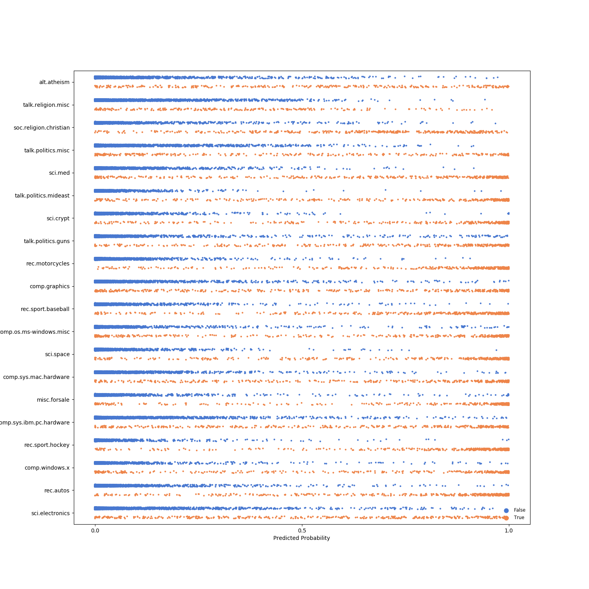
---
# Results: XLM
```
(pid=1247) INFO:gobbli.experiment.base:Transformer initialized with data directory '/data/users/jnance/gobbli/benchmark/benchmark_data/model/Transformer/d02f90c349fd428dabbeefee64cbb0cc'
(pid=1247) INFO:gobbli.experiment.base:Starting build.
(pid=1247) INFO:gobbli.experiment.base:Build finished in 0.26 sec.
(pid=1247) INFO:gobbli.experiment.base:Starting training.
(pid=1247) INFO:gobbli.experiment.base:Training finished in 1379.16 sec.
(pid=1247) INFO:gobbli.experiment.base:RESULTS:
(pid=1247) INFO:gobbli.experiment.base:  Validation loss: 0.09383381060989252
(pid=1247) INFO:gobbli.experiment.base:  Validation accuracy: 0.048608042421564294
(pid=1247) INFO:gobbli.experiment.base:  Training loss: 0.20049872220306683
(pid=1247) INFO:gobbli.experiment.base:Transformer initialized with data directory '/data/users/jnance/gobbli/benchmark/benchmark_data/model/Transformer/3210c170deda45e4b454c58bfe07b819'
(pid=1247) INFO:gobbli.experiment.base:Starting build.
(pid=1247) INFO:gobbli.experiment.base:Build finished in 0.20 sec.
(pid=1247) INFO:gobbli.experiment.base:Starting training.
(pid=1247) INFO:gobbli.experiment.base:Training finished in 819.81 sec.
(pid=1247) INFO:gobbli.experiment.base:RESULTS:
(pid=1247) INFO:gobbli.experiment.base:  Validation loss: 0.023119816845476336
(pid=1247) INFO:gobbli.experiment.base:  Validation accuracy: 0.8532920901458241
(pid=1247) INFO:gobbli.experiment.base:  Training loss: 0.006614376033375956
(pid=1247) INFO:gobbli.experiment.base:Transformer initialized with data directory '/data/users/jnance/gobbli/benchmark/benchmark_data/model/Transformer/f73e9bfca4414c04bfe29e5532f21459'
(pid=1247) INFO:gobbli.experiment.base:Starting build.
(pid=1247) INFO:gobbli.experiment.base:Build finished in 0.20 sec.
(pid=1247) INFO:gobbli.experiment.base:Starting prediction.
(pid=1247) INFO:gobbli.experiment.base:Prediction finished in 55.19 sec.
(pid=1247) /usr/local/lib/python3.7/site-packages/ray/pyarrow_files/pyarrow/serialization.py:165: FutureWarning: The SparseDataFrame class is removed from pandas. Accessing it from the top-level namespace will also be removed in the next version
(pid=1247)   if isinstance(obj, pd.SparseDataFrame):

```
|    |   valid_loss |   valid_accuracy |   train_loss | multilabel   | labels                                                                                                                                                                                                                                                                                                                                                                                                    | checkpoint                                                                                                                                                     | node_ip_address   | model_params                                                                   |
|---:|-------------:|-----------------:|-------------:|:-------------|:----------------------------------------------------------------------------------------------------------------------------------------------------------------------------------------------------------------------------------------------------------------------------------------------------------------------------------------------------------------------------------------------------------|:---------------------------------------------------------------------------------------------------------------------------------------------------------------|:------------------|:-------------------------------------------------------------------------------|
|  0 |    0.0938338 |         0.048608 |   0.200499   | False        | ['alt.atheism', 'comp.graphics', 'comp.os.ms-windows.misc', 'comp.sys.ibm.pc.hardware', 'comp.sys.mac.hardware', 'comp.windows.x', 'misc.forsale', 'rec.autos', 'rec.motorcycles', 'rec.sport.baseball', 'rec.sport.hockey', 'sci.crypt', 'sci.electronics', 'sci.med', 'sci.space', 'soc.religion.christian', 'talk.politics.guns', 'talk.politics.mideast', 'talk.politics.misc', 'talk.religion.misc'] | /data/users/jnance/gobbli/benchmark/benchmark_data/model/Transformer/d02f90c349fd428dabbeefee64cbb0cc/train/708b725b38a24ae6afc5e2fee3cf8764/output/checkpoint | 172.80.10.2       | {'transformer_model': 'XLM', 'transformer_weights': 'xlm-mlm-tlm-xnli15-1024'} |
|  1 |    0.0231198 |         0.853292 |   0.00661438 | False        | ['alt.atheism', 'comp.graphics', 'comp.os.ms-windows.misc', 'comp.sys.ibm.pc.hardware', 'comp.sys.mac.hardware', 'comp.windows.x', 'misc.forsale', 'rec.autos', 'rec.motorcycles', 'rec.sport.baseball', 'rec.sport.hockey', 'sci.crypt', 'sci.electronics', 'sci.med', 'sci.space', 'soc.religion.christian', 'talk.politics.guns', 'talk.politics.mideast', 'talk.politics.misc', 'talk.religion.misc'] | /data/users/jnance/gobbli/benchmark/benchmark_data/model/Transformer/3210c170deda45e4b454c58bfe07b819/train/e6588a51b3f4499397908ff8cb687f67/output/checkpoint | 172.80.10.2       | {'transformer_model': 'XLM', 'transformer_weights': 'xlm-clm-ende-1024'}       |
```
Metrics:
--------
Weighted F1 Score: 0.7663560244706216
Weighted Precision Score: 0.7696143964835898
Weighted Recall Score: 0.7656664896441848
Accuracy: 0.7656664896441848

Classification Report:
----------------------
                          precision    recall  f1-score   support

             alt.atheism       0.00      0.00      0.00         0
           comp.graphics       0.00      0.00      0.00         0
 comp.os.ms-windows.misc       0.00      0.00      0.00         0
comp.sys.ibm.pc.hardware       0.00      0.00      0.00         0
   comp.sys.mac.hardware       0.00      0.00      0.00         0
          comp.windows.x       0.00      0.00      0.00         0
            misc.forsale       0.00      0.00      0.00         0
               rec.autos       0.00      0.00      0.00         0
         rec.motorcycles       0.00      0.00      0.00         0
      rec.sport.baseball       0.00      0.00      0.00         0
        rec.sport.hockey       0.00      0.00      0.00         0
               sci.crypt       0.00      0.00      0.00         0
         sci.electronics       0.00      0.00      0.00         0
                 sci.med       0.00      0.00      0.00         0
               sci.space       0.00      0.00      0.00         0
  soc.religion.christian       0.00      0.00      0.00         0
      talk.politics.guns       0.00      0.00      0.00         0
   talk.politics.mideast       0.00      0.00      0.00         0
      talk.politics.misc       0.00      0.00      0.00         0
      talk.religion.misc       0.00      0.00      0.00         0

               micro avg       0.00      0.00      0.00         0
               macro avg       0.00      0.00      0.00         0
            weighted avg       0.00      0.00      0.00         0


```

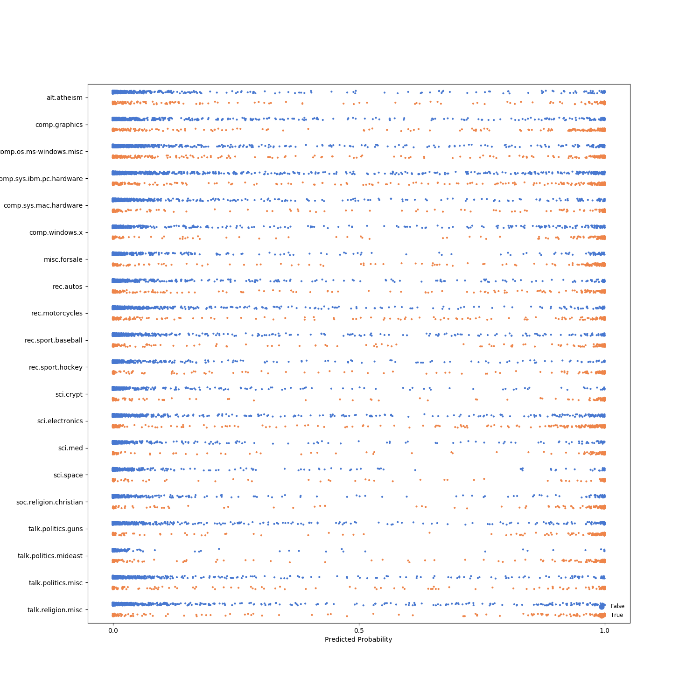
---
# Results: XLNet
```
(pid=1477) INFO:gobbli.experiment.base:Transformer initialized with data directory '/data/users/jnance/gobbli/benchmark/benchmark_data/model/Transformer/5a8933659ab5448a8aa2067cd48a6c96'
(pid=1477) INFO:gobbli.experiment.base:Starting build.
(pid=1477) INFO:gobbli.experiment.base:Build finished in 0.21 sec.
(pid=1477) INFO:gobbli.experiment.base:Starting training.
(pid=1477) INFO:gobbli.experiment.base:Training finished in 1095.99 sec.
(pid=1477) INFO:gobbli.experiment.base:RESULTS:
(pid=1477) INFO:gobbli.experiment.base:  Validation loss: 0.02455309041295492
(pid=1477) INFO:gobbli.experiment.base:  Validation accuracy: 0.7494476358815731
(pid=1477) INFO:gobbli.experiment.base:  Training loss: 0.04835376695478414
(pid=1477) INFO:gobbli.experiment.base:Transformer initialized with data directory '/data/users/jnance/gobbli/benchmark/benchmark_data/model/Transformer/849f8310560f469b992ced757abf0ddf'
(pid=1477) INFO:gobbli.experiment.base:Starting build.
(pid=1477) INFO:gobbli.experiment.base:Build finished in 0.23 sec.
(pid=1477) INFO:gobbli.experiment.base:Starting prediction.
(pid=1477) INFO:gobbli.experiment.base:Prediction finished in 68.84 sec.
(pid=1477) /usr/local/lib/python3.7/site-packages/ray/pyarrow_files/pyarrow/serialization.py:165: FutureWarning: The SparseDataFrame class is removed from pandas. Accessing it from the top-level namespace will also be removed in the next version
(pid=1477)   if isinstance(obj, pd.SparseDataFrame):

```
|    |   valid_loss |   valid_accuracy |   train_loss | multilabel   | labels                                                                                                                                                                                                                                                                                                                                                                                                    | checkpoint                                                                                                                                                     | node_ip_address   | model_params                                                              |
|---:|-------------:|-----------------:|-------------:|:-------------|:----------------------------------------------------------------------------------------------------------------------------------------------------------------------------------------------------------------------------------------------------------------------------------------------------------------------------------------------------------------------------------------------------------|:---------------------------------------------------------------------------------------------------------------------------------------------------------------|:------------------|:--------------------------------------------------------------------------|
|  0 |    0.0245531 |         0.749448 |    0.0483538 | False        | ['alt.atheism', 'comp.graphics', 'comp.os.ms-windows.misc', 'comp.sys.ibm.pc.hardware', 'comp.sys.mac.hardware', 'comp.windows.x', 'misc.forsale', 'rec.autos', 'rec.motorcycles', 'rec.sport.baseball', 'rec.sport.hockey', 'sci.crypt', 'sci.electronics', 'sci.med', 'sci.space', 'soc.religion.christian', 'talk.politics.guns', 'talk.politics.mideast', 'talk.politics.misc', 'talk.religion.misc'] | /data/users/jnance/gobbli/benchmark/benchmark_data/model/Transformer/5a8933659ab5448a8aa2067cd48a6c96/train/d5e726b926414724a71bdc398f410b96/output/checkpoint | 172.80.10.2       | {'transformer_model': 'XLNet', 'transformer_weights': 'xlnet-base-cased'} |
```
Metrics:
--------
Weighted F1 Score: 0.6676947776035
Weighted Precision Score: 0.669441323343694
Weighted Recall Score: 0.6775092936802974
Accuracy: 0.6775092936802974

Classification Report:
----------------------
                          precision    recall  f1-score   support

             alt.atheism       0.00      0.00      0.00         0
           comp.graphics       0.00      0.00      0.00         0
 comp.os.ms-windows.misc       0.00      0.00      0.00         0
comp.sys.ibm.pc.hardware       0.00      0.00      0.00         0
   comp.sys.mac.hardware       0.00      0.00      0.00         0
          comp.windows.x       0.00      0.00      0.00         0
            misc.forsale       0.00      0.00      0.00         0
               rec.autos       0.00      0.00      0.00         0
         rec.motorcycles       0.00      0.00      0.00         0
      rec.sport.baseball       0.00      0.00      0.00         0
        rec.sport.hockey       0.00      0.00      0.00         0
               sci.crypt       0.00      0.00      0.00         0
         sci.electronics       0.00      0.00      0.00         0
                 sci.med       0.00      0.00      0.00         0
               sci.space       0.00      0.00      0.00         0
  soc.religion.christian       0.00      0.00      0.00         0
      talk.politics.guns       0.00      0.00      0.00         0
   talk.politics.mideast       0.00      0.00      0.00         0
      talk.politics.misc       0.00      0.00      0.00         0
      talk.religion.misc       0.00      0.00      0.00         0

               micro avg       0.00      0.00      0.00         0
               macro avg       0.00      0.00      0.00         0
            weighted avg       0.00      0.00      0.00         0


```

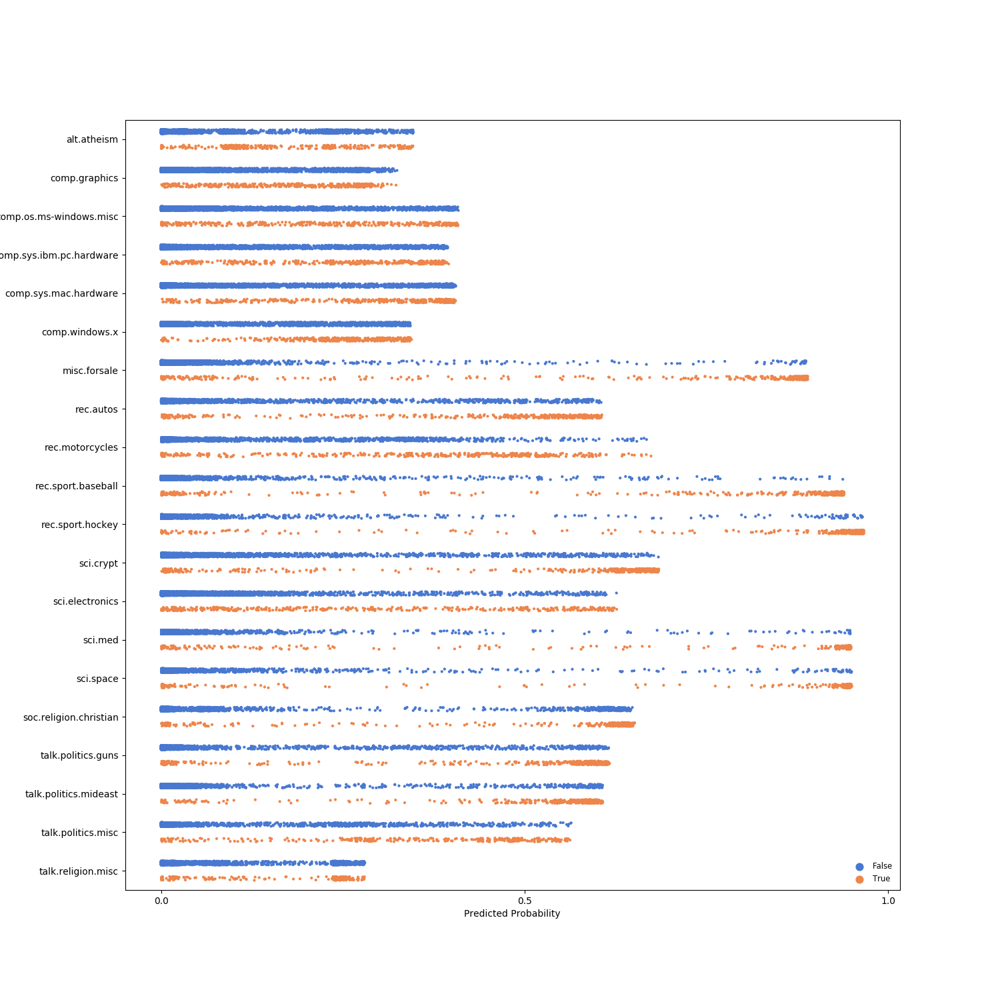
---
# Results: RoBERTa
```
(pid=1718) INFO:gobbli.experiment.base:Transformer initialized with data directory '/data/users/jnance/gobbli/benchmark/benchmark_data/model/Transformer/384a943be35e45108d5c085a64a53755'
(pid=1718) INFO:gobbli.experiment.base:Starting build.
(pid=1718) INFO:gobbli.experiment.base:Build finished in 0.46 sec.
(pid=1718) INFO:gobbli.experiment.base:Starting training.
(pid=1718) INFO:gobbli.experiment.base:Training finished in 916.25 sec.
(pid=1718) INFO:gobbli.experiment.base:RESULTS:
(pid=1718) INFO:gobbli.experiment.base:  Validation loss: 0.016980514437342133
(pid=1718) INFO:gobbli.experiment.base:  Validation accuracy: 0.895271763146266
(pid=1718) INFO:gobbli.experiment.base:  Training loss: 0.005296037527501547
(pid=1718) INFO:gobbli.experiment.base:Transformer initialized with data directory '/data/users/jnance/gobbli/benchmark/benchmark_data/model/Transformer/3de0f42cb83f40c691407612654ebf1c'
(pid=1718) INFO:gobbli.experiment.base:Starting build.
(pid=1718) INFO:gobbli.experiment.base:Build finished in 0.25 sec.
(pid=1718) INFO:gobbli.experiment.base:Starting prediction.
(pid=1718) INFO:gobbli.experiment.base:Prediction finished in 51.55 sec.
(pid=1718) /usr/local/lib/python3.7/site-packages/ray/pyarrow_files/pyarrow/serialization.py:165: FutureWarning: The SparseDataFrame class is removed from pandas. Accessing it from the top-level namespace will also be removed in the next version
(pid=1718)   if isinstance(obj, pd.SparseDataFrame):

```
|    |   valid_loss |   valid_accuracy |   train_loss | multilabel   | labels                                                                                                                                                                                                                                                                                                                                                                                                    | checkpoint                                                                                                                                                     | node_ip_address   | model_params                                                            |
|---:|-------------:|-----------------:|-------------:|:-------------|:----------------------------------------------------------------------------------------------------------------------------------------------------------------------------------------------------------------------------------------------------------------------------------------------------------------------------------------------------------------------------------------------------------|:---------------------------------------------------------------------------------------------------------------------------------------------------------------|:------------------|:------------------------------------------------------------------------|
|  0 |    0.0169805 |         0.895272 |   0.00529604 | False        | ['alt.atheism', 'comp.graphics', 'comp.os.ms-windows.misc', 'comp.sys.ibm.pc.hardware', 'comp.sys.mac.hardware', 'comp.windows.x', 'misc.forsale', 'rec.autos', 'rec.motorcycles', 'rec.sport.baseball', 'rec.sport.hockey', 'sci.crypt', 'sci.electronics', 'sci.med', 'sci.space', 'soc.religion.christian', 'talk.politics.guns', 'talk.politics.mideast', 'talk.politics.misc', 'talk.religion.misc'] | /data/users/jnance/gobbli/benchmark/benchmark_data/model/Transformer/384a943be35e45108d5c085a64a53755/train/aa4d2d58345e4ac7b3740e076291407b/output/checkpoint | 172.80.10.2       | {'transformer_model': 'Roberta', 'transformer_weights': 'roberta-base'} |
```
Metrics:
--------
Weighted F1 Score: 0.8150377440478993
Weighted Precision Score: 0.8226010055432904
Weighted Recall Score: 0.8134625597450876
Accuracy: 0.8134625597450876

Classification Report:
----------------------
                          precision    recall  f1-score   support

             alt.atheism       0.00      0.00      0.00         0
           comp.graphics       0.00      0.00      0.00         0
 comp.os.ms-windows.misc       0.00      0.00      0.00         0
comp.sys.ibm.pc.hardware       0.00      0.00      0.00         0
   comp.sys.mac.hardware       0.00      0.00      0.00         0
          comp.windows.x       0.00      0.00      0.00         0
            misc.forsale       0.00      0.00      0.00         0
               rec.autos       0.00      0.00      0.00         0
         rec.motorcycles       0.00      0.00      0.00         0
      rec.sport.baseball       0.00      0.00      0.00         0
        rec.sport.hockey       0.00      0.00      0.00         0
               sci.crypt       0.00      0.00      0.00         0
         sci.electronics       0.00      0.00      0.00         0
                 sci.med       0.00      0.00      0.00         0
               sci.space       0.00      0.00      0.00         0
  soc.religion.christian       0.00      0.00      0.00         0
      talk.politics.guns       0.00      0.00      0.00         0
   talk.politics.mideast       0.00      0.00      0.00         0
      talk.politics.misc       0.00      0.00      0.00         0
      talk.religion.misc       0.00      0.00      0.00         0

               micro avg       0.00      0.00      0.00         0
               macro avg       0.00      0.00      0.00         0
            weighted avg       0.00      0.00      0.00         0


```

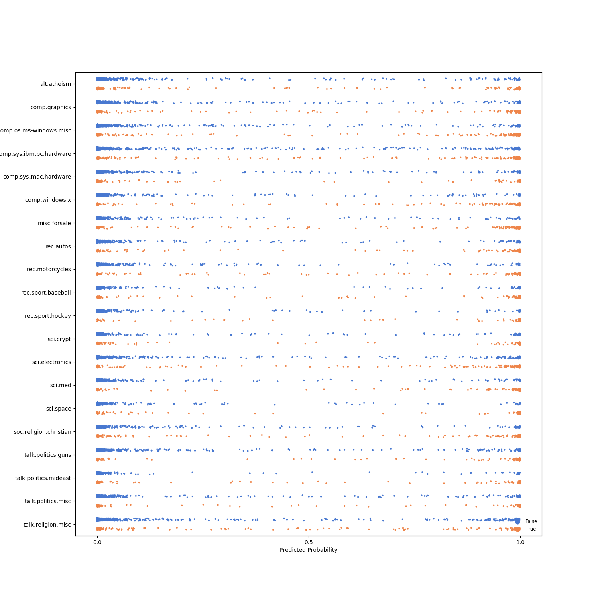
---
# Results: DistilBERT
```
(pid=1937) INFO:gobbli.experiment.base:Transformer initialized with data directory '/data/users/jnance/gobbli/benchmark/benchmark_data/model/Transformer/96f7bae68e734282822a4602f4c255d3'
(pid=1937) INFO:gobbli.experiment.base:Starting build.
(pid=1937) INFO:gobbli.experiment.base:Build finished in 0.58 sec.
(pid=1937) INFO:gobbli.experiment.base:Starting training.
(pid=1937) INFO:gobbli.experiment.base:Training finished in 608.37 sec.
(pid=1937) INFO:gobbli.experiment.base:RESULTS:
(pid=1937) INFO:gobbli.experiment.base:  Validation loss: 0.01350625830246082
(pid=1937) INFO:gobbli.experiment.base:  Validation accuracy: 0.9010163499779055
(pid=1937) INFO:gobbli.experiment.base:  Training loss: 0.0018005909378853455
(pid=1937) INFO:gobbli.experiment.base:Transformer initialized with data directory '/data/users/jnance/gobbli/benchmark/benchmark_data/model/Transformer/5f3bf613cb13435dbb149fcf448565ab'
(pid=1937) INFO:gobbli.experiment.base:Starting build.
(pid=1937) INFO:gobbli.experiment.base:Build finished in 0.26 sec.
(pid=1937) INFO:gobbli.experiment.base:Starting training.
(pid=1937) INFO:gobbli.experiment.base:Training finished in 551.27 sec.
(pid=1937) INFO:gobbli.experiment.base:RESULTS:
(pid=1937) INFO:gobbli.experiment.base:  Validation loss: 0.014563428090701732
(pid=1937) INFO:gobbli.experiment.base:  Validation accuracy: 0.8846663720724701
(pid=1937) INFO:gobbli.experiment.base:  Training loss: 0.0032057813761290524
(pid=1937) INFO:gobbli.experiment.base:Transformer initialized with data directory '/data/users/jnance/gobbli/benchmark/benchmark_data/model/Transformer/cc1d2b0a3105467b8dce53595d0d9d96'
(pid=1937) INFO:gobbli.experiment.base:Starting build.
(pid=1937) INFO:gobbli.experiment.base:Build finished in 0.25 sec.
(pid=1937) INFO:gobbli.experiment.base:Starting prediction.
(pid=1937) INFO:gobbli.experiment.base:Prediction finished in 46.88 sec.
(pid=1937) /usr/local/lib/python3.7/site-packages/ray/pyarrow_files/pyarrow/serialization.py:165: FutureWarning: The SparseDataFrame class is removed from pandas. Accessing it from the top-level namespace will also be removed in the next version
(pid=1937)   if isinstance(obj, pd.SparseDataFrame):

```
|    |   valid_loss |   valid_accuracy |   train_loss | multilabel   | labels                                                                                                                                                                                                                                                                                                                                                                                                    | checkpoint                                                                                                                                                     | node_ip_address   | model_params                                                                                          |
|---:|-------------:|-----------------:|-------------:|:-------------|:----------------------------------------------------------------------------------------------------------------------------------------------------------------------------------------------------------------------------------------------------------------------------------------------------------------------------------------------------------------------------------------------------------|:---------------------------------------------------------------------------------------------------------------------------------------------------------------|:------------------|:------------------------------------------------------------------------------------------------------|
|  0 |    0.0135063 |         0.901016 |   0.00180059 | False        | ['alt.atheism', 'comp.graphics', 'comp.os.ms-windows.misc', 'comp.sys.ibm.pc.hardware', 'comp.sys.mac.hardware', 'comp.windows.x', 'misc.forsale', 'rec.autos', 'rec.motorcycles', 'rec.sport.baseball', 'rec.sport.hockey', 'sci.crypt', 'sci.electronics', 'sci.med', 'sci.space', 'soc.religion.christian', 'talk.politics.guns', 'talk.politics.mideast', 'talk.politics.misc', 'talk.religion.misc'] | /data/users/jnance/gobbli/benchmark/benchmark_data/model/Transformer/96f7bae68e734282822a4602f4c255d3/train/76c0eb0eeaee4820b0fe7365219fe8db/output/checkpoint | 172.80.10.2       | {'transformer_model': 'DistilBert', 'transformer_weights': 'distilbert-base-uncased'}                 |
|  1 |    0.0145634 |         0.884666 |   0.00320578 | False        | ['alt.atheism', 'comp.graphics', 'comp.os.ms-windows.misc', 'comp.sys.ibm.pc.hardware', 'comp.sys.mac.hardware', 'comp.windows.x', 'misc.forsale', 'rec.autos', 'rec.motorcycles', 'rec.sport.baseball', 'rec.sport.hockey', 'sci.crypt', 'sci.electronics', 'sci.med', 'sci.space', 'soc.religion.christian', 'talk.politics.guns', 'talk.politics.mideast', 'talk.politics.misc', 'talk.religion.misc'] | /data/users/jnance/gobbli/benchmark/benchmark_data/model/Transformer/5f3bf613cb13435dbb149fcf448565ab/train/54b34a27a09f44228f5cffe2c7a48e29/output/checkpoint | 172.80.10.2       | {'transformer_model': 'DistilBert', 'transformer_weights': 'distilbert-base-uncased-distilled-squad'} |
```
Metrics:
--------
Weighted F1 Score: 0.8268778917348241
Weighted Precision Score: 0.8314467456648094
Weighted Recall Score: 0.8248805098247477
Accuracy: 0.8248805098247477

Classification Report:
----------------------
                          precision    recall  f1-score   support

             alt.atheism       0.00      0.00      0.00         0
           comp.graphics       0.00      0.00      0.00         0
 comp.os.ms-windows.misc       0.00      0.00      0.00         0
comp.sys.ibm.pc.hardware       0.00      0.00      0.00         0
   comp.sys.mac.hardware       0.00      0.00      0.00         0
          comp.windows.x       0.00      0.00      0.00         0
            misc.forsale       0.00      0.00      0.00         0
               rec.autos       0.00      0.00      0.00         0
         rec.motorcycles       0.00      0.00      0.00         0
      rec.sport.baseball       0.00      0.00      0.00         0
        rec.sport.hockey       0.00      0.00      0.00         0
               sci.crypt       0.00      0.00      0.00         0
         sci.electronics       0.00      0.00      0.00         0
                 sci.med       0.00      0.00      0.00         0
               sci.space       0.00      0.00      0.00         0
  soc.religion.christian       0.00      0.00      0.00         0
      talk.politics.guns       0.00      0.00      0.00         0
   talk.politics.mideast       0.00      0.00      0.00         0
      talk.politics.misc       0.00      0.00      0.00         0
      talk.religion.misc       0.00      0.00      0.00         0

               micro avg       0.00      0.00      0.00         0
               macro avg       0.00      0.00      0.00         0
            weighted avg       0.00      0.00      0.00         0


```

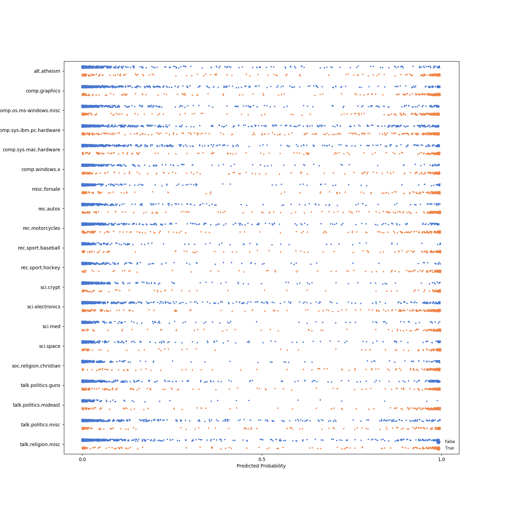
---
# Results: ALBERT
```
(pid=2164) INFO:gobbli.experiment.base:Transformer initialized with data directory '/data/users/jnance/gobbli/benchmark/benchmark_data/model/Transformer/4751263bef4044b888874318bf8f8406'
(pid=2164) INFO:gobbli.experiment.base:Starting build.
(pid=2164) INFO:gobbli.experiment.base:Build finished in 0.22 sec.
(pid=2164) INFO:gobbli.experiment.base:Starting training.
(pid=2164) INFO:gobbli.experiment.base:Training finished in 658.77 sec.
(pid=2164) INFO:gobbli.experiment.base:RESULTS:
(pid=2164) INFO:gobbli.experiment.base:  Validation loss: 0.016683096116325576
(pid=2164) INFO:gobbli.experiment.base:  Validation accuracy: 0.8448961555457357
(pid=2164) INFO:gobbli.experiment.base:  Training loss: 0.00854644861593785
(pid=2164) INFO:gobbli.experiment.base:Transformer initialized with data directory '/data/users/jnance/gobbli/benchmark/benchmark_data/model/Transformer/03e72ec7e47c444ea0c3b004b794078e'
(pid=2164) INFO:gobbli.experiment.base:Starting build.
(pid=2164) INFO:gobbli.experiment.base:Build finished in 0.19 sec.
(pid=2164) INFO:gobbli.experiment.base:Starting training.
(pid=2164) INFO:gobbli.experiment.base:Training finished in 723.89 sec.
(pid=2164) INFO:gobbli.experiment.base:RESULTS:
(pid=2164) INFO:gobbli.experiment.base:  Validation loss: 0.03625400944510446
(pid=2164) INFO:gobbli.experiment.base:  Validation accuracy: 0.6703490941228458
(pid=2164) INFO:gobbli.experiment.base:  Training loss: 0.031885856687001876
(pid=2164) INFO:gobbli.experiment.base:Transformer initialized with data directory '/data/users/jnance/gobbli/benchmark/benchmark_data/model/Transformer/ef11400c59324aa3a37e043d39e36741'
(pid=2164) INFO:gobbli.experiment.base:Starting build.
(pid=2164) INFO:gobbli.experiment.base:Build finished in 0.25 sec.
(pid=2164) INFO:gobbli.experiment.base:Starting prediction.
(pid=2164) INFO:gobbli.experiment.base:Prediction finished in 44.44 sec.
(pid=2164) /usr/local/lib/python3.7/site-packages/ray/pyarrow_files/pyarrow/serialization.py:165: FutureWarning: The SparseDataFrame class is removed from pandas. Accessing it from the top-level namespace will also be removed in the next version
(pid=2164)   if isinstance(obj, pd.SparseDataFrame):

```
|    |   valid_loss |   valid_accuracy |   train_loss | multilabel   | labels                                                                                                                                                                                                                                                                                                                                                                                                    | checkpoint                                                                                                                                                     | node_ip_address   | model_params                                                             |
|---:|-------------:|-----------------:|-------------:|:-------------|:----------------------------------------------------------------------------------------------------------------------------------------------------------------------------------------------------------------------------------------------------------------------------------------------------------------------------------------------------------------------------------------------------------|:---------------------------------------------------------------------------------------------------------------------------------------------------------------|:------------------|:-------------------------------------------------------------------------|
|  0 |    0.0166831 |         0.844896 |   0.00854645 | False        | ['alt.atheism', 'comp.graphics', 'comp.os.ms-windows.misc', 'comp.sys.ibm.pc.hardware', 'comp.sys.mac.hardware', 'comp.windows.x', 'misc.forsale', 'rec.autos', 'rec.motorcycles', 'rec.sport.baseball', 'rec.sport.hockey', 'sci.crypt', 'sci.electronics', 'sci.med', 'sci.space', 'soc.religion.christian', 'talk.politics.guns', 'talk.politics.mideast', 'talk.politics.misc', 'talk.religion.misc'] | /data/users/jnance/gobbli/benchmark/benchmark_data/model/Transformer/4751263bef4044b888874318bf8f8406/train/019a5e6ce7e94ba7a0da083d7ab6e7ac/output/checkpoint | 172.80.10.2       | {'transformer_model': 'Albert', 'transformer_weights': 'albert-base-v1'} |
|  1 |    0.036254  |         0.670349 |   0.0318859  | False        | ['alt.atheism', 'comp.graphics', 'comp.os.ms-windows.misc', 'comp.sys.ibm.pc.hardware', 'comp.sys.mac.hardware', 'comp.windows.x', 'misc.forsale', 'rec.autos', 'rec.motorcycles', 'rec.sport.baseball', 'rec.sport.hockey', 'sci.crypt', 'sci.electronics', 'sci.med', 'sci.space', 'soc.religion.christian', 'talk.politics.guns', 'talk.politics.mideast', 'talk.politics.misc', 'talk.religion.misc'] | /data/users/jnance/gobbli/benchmark/benchmark_data/model/Transformer/03e72ec7e47c444ea0c3b004b794078e/train/1c506e63d1b3479b87f5bb2c405d9772/output/checkpoint | 172.80.10.2       | {'transformer_model': 'Albert', 'transformer_weights': 'albert-base-v2'} |
```
Metrics:
--------
Weighted F1 Score: 0.7809736147217773
Weighted Precision Score: 0.7840864983706365
Weighted Recall Score: 0.780801911842804
Accuracy: 0.780801911842804

Classification Report:
----------------------
                          precision    recall  f1-score   support

             alt.atheism       0.00      0.00      0.00         0
           comp.graphics       0.00      0.00      0.00         0
 comp.os.ms-windows.misc       0.00      0.00      0.00         0
comp.sys.ibm.pc.hardware       0.00      0.00      0.00         0
   comp.sys.mac.hardware       0.00      0.00      0.00         0
          comp.windows.x       0.00      0.00      0.00         0
            misc.forsale       0.00      0.00      0.00         0
               rec.autos       0.00      0.00      0.00         0
         rec.motorcycles       0.00      0.00      0.00         0
      rec.sport.baseball       0.00      0.00      0.00         0
        rec.sport.hockey       0.00      0.00      0.00         0
               sci.crypt       0.00      0.00      0.00         0
         sci.electronics       0.00      0.00      0.00         0
                 sci.med       0.00      0.00      0.00         0
               sci.space       0.00      0.00      0.00         0
  soc.religion.christian       0.00      0.00      0.00         0
      talk.politics.guns       0.00      0.00      0.00         0
   talk.politics.mideast       0.00      0.00      0.00         0
      talk.politics.misc       0.00      0.00      0.00         0
      talk.religion.misc       0.00      0.00      0.00         0

               micro avg       0.00      0.00      0.00         0
               macro avg       0.00      0.00      0.00         0
            weighted avg       0.00      0.00      0.00         0


```

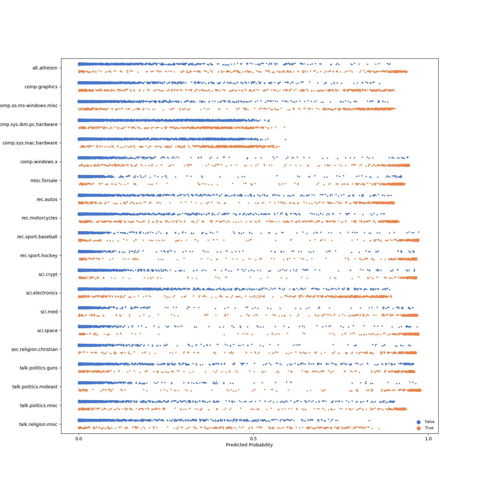
---
# Results: XLM-RoBERTa
```
(pid=2398) INFO:gobbli.experiment.base:Transformer initialized with data directory '/data/users/jnance/gobbli/benchmark/benchmark_data/model/Transformer/a5320a7da0e44f0498864c0110daa78e'
(pid=2398) INFO:gobbli.experiment.base:Starting build.
(pid=2398) INFO:gobbli.experiment.base:Build finished in 0.21 sec.
(pid=2398) INFO:gobbli.experiment.base:Starting training.
(pid=2398) INFO:gobbli.experiment.base:Training finished in 799.86 sec.
(pid=2398) INFO:gobbli.experiment.base:RESULTS:
(pid=2398) INFO:gobbli.experiment.base:  Validation loss: 0.018771470712445976
(pid=2398) INFO:gobbli.experiment.base:  Validation accuracy: 0.8329650905877154
(pid=2398) INFO:gobbli.experiment.base:  Training loss: 0.013683362611551045
(pid=2398) INFO:gobbli.experiment.base:Transformer initialized with data directory '/data/users/jnance/gobbli/benchmark/benchmark_data/model/Transformer/131363db56e84d7194e7c5e0e04e3966'
(pid=2398) INFO:gobbli.experiment.base:Starting build.
(pid=2398) INFO:gobbli.experiment.base:Build finished in 0.19 sec.
(pid=2398) INFO:gobbli.experiment.base:Starting prediction.
(pid=2398) INFO:gobbli.experiment.base:Prediction finished in 51.98 sec.
(pid=2398) /usr/local/lib/python3.7/site-packages/ray/pyarrow_files/pyarrow/serialization.py:165: FutureWarning: The SparseDataFrame class is removed from pandas. Accessing it from the top-level namespace will also be removed in the next version
(pid=2398)   if isinstance(obj, pd.SparseDataFrame):

```
|    |   valid_loss |   valid_accuracy |   train_loss | multilabel   | labels                                                                                                                                                                                                                                                                                                                                                                                                    | checkpoint                                                                                                                                                     | node_ip_address   | model_params                                                                   |
|---:|-------------:|-----------------:|-------------:|:-------------|:----------------------------------------------------------------------------------------------------------------------------------------------------------------------------------------------------------------------------------------------------------------------------------------------------------------------------------------------------------------------------------------------------------|:---------------------------------------------------------------------------------------------------------------------------------------------------------------|:------------------|:-------------------------------------------------------------------------------|
|  0 |    0.0187715 |         0.832965 |    0.0136834 | False        | ['alt.atheism', 'comp.graphics', 'comp.os.ms-windows.misc', 'comp.sys.ibm.pc.hardware', 'comp.sys.mac.hardware', 'comp.windows.x', 'misc.forsale', 'rec.autos', 'rec.motorcycles', 'rec.sport.baseball', 'rec.sport.hockey', 'sci.crypt', 'sci.electronics', 'sci.med', 'sci.space', 'soc.religion.christian', 'talk.politics.guns', 'talk.politics.mideast', 'talk.politics.misc', 'talk.religion.misc'] | /data/users/jnance/gobbli/benchmark/benchmark_data/model/Transformer/a5320a7da0e44f0498864c0110daa78e/train/78d3f1a2616e4adcb474c10fd66d7337/output/checkpoint | 172.80.10.2       | {'transformer_model': 'XLMRoberta', 'transformer_weights': 'xlm-roberta-base'} |
```
Metrics:
--------
Weighted F1 Score: 0.7537213915386661
Weighted Precision Score: 0.7563358589480229
Weighted Recall Score: 0.7529208709506108
Accuracy: 0.7529208709506108

Classification Report:
----------------------
                          precision    recall  f1-score   support

             alt.atheism       0.00      0.00      0.00         0
           comp.graphics       0.00      0.00      0.00         0
 comp.os.ms-windows.misc       0.00      0.00      0.00         0
comp.sys.ibm.pc.hardware       0.00      0.00      0.00         0
   comp.sys.mac.hardware       0.00      0.00      0.00         0
          comp.windows.x       0.00      0.00      0.00         0
            misc.forsale       0.00      0.00      0.00         0
               rec.autos       0.00      0.00      0.00         0
         rec.motorcycles       0.00      0.00      0.00         0
      rec.sport.baseball       0.00      0.00      0.00         0
        rec.sport.hockey       0.00      0.00      0.00         0
               sci.crypt       0.00      0.00      0.00         0
         sci.electronics       0.00      0.00      0.00         0
                 sci.med       0.00      0.00      0.00         0
               sci.space       0.00      0.00      0.00         0
  soc.religion.christian       0.00      0.00      0.00         0
      talk.politics.guns       0.00      0.00      0.00         0
   talk.politics.mideast       0.00      0.00      0.00         0
      talk.politics.misc       0.00      0.00      0.00         0
      talk.religion.misc       0.00      0.00      0.00         0

               micro avg       0.00      0.00      0.00         0
               macro avg       0.00      0.00      0.00         0
            weighted avg       0.00      0.00      0.00         0


```

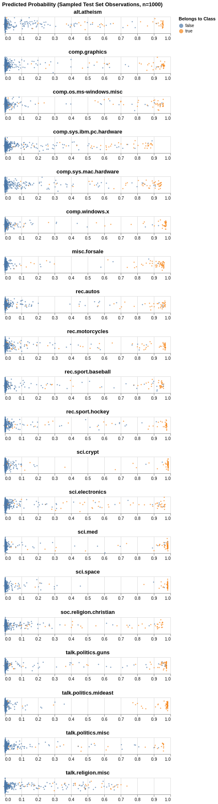
---
# Results: SKLearn
```
(pid=2629) INFO:gobbli.experiment.base:SKLearnClassifier initialized with data directory '/data/users/jnance/gobbli/benchmark/benchmark_data/model/SKLearnClassifier/32b966f0016e4f6fa6aa9966a8c6fd81'
(pid=2629) INFO:gobbli.experiment.base:Starting build.
(pid=2629) INFO:gobbli.experiment.base:Build finished in 0.00 sec.
(pid=2629) INFO:gobbli.experiment.base:Starting training.
(pid=2629) INFO:gobbli.experiment.base:Training finished in 34.51 sec.
(pid=2629) INFO:gobbli.experiment.base:RESULTS:
(pid=2629) INFO:gobbli.experiment.base:  Validation loss: -0.8812004917087203
(pid=2629) INFO:gobbli.experiment.base:  Validation accuracy: 0.8815731330092798
(pid=2629) INFO:gobbli.experiment.base:  Training loss: -0.9690307665707693
(pid=2629) INFO:gobbli.experiment.base:SKLearnClassifier initialized with data directory '/data/users/jnance/gobbli/benchmark/benchmark_data/model/SKLearnClassifier/42f3b187edf44a78b04c33188f66de0b'
(pid=2629) INFO:gobbli.experiment.base:Starting build.
(pid=2629) INFO:gobbli.experiment.base:Build finished in 0.00 sec.
(pid=2629) INFO:gobbli.experiment.base:Starting prediction.
(pid=2629) INFO:gobbli.experiment.base:Prediction finished in 4.30 sec.
(pid=2629) /usr/local/lib/python3.7/site-packages/ray/pyarrow_files/pyarrow/serialization.py:165: FutureWarning: The SparseDataFrame class is removed from pandas. Accessing it from the top-level namespace will also be removed in the next version
(pid=2629)   if isinstance(obj, pd.SparseDataFrame):

```
|    |   valid_loss |   valid_accuracy |   train_loss | multilabel   | labels                                                                                                                                                                                                                                                                                                                                                                                                    | checkpoint                                                                                                                                                                 | node_ip_address   | model_params   |
|---:|-------------:|-----------------:|-------------:|:-------------|:----------------------------------------------------------------------------------------------------------------------------------------------------------------------------------------------------------------------------------------------------------------------------------------------------------------------------------------------------------------------------------------------------------|:---------------------------------------------------------------------------------------------------------------------------------------------------------------------------|:------------------|:---------------|
|  0 |      -0.8812 |         0.881573 |    -0.969031 | False        | ['alt.atheism', 'comp.graphics', 'comp.os.ms-windows.misc', 'comp.sys.ibm.pc.hardware', 'comp.sys.mac.hardware', 'comp.windows.x', 'misc.forsale', 'rec.autos', 'rec.motorcycles', 'rec.sport.baseball', 'rec.sport.hockey', 'sci.crypt', 'sci.electronics', 'sci.med', 'sci.space', 'soc.religion.christian', 'talk.politics.guns', 'talk.politics.mideast', 'talk.politics.misc', 'talk.religion.misc'] | /data/users/jnance/gobbli/benchmark/benchmark_data/model/SKLearnClassifier/32b966f0016e4f6fa6aa9966a8c6fd81/train/327d971e8f1e448fad3890a03883816e/output/estimator.joblib | 172.80.10.2       | {}             |
```
Metrics:
--------
Weighted F1 Score: 0.8067615329675221
Weighted Precision Score: 0.8130511614151636
Weighted Recall Score: 0.8093467870419543
Accuracy: 0.8093467870419543

Classification Report:
----------------------
                          precision    recall  f1-score   support

             alt.atheism       0.00      0.00      0.00         0
           comp.graphics       0.00      0.00      0.00         0
 comp.os.ms-windows.misc       0.00      0.00      0.00         0
comp.sys.ibm.pc.hardware       0.00      0.00      0.00         0
   comp.sys.mac.hardware       0.00      0.00      0.00         0
          comp.windows.x       0.00      0.00      0.00         0
            misc.forsale       0.00      0.00      0.00         0
               rec.autos       0.00      0.00      0.00         0
         rec.motorcycles       0.00      0.00      0.00         0
      rec.sport.baseball       0.00      0.00      0.00         0
        rec.sport.hockey       0.00      0.00      0.00         0
               sci.crypt       0.00      0.00      0.00         0
         sci.electronics       0.00      0.00      0.00         0
                 sci.med       0.00      0.00      0.00         0
               sci.space       0.00      0.00      0.00         0
  soc.religion.christian       0.00      0.00      0.00         0
      talk.politics.guns       0.00      0.00      0.00         0
   talk.politics.mideast       0.00      0.00      0.00         0
      talk.politics.misc       0.00      0.00      0.00         0
      talk.religion.misc       0.00      0.00      0.00         0

               micro avg       0.00      0.00      0.00         0
               macro avg       0.00      0.00      0.00         0
            weighted avg       0.00      0.00      0.00         0


```

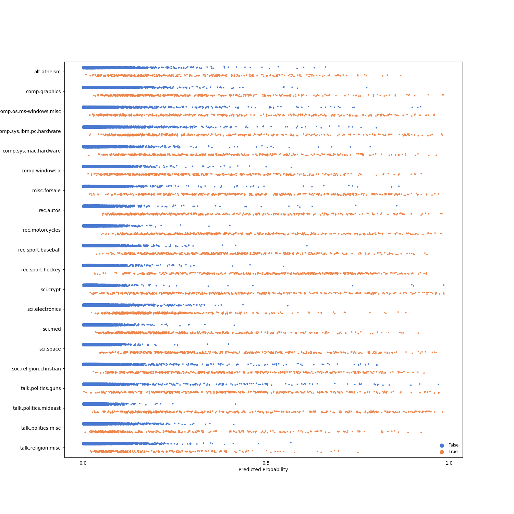
---
# Results: spaCy
```
(pid=2855) INFO:gobbli.experiment.base:SpaCyModel initialized with data directory '/data/users/jnance/gobbli/benchmark/benchmark_data/model/SpaCyModel/8e85e163f8e24794a05249f8a1c22b1f'
(pid=2855) INFO:gobbli.experiment.base:Starting build.
(pid=2855) INFO:gobbli.experiment.base:Build finished in 0.27 sec.
(pid=2855) INFO:gobbli.experiment.base:Starting training.
(pid=2855) /code/gobbli/model/spacy/model.py:176: UserWarning: The spaCy model doesn't batch validation data, so the validation batch size parameter will be ignored.
(pid=2855)   "The spaCy model doesn't batch validation data, so the validation "
(pid=2855) INFO:gobbli.experiment.base:Training finished in 451.82 sec.
(pid=2855) INFO:gobbli.experiment.base:RESULTS:
(pid=2855) INFO:gobbli.experiment.base:  Validation loss: 1.9811780830796995e-11
(pid=2855) INFO:gobbli.experiment.base:  Validation accuracy: 0.9856164383559467
(pid=2855) INFO:gobbli.experiment.base:  Training loss: 3.071053097693945e-06
(pid=2855) INFO:gobbli.experiment.base:SpaCyModel initialized with data directory '/data/users/jnance/gobbli/benchmark/benchmark_data/model/SpaCyModel/eb4e69016774476fb5d0c4f857038d33'
(pid=2855) INFO:gobbli.experiment.base:Starting build.
(pid=2855) INFO:gobbli.experiment.base:Build finished in 0.35 sec.
(pid=2855) INFO:gobbli.experiment.base:Starting training.
(pid=2855) INFO:gobbli.experiment.base:Training finished in 345.31 sec.
(pid=2855) INFO:gobbli.experiment.base:RESULTS:
(pid=2855) INFO:gobbli.experiment.base:  Validation loss: 2.0433863664807483e-11
(pid=2855) INFO:gobbli.experiment.base:  Validation accuracy: 0.9852408307554165
(pid=2855) INFO:gobbli.experiment.base:  Training loss: 3.071268050702406e-06
(pid=2855) INFO:gobbli.experiment.base:SpaCyModel initialized with data directory '/data/users/jnance/gobbli/benchmark/benchmark_data/model/SpaCyModel/a7aeb257ff3d40f2a7376f1861578b8a'
(pid=2855) INFO:gobbli.experiment.base:Starting build.
(pid=2855) INFO:gobbli.experiment.base:Build finished in 0.33 sec.
(pid=2855) INFO:gobbli.experiment.base:Starting training.
(pid=2855) INFO:gobbli.experiment.base:Training finished in 582.83 sec.
(pid=2855) INFO:gobbli.experiment.base:RESULTS:
(pid=2855) INFO:gobbli.experiment.base:  Validation loss: 3.416400937375125e-11
(pid=2855) INFO:gobbli.experiment.base:  Validation accuracy: 0.9741051701279333
(pid=2855) INFO:gobbli.experiment.base:  Training loss: 1.0551788246386892e-05
(pid=2855) INFO:gobbli.experiment.base:SpaCyModel initialized with data directory '/data/users/jnance/gobbli/benchmark/benchmark_data/model/SpaCyModel/273eaa9f33e843c480dde5b790bb6545'
(pid=2855) INFO:gobbli.experiment.base:Starting build.
(pid=2855) INFO:gobbli.experiment.base:Build finished in 0.33 sec.
(pid=2855) INFO:gobbli.experiment.base:Starting training.
(pid=2855) INFO:gobbli.experiment.base:Training finished in 474.96 sec.
(pid=2855) INFO:gobbli.experiment.base:RESULTS:
(pid=2855) INFO:gobbli.experiment.base:  Validation loss: 2.6411595648296713e-11
(pid=2855) INFO:gobbli.experiment.base:  Validation accuracy: 0.9798055678300973
(pid=2855) INFO:gobbli.experiment.base:  Training loss: 8.207961189009424e-06
(pid=2855) INFO:gobbli.experiment.base:SpaCyModel initialized with data directory '/data/users/jnance/gobbli/benchmark/benchmark_data/model/SpaCyModel/3d62e7c8dee048dc8b32aeed954e2576'
(pid=2855) INFO:gobbli.experiment.base:Starting build.
(pid=2855) INFO:gobbli.experiment.base:Build finished in 0.32 sec.
(pid=2855) INFO:gobbli.experiment.base:Starting training.
(pid=2855) INFO:gobbli.experiment.base:Training finished in 624.11 sec.
(pid=2855) INFO:gobbli.experiment.base:RESULTS:
(pid=2855) INFO:gobbli.experiment.base:  Validation loss: 2.2246003536855062e-11
(pid=2855) INFO:gobbli.experiment.base:  Validation accuracy: 0.984114007953826
(pid=2855) INFO:gobbli.experiment.base:  Training loss: 9.69575800948224e-06
(pid=2855) INFO:gobbli.experiment.base:SpaCyModel initialized with data directory '/data/users/jnance/gobbli/benchmark/benchmark_data/model/SpaCyModel/4c75225d810c4dcdb9ccd8e3d212637e'
(pid=2855) INFO:gobbli.experiment.base:Starting build.
(pid=2855) INFO:gobbli.experiment.base:Build finished in 0.35 sec.
(pid=2855) INFO:gobbli.experiment.base:Starting training.
(pid=2855) INFO:gobbli.experiment.base:Training finished in 488.23 sec.
(pid=2855) INFO:gobbli.experiment.base:RESULTS:
(pid=2855) INFO:gobbli.experiment.base:  Validation loss: 2.4852327982656168e-11
(pid=2855) INFO:gobbli.experiment.base:  Validation accuracy: 0.982258064515912
(pid=2855) INFO:gobbli.experiment.base:  Training loss: 9.746779300873488e-06
(pid=2855) INFO:gobbli.experiment.base:SpaCyModel initialized with data directory '/data/users/jnance/gobbli/benchmark/benchmark_data/model/SpaCyModel/e4ece14ec3df42f9b9b43981c0199011'
(pid=2855) INFO:gobbli.experiment.base:Starting build.
(pid=2855) INFO:gobbli.experiment.base:Build finished in 0.33 sec.
(pid=2855) INFO:gobbli.experiment.base:Starting prediction.
(pid=2855) INFO:gobbli.experiment.base:Prediction finished in 46.22 sec.
(pid=2855) /usr/local/lib/python3.7/site-packages/ray/pyarrow_files/pyarrow/serialization.py:165: FutureWarning: The SparseDataFrame class is removed from pandas. Accessing it from the top-level namespace will also be removed in the next version
(pid=2855)   if isinstance(obj, pd.SparseDataFrame):

```
|    |   valid_loss |   valid_accuracy |   train_loss | multilabel   | labels                                                                                                                                                                                                                                                                                                                                                                                                    | checkpoint                                                                                                                                                    | node_ip_address   | model_params                                              |
|---:|-------------:|-----------------:|-------------:|:-------------|:----------------------------------------------------------------------------------------------------------------------------------------------------------------------------------------------------------------------------------------------------------------------------------------------------------------------------------------------------------------------------------------------------------|:--------------------------------------------------------------------------------------------------------------------------------------------------------------|:------------------|:----------------------------------------------------------|
|  0 |  1.98118e-11 |         0.985616 |  3.07105e-06 | False        | ['alt.atheism', 'comp.graphics', 'comp.os.ms-windows.misc', 'comp.sys.ibm.pc.hardware', 'comp.sys.mac.hardware', 'comp.windows.x', 'misc.forsale', 'rec.autos', 'rec.motorcycles', 'rec.sport.baseball', 'rec.sport.hockey', 'sci.crypt', 'sci.electronics', 'sci.med', 'sci.space', 'soc.religion.christian', 'talk.politics.guns', 'talk.politics.mideast', 'talk.politics.misc', 'talk.religion.misc'] | /data/users/jnance/gobbli/benchmark/benchmark_data/model/SpaCyModel/8e85e163f8e24794a05249f8a1c22b1f/train/dc196d85f8034829bd96f0e1d8e2a1f4/output/checkpoint | 172.80.10.2       | {'architecture': 'bow', 'model': 'en_core_web_sm'}        |
|  1 |  2.04339e-11 |         0.985241 |  3.07127e-06 | False        | ['alt.atheism', 'comp.graphics', 'comp.os.ms-windows.misc', 'comp.sys.ibm.pc.hardware', 'comp.sys.mac.hardware', 'comp.windows.x', 'misc.forsale', 'rec.autos', 'rec.motorcycles', 'rec.sport.baseball', 'rec.sport.hockey', 'sci.crypt', 'sci.electronics', 'sci.med', 'sci.space', 'soc.religion.christian', 'talk.politics.guns', 'talk.politics.mideast', 'talk.politics.misc', 'talk.religion.misc'] | /data/users/jnance/gobbli/benchmark/benchmark_data/model/SpaCyModel/eb4e69016774476fb5d0c4f857038d33/train/88d7e57d95b04dabaf6f423e477f3a37/output/checkpoint | 172.80.10.2       | {'architecture': 'bow', 'model': 'en_core_web_lg'}        |
|  2 |  3.4164e-11  |         0.974105 |  1.05518e-05 | False        | ['alt.atheism', 'comp.graphics', 'comp.os.ms-windows.misc', 'comp.sys.ibm.pc.hardware', 'comp.sys.mac.hardware', 'comp.windows.x', 'misc.forsale', 'rec.autos', 'rec.motorcycles', 'rec.sport.baseball', 'rec.sport.hockey', 'sci.crypt', 'sci.electronics', 'sci.med', 'sci.space', 'soc.religion.christian', 'talk.politics.guns', 'talk.politics.mideast', 'talk.politics.misc', 'talk.religion.misc'] | /data/users/jnance/gobbli/benchmark/benchmark_data/model/SpaCyModel/a7aeb257ff3d40f2a7376f1861578b8a/train/4f78bef766e64c479e0d4751880c58bf/output/checkpoint | 172.80.10.2       | {'architecture': 'simple_cnn', 'model': 'en_core_web_sm'} |
|  3 |  2.64116e-11 |         0.979806 |  8.20796e-06 | False        | ['alt.atheism', 'comp.graphics', 'comp.os.ms-windows.misc', 'comp.sys.ibm.pc.hardware', 'comp.sys.mac.hardware', 'comp.windows.x', 'misc.forsale', 'rec.autos', 'rec.motorcycles', 'rec.sport.baseball', 'rec.sport.hockey', 'sci.crypt', 'sci.electronics', 'sci.med', 'sci.space', 'soc.religion.christian', 'talk.politics.guns', 'talk.politics.mideast', 'talk.politics.misc', 'talk.religion.misc'] | /data/users/jnance/gobbli/benchmark/benchmark_data/model/SpaCyModel/273eaa9f33e843c480dde5b790bb6545/train/3f534cf7035c4bca9a13d2bb0dfd6673/output/checkpoint | 172.80.10.2       | {'architecture': 'simple_cnn', 'model': 'en_core_web_lg'} |
|  4 |  2.2246e-11  |         0.984114 |  9.69576e-06 | False        | ['alt.atheism', 'comp.graphics', 'comp.os.ms-windows.misc', 'comp.sys.ibm.pc.hardware', 'comp.sys.mac.hardware', 'comp.windows.x', 'misc.forsale', 'rec.autos', 'rec.motorcycles', 'rec.sport.baseball', 'rec.sport.hockey', 'sci.crypt', 'sci.electronics', 'sci.med', 'sci.space', 'soc.religion.christian', 'talk.politics.guns', 'talk.politics.mideast', 'talk.politics.misc', 'talk.religion.misc'] | /data/users/jnance/gobbli/benchmark/benchmark_data/model/SpaCyModel/3d62e7c8dee048dc8b32aeed954e2576/train/9678c4dd166f409a8c5c5ebc090e27b3/output/checkpoint | 172.80.10.2       | {'architecture': 'ensemble', 'model': 'en_core_web_sm'}   |
|  5 |  2.48523e-11 |         0.982258 |  9.74678e-06 | False        | ['alt.atheism', 'comp.graphics', 'comp.os.ms-windows.misc', 'comp.sys.ibm.pc.hardware', 'comp.sys.mac.hardware', 'comp.windows.x', 'misc.forsale', 'rec.autos', 'rec.motorcycles', 'rec.sport.baseball', 'rec.sport.hockey', 'sci.crypt', 'sci.electronics', 'sci.med', 'sci.space', 'soc.religion.christian', 'talk.politics.guns', 'talk.politics.mideast', 'talk.politics.misc', 'talk.religion.misc'] | /data/users/jnance/gobbli/benchmark/benchmark_data/model/SpaCyModel/4c75225d810c4dcdb9ccd8e3d212637e/train/dda04067accd4c8f90c33b60d469519b/output/checkpoint | 172.80.10.2       | {'architecture': 'ensemble', 'model': 'en_core_web_lg'}   |
```
Metrics:
--------
Weighted F1 Score: 0.7366514137849649
Weighted Precision Score: 0.7408625609022476
Weighted Recall Score: 0.7379182156133829
Accuracy: 0.7379182156133829

Classification Report:
----------------------
                          precision    recall  f1-score   support

             alt.atheism       0.00      0.00      0.00         0
           comp.graphics       0.00      0.00      0.00         0
 comp.os.ms-windows.misc       0.00      0.00      0.00         0
comp.sys.ibm.pc.hardware       0.00      0.00      0.00         0
   comp.sys.mac.hardware       0.00      0.00      0.00         0
          comp.windows.x       0.00      0.00      0.00         0
            misc.forsale       0.00      0.00      0.00         0
               rec.autos       0.00      0.00      0.00         0
         rec.motorcycles       0.00      0.00      0.00         0
      rec.sport.baseball       0.00      0.00      0.00         0
        rec.sport.hockey       0.00      0.00      0.00         0
               sci.crypt       0.00      0.00      0.00         0
         sci.electronics       0.00      0.00      0.00         0
                 sci.med       0.00      0.00      0.00         0
               sci.space       0.00      0.00      0.00         0
  soc.religion.christian       0.00      0.00      0.00         0
      talk.politics.guns       0.00      0.00      0.00         0
   talk.politics.mideast       0.00      0.00      0.00         0
      talk.politics.misc       0.00      0.00      0.00         0
      talk.religion.misc       0.00      0.00      0.00         0

               micro avg       0.00      0.00      0.00         0
               macro avg       0.00      0.00      0.00         0
            weighted avg       0.00      0.00      0.00         0


```

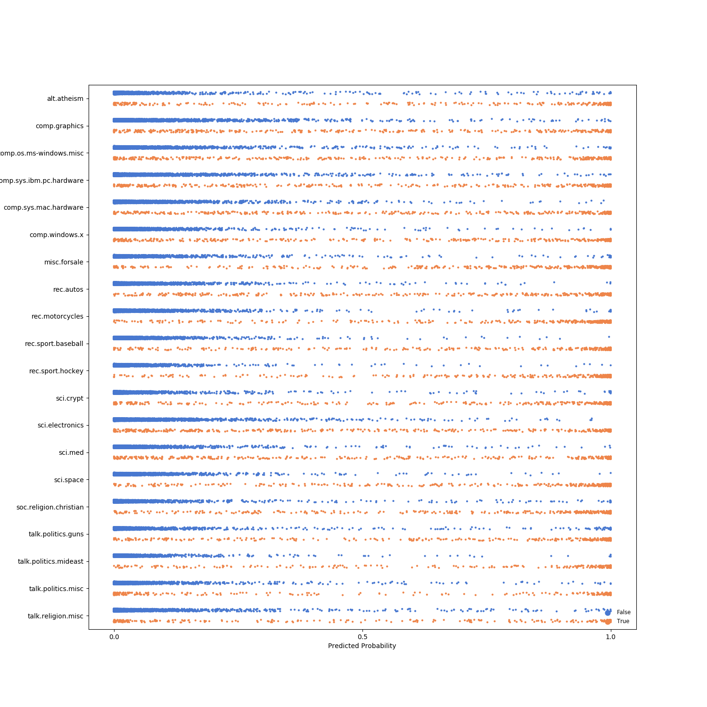
---
# Results: spacy-transformers
```
(pid=3086) INFO:gobbli.experiment.base:SpaCyModel initialized with data directory '/data/users/jnance/gobbli/benchmark/benchmark_data/model/SpaCyModel/9ffe6222598f4e8e884fbe60ac458d0e'
(pid=3086) INFO:gobbli.experiment.base:Starting build.
(pid=3086) INFO:gobbli.experiment.base:Build finished in 0.28 sec.
(pid=3086) INFO:gobbli.experiment.base:Starting training.
(pid=3086) /code/gobbli/model/spacy/model.py:176: UserWarning: The spaCy model doesn't batch validation data, so the validation batch size parameter will be ignored.
(pid=3086)   "The spaCy model doesn't batch validation data, so the validation "
(pid=3086) INFO:gobbli.experiment.base:Training finished in 4155.86 sec.
(pid=3086) INFO:gobbli.experiment.base:RESULTS:
(pid=3086) INFO:gobbli.experiment.base:  Validation loss: 1.516424105154493e-11
(pid=3086) INFO:gobbli.experiment.base:  Validation accuracy: 0.9897702165265158
(pid=3086) INFO:gobbli.experiment.base:  Training loss: 5.762817107745332e-06
(pid=3086) INFO:gobbli.experiment.base:SpaCyModel initialized with data directory '/data/users/jnance/gobbli/benchmark/benchmark_data/model/SpaCyModel/52f14545ff5c4e159dda1568908a66d0'
(pid=3086) INFO:gobbli.experiment.base:Starting build.
(pid=3086) INFO:gobbli.experiment.base:Build finished in 0.40 sec.
(pid=3086) INFO:gobbli.experiment.base:Starting training.
(pid=3086) INFO:gobbli.experiment.base:Training finished in 4824.18 sec.
(pid=3086) INFO:gobbli.experiment.base:RESULTS:
(pid=3086) INFO:gobbli.experiment.base:  Validation loss: 1.5262768806949932e-11
(pid=3086) INFO:gobbli.experiment.base:  Validation accuracy: 0.9900353513033606
(pid=3086) INFO:gobbli.experiment.base:  Training loss: 1.6731242336570725e-05
(pid=3086) INFO:gobbli.experiment.base:SpaCyModel initialized with data directory '/data/users/jnance/gobbli/benchmark/benchmark_data/model/SpaCyModel/ffc52be82d484a08a2a726314b9b5018'
(pid=3086) INFO:gobbli.experiment.base:Starting build.
(pid=3086) INFO:gobbli.experiment.base:Build finished in 0.33 sec.
(pid=3086) INFO:gobbli.experiment.base:Starting training.
(pid=3086) INFO:gobbli.experiment.base:Training finished in 4480.74 sec.
(pid=3086) INFO:gobbli.experiment.base:RESULTS:
(pid=3086) INFO:gobbli.experiment.base:  Validation loss: 1.731408810206097e-11
(pid=3086) INFO:gobbli.experiment.base:  Validation accuracy: 0.9877817057001795
(pid=3086) INFO:gobbli.experiment.base:  Training loss: 2.0574636453659296e-05
(pid=3086) INFO:gobbli.experiment.base:SpaCyModel initialized with data directory '/data/users/jnance/gobbli/benchmark/benchmark_data/model/SpaCyModel/21d45d7e540b429ab452709132af359d'
(pid=3086) INFO:gobbli.experiment.base:Starting build.
(pid=3086) INFO:gobbli.experiment.base:Build finished in 0.31 sec.
(pid=3086) INFO:gobbli.experiment.base:Starting training.
(pid=3086) INFO:gobbli.experiment.base:Training finished in 2952.86 sec.
(pid=3086) INFO:gobbli.experiment.base:RESULTS:
(pid=3086) INFO:gobbli.experiment.base:  Validation loss: 1.484312000653494e-11
(pid=3086) INFO:gobbli.experiment.base:  Validation accuracy: 0.9898585947854641
(pid=3086) INFO:gobbli.experiment.base:  Training loss: 3.2828676847331087e-06
(pid=3086) INFO:gobbli.experiment.base:SpaCyModel initialized with data directory '/data/users/jnance/gobbli/benchmark/benchmark_data/model/SpaCyModel/b4e623d017d74af6a5c2c24b48b8a378'
(pid=3086) INFO:gobbli.experiment.base:Starting build.
(pid=3086) INFO:gobbli.experiment.base:Build finished in 0.30 sec.
(pid=3086) INFO:gobbli.experiment.base:Starting prediction.
(pid=3086) INFO:gobbli.experiment.base:Prediction finished in 250.64 sec.
(pid=3086) /usr/local/lib/python3.7/site-packages/ray/pyarrow_files/pyarrow/serialization.py:165: FutureWarning: The SparseDataFrame class is removed from pandas. Accessing it from the top-level namespace will also be removed in the next version
(pid=3086)   if isinstance(obj, pd.SparseDataFrame):

```
|    |   valid_loss |   valid_accuracy |   train_loss | multilabel   | labels                                                                                                                                                                                                                                                                                                                                                                                                    | checkpoint                                                                                                                                                    | node_ip_address   | model_params                                 |
|---:|-------------:|-----------------:|-------------:|:-------------|:----------------------------------------------------------------------------------------------------------------------------------------------------------------------------------------------------------------------------------------------------------------------------------------------------------------------------------------------------------------------------------------------------------|:--------------------------------------------------------------------------------------------------------------------------------------------------------------|:------------------|:---------------------------------------------|
|  0 |  1.51642e-11 |         0.98977  |  5.76282e-06 | False        | ['alt.atheism', 'comp.graphics', 'comp.os.ms-windows.misc', 'comp.sys.ibm.pc.hardware', 'comp.sys.mac.hardware', 'comp.windows.x', 'misc.forsale', 'rec.autos', 'rec.motorcycles', 'rec.sport.baseball', 'rec.sport.hockey', 'sci.crypt', 'sci.electronics', 'sci.med', 'sci.space', 'soc.religion.christian', 'talk.politics.guns', 'talk.politics.mideast', 'talk.politics.misc', 'talk.religion.misc'] | /data/users/jnance/gobbli/benchmark/benchmark_data/model/SpaCyModel/9ffe6222598f4e8e884fbe60ac458d0e/train/dc13a2caab3244b7a0bd96e3a473b82a/output/checkpoint | 172.80.10.2       | {'model': 'en_trf_bertbaseuncased_lg'}       |
|  1 |  1.52628e-11 |         0.990035 |  1.67312e-05 | False        | ['alt.atheism', 'comp.graphics', 'comp.os.ms-windows.misc', 'comp.sys.ibm.pc.hardware', 'comp.sys.mac.hardware', 'comp.windows.x', 'misc.forsale', 'rec.autos', 'rec.motorcycles', 'rec.sport.baseball', 'rec.sport.hockey', 'sci.crypt', 'sci.electronics', 'sci.med', 'sci.space', 'soc.religion.christian', 'talk.politics.guns', 'talk.politics.mideast', 'talk.politics.misc', 'talk.religion.misc'] | /data/users/jnance/gobbli/benchmark/benchmark_data/model/SpaCyModel/52f14545ff5c4e159dda1568908a66d0/train/e9dedfc5333940de99056c2d802d78aa/output/checkpoint | 172.80.10.2       | {'model': 'en_trf_xlnetbasecased_lg'}        |
|  2 |  1.73141e-11 |         0.987782 |  2.05746e-05 | False        | ['alt.atheism', 'comp.graphics', 'comp.os.ms-windows.misc', 'comp.sys.ibm.pc.hardware', 'comp.sys.mac.hardware', 'comp.windows.x', 'misc.forsale', 'rec.autos', 'rec.motorcycles', 'rec.sport.baseball', 'rec.sport.hockey', 'sci.crypt', 'sci.electronics', 'sci.med', 'sci.space', 'soc.religion.christian', 'talk.politics.guns', 'talk.politics.mideast', 'talk.politics.misc', 'talk.religion.misc'] | /data/users/jnance/gobbli/benchmark/benchmark_data/model/SpaCyModel/ffc52be82d484a08a2a726314b9b5018/train/a12ec20dde5e404881a0fec4abc36216/output/checkpoint | 172.80.10.2       | {'model': 'en_trf_robertabase_lg'}           |
|  3 |  1.48431e-11 |         0.989859 |  3.28287e-06 | False        | ['alt.atheism', 'comp.graphics', 'comp.os.ms-windows.misc', 'comp.sys.ibm.pc.hardware', 'comp.sys.mac.hardware', 'comp.windows.x', 'misc.forsale', 'rec.autos', 'rec.motorcycles', 'rec.sport.baseball', 'rec.sport.hockey', 'sci.crypt', 'sci.electronics', 'sci.med', 'sci.space', 'soc.religion.christian', 'talk.politics.guns', 'talk.politics.mideast', 'talk.politics.misc', 'talk.religion.misc'] | /data/users/jnance/gobbli/benchmark/benchmark_data/model/SpaCyModel/21d45d7e540b429ab452709132af359d/train/2757850db67145d2afabe2161bce9905/output/checkpoint | 172.80.10.2       | {'model': 'en_trf_distilbertbaseuncased_lg'} |
```
Metrics:
--------
Weighted F1 Score: 0.8232098408476677
Weighted Precision Score: 0.8253413271393194
Weighted Recall Score: 0.8228890069038768
Accuracy: 0.8228890069038768

Classification Report:
----------------------
                          precision    recall  f1-score   support

             alt.atheism       0.00      0.00      0.00         0
           comp.graphics       0.00      0.00      0.00         0
 comp.os.ms-windows.misc       0.00      0.00      0.00         0
comp.sys.ibm.pc.hardware       0.00      0.00      0.00         0
   comp.sys.mac.hardware       0.00      0.00      0.00         0
          comp.windows.x       0.00      0.00      0.00         0
            misc.forsale       0.00      0.00      0.00         0
               rec.autos       0.00      0.00      0.00         0
         rec.motorcycles       0.00      0.00      0.00         0
      rec.sport.baseball       0.00      0.00      0.00         0
        rec.sport.hockey       0.00      0.00      0.00         0
               sci.crypt       0.00      0.00      0.00         0
         sci.electronics       0.00      0.00      0.00         0
                 sci.med       0.00      0.00      0.00         0
               sci.space       0.00      0.00      0.00         0
  soc.religion.christian       0.00      0.00      0.00         0
      talk.politics.guns       0.00      0.00      0.00         0
   talk.politics.mideast       0.00      0.00      0.00         0
      talk.politics.misc       0.00      0.00      0.00         0
      talk.religion.misc       0.00      0.00      0.00         0

               micro avg       0.00      0.00      0.00         0
               macro avg       0.00      0.00      0.00         0
            weighted avg       0.00      0.00      0.00         0


```

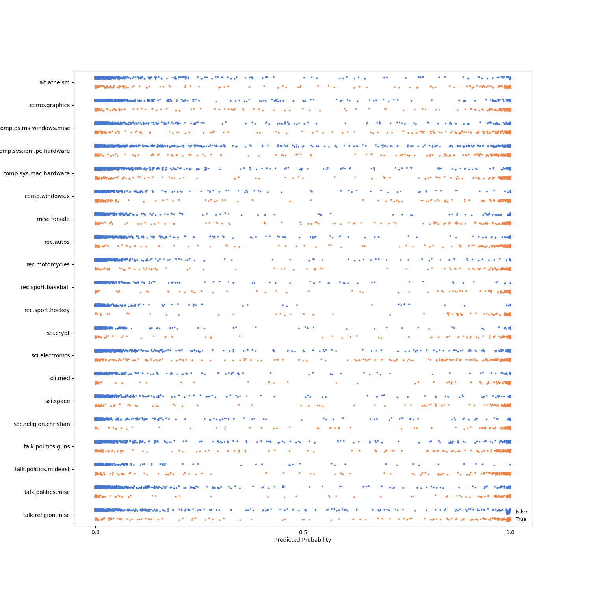
---