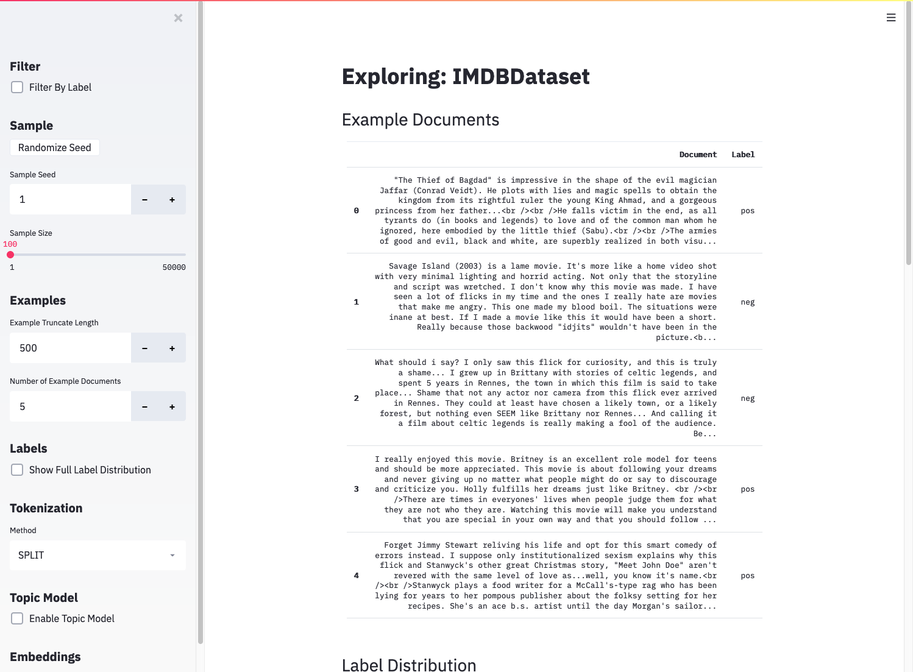
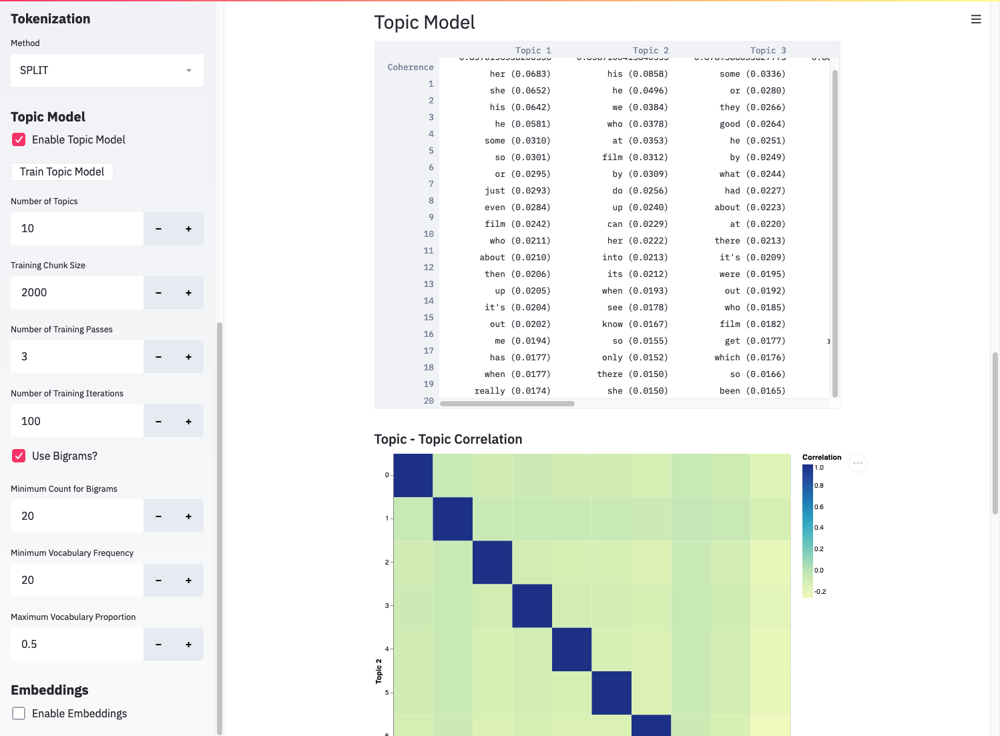
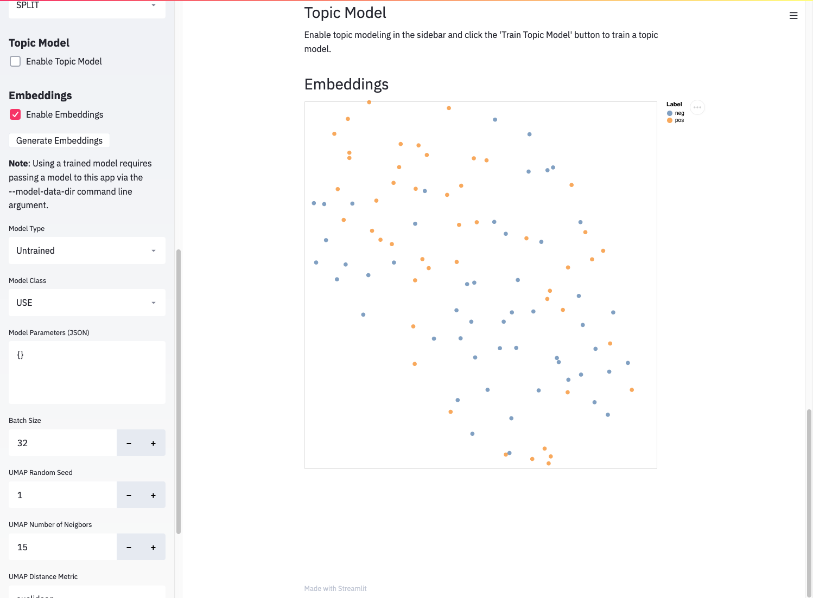
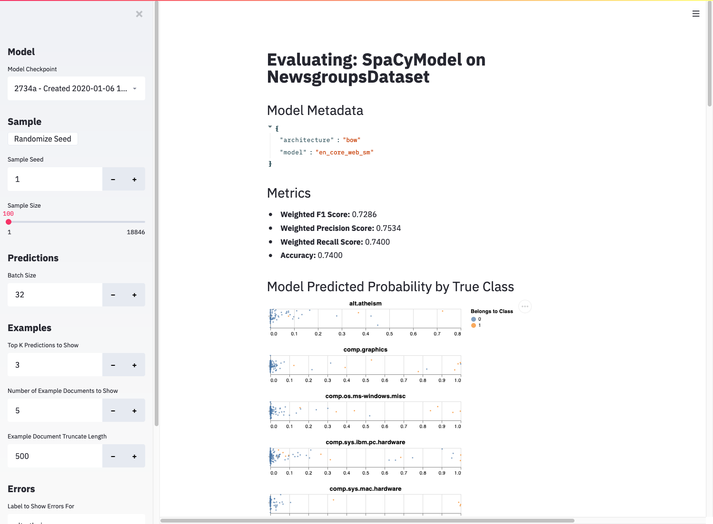
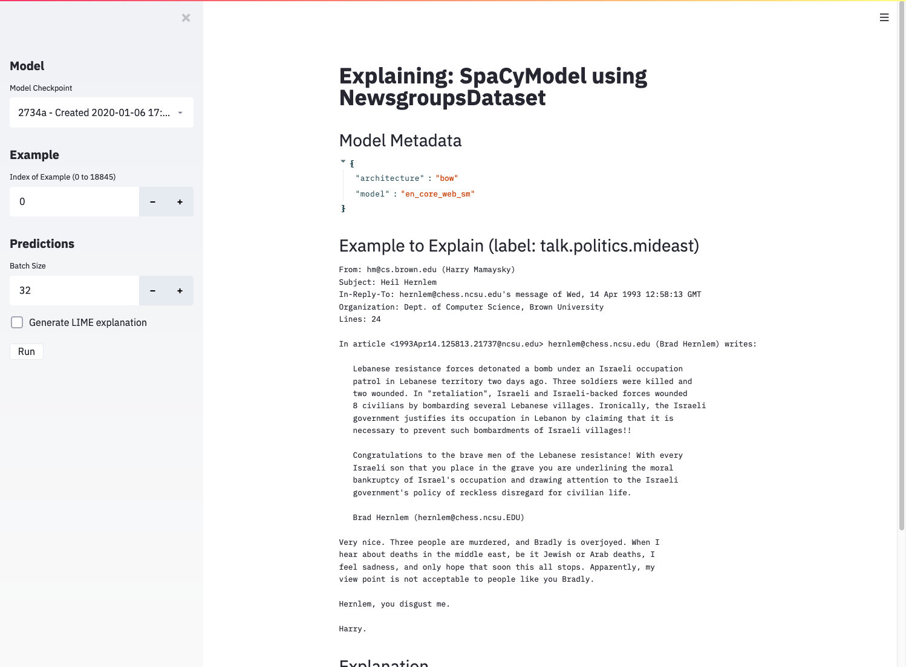
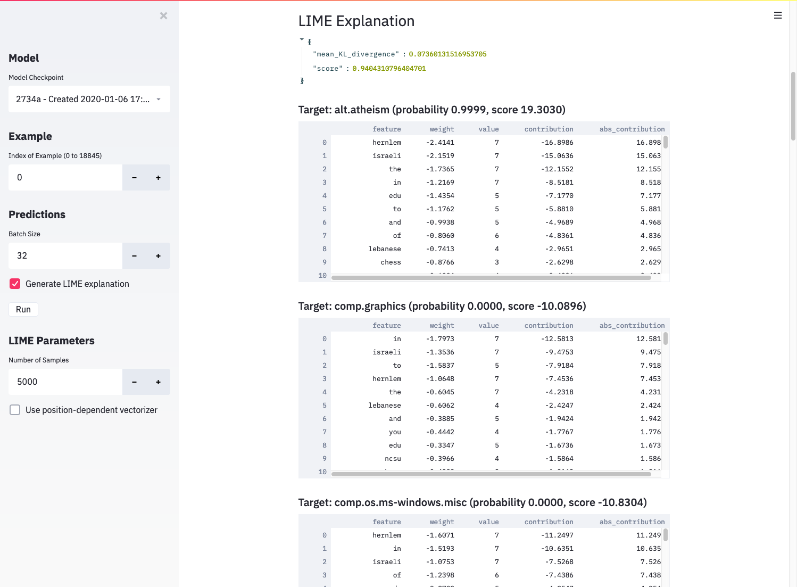

.. _interactive-apps:

Interactive Apps
================

First, make sure you have the :ref:`interactive app prerequisites <interactive-app-prereqs>` installed.  Once that's done, you'll be able to use the command line interface which wraps the bundled Streamlit apps.  You can see the available apps by running the following in your shell:

.. code-block:: bash

    gobbli --help

Here are some general things to know about the gobbli interactive apps:

 - Parameters and user input are kept in the sidebar. The main section is reserved for displaying data and output.
 - Since the entire app re-runs with every input widget change, the apps default to taking a small sample of data so you can tweak parameters without locking up your browser on long-running tasks. You can increase the sample size when you have everything set the way you want.
 - All the normal gobbli output goes to the terminal window running Streamlit. Check the terminal to see status of long-running tasks that involve use of a model (embedding generation, prediction, etc).
 - We attempt to cache long-running task results as much as possible, but re-running costly tasks is required in many cases when parameters change.

explore
-------

.. _dataset-formats:

The explore app requires a dataset. The dataset can be one of a few formats (note it must fit in memory):

 - A built-in gobbli dataset (ex. NewsgroupsDataset or IMDBDataset)
 - A text file with one document per line
 - A ``.csv`` file with a "text" column and optional "label" column
 - A ``.tsv`` file with a "text" column and optional "label" column

Some functionality won't appear for datasets without labels. If you don't have your own dataset handy, the following invocation will work out of the box:

.. code-block:: bash

    gobbli explore IMDBDataset

If everything is installed correctly, you should see the explore app open in your browser.

   The explore app pointed at the built-in IMDB dataset.
                 
You'll be able to read through example documents from the dataset and check the distributions of labels and document lengths. The more involved tasks of topic modeling and embedding generation require some additional inputs.

Topic Modeling
^^^^^^^^^^^^^^

The explore app provides an interface to `gensim <https://radimrehurek.com/gensim/>`__'s `LDA <https://radimrehurek.com/gensim/auto_examples/tutorials/run_lda.html#sphx-glr-auto-examples-tutorials-run-lda-py>`__ model, which allows you to train a topic model that learns latent topics from a bag-of-words representation of your documents. The approach doesn't incorporate contextual information like a modern neural network, but it can reveal recurring themes in your dataset. To train a topic model, check the "Enable Topic Model" box in the sidebar and click "Train Topic Model".

   Results from a topic model in the explore app.

The explore app displays the coherence score and top 20 words for each learned topic. It also displays the correlation between topics, which helps determine how well-fit the model is, and the correlation between topics and labels, which may help interpret some of the topics.

Plotting Embeddings
^^^^^^^^^^^^^^^^^^^

Embeddings represent the hidden state of a neural network. They generally aim to quantify the semantics of a document, meaning documents with similar meanings are close together in the embedding space, so plotting them can provide a useful "map" of your dataset. gobbli makes this easy. To generate and plot embeddings, check the "Enable Embeddings" check box and click the "Generate Embeddings" button.

   Results from plotting embeddings in the explore app.

After some time, you'll see the embeddings with their dimensionality reduced via `UMAP <https://umap-learn.readthedocs.io/en/latest/>`__. You can hover over individual points to see the text and label for that document. Points are colored by label.

Untrained embeddings can preview how well a model differentiates between the classes in your dataset. The more separated your classes are in the embeddings plot, the more likely the model will be able to discern the difference between them. Using the "Model Class" dropdown and "Model Parameters" JSON input, you can quickly evaluate different model types and parameter combinations on your dataset.

.. _data-dir-methods:

If you have a trained gobbli model, you can also visualize its embeddings (if it supports embeddings). You'll need the path returned by calling ".data_dir()" on the model if you trained a model directly: ::

    from gobbli.model.bert import BERT
    from gobbli.io import TrainInput

    clf = BERT()
    clf.build()

    train_input = TrainInput(
        X_train=["This is a training document.",
                "This is another training document."],
        y_train=["0", "1"],
        X_valid=["This is a validation sentence.",
                "This is another validation sentence."],
        y_valid=["1", "0"],
    )

    clf.train(train_input)
    print(clf.data_dir())

If you trained the model using a (non-distributed) experiment, you'll need the path two directories up from the checkpoint: ::

    from gobbli.experiment.classification import ClassificationExperiment
    from gobbli.model.bert import BERT

    X = [
        "This is positive.",
        "This is negative.",
        ...
    ]

    y = [
        "Good",
        "Bad",
        ...
    ]

    # Experiment must NOT be run in distributed mode --
    # if it was, the checkpoint will be somewhere on a worker.
    # You'd need to go find the model data directory on the worker
    # in that case.
    exp = ClassificationExperiment(
        model_cls=BERT,
        dataset=(X, y)
    )

    results = exp.run()
    print(results.get_checkpoint().parent.parent)

Pass this path to the explore app to use a trained model:

.. code-block:: bash

    gobbli explore --model-data-dir <MODEL_DATA_DIR> <DATASET>

You should then see the available checkpoints for the model in the "Embedding" section:

.. figure:: img/interactive_apps/explore/explore_trained_embeddings.png
   :alt: Explore trained embeddings plot

   Generating embeddings using a trained gobbli model.

You can also apply clustering algorithms (`HDBSCAN <https://hdbscan.readthedocs.io/en/latest/how_hdbscan_works.html>`__ or `K-means <https://scikit-learn.org/stable/modules/clustering.html#k-means>`__) to the embeddings before or after dimensionality reduction and plot the clusters, if you're interested in seeing how well a clustering algorithm groups your documents in a high-dimensional or low-dimensional space. Check the "Cluster Embeddings" box, set parameters, and click "Generate Embeddings" again to see clusters plotted.

evaluate
--------

The evaluate app displays evaluation metrics for a trained gobbli model applied to a given dataset. To use it, you need a dataset in any of the formats described :ref:`above <dataset-formats>` and the data directory of a trained model as obtained in one of the ways described :ref:`above <data-dir-methods>`:

.. code-block:: bash

   gobbli evaluate <MODEL_DATA_DIR> <DATASET>

This should open the evaluate app in your browser.

   The evaluate app displaying results.

After loading and generating predictions using the passed model, the app displays the following:

 - metadata (parameters) for the model
 - standard metrics calculated from the model's performance on the sampled dataset
 - a plot of the predicted probability for every observation in the sample for each class
 - a small set of example predictions, including the model's most highly predicted classes and the true class for each
 - the top errors (false positives and false negatives) in the sample by predicted probability, allowing you to see which documents are most confusing to your model

These tools allow you to inspect both the overall and fine-grained performance of your model and potentially determine ways to improve its performance on troublesome documents.

explain
-------

Finally, the explain app allows you to generate local explanations for individual documents using the `ELI5 <https://eli5.readthedocs.io/en/latest/overview.html>`__ package's implementation of `LIME <https://eli5.readthedocs.io/en/latest/blackbox/lime.html#eli5-lime>`__. These explanations can be useful for understanding why a model generates a certain prediction. Just like the evaluate app, the explain app requires a trained gobbli model's :ref:`data directory <data-dir-methods>` and a :ref:`dataset <dataset-formats>`:

.. code-block:: bash

   gobbli evaluate <MODEL_DATA_DIR> <DATASET>

You'll see this when the explain app launches in your browser:

   The explain app before displaying results.

The interface allows you to choose a single document and shows its full text and true label. If you check "Generate LIME explanation" and click the "Run" button, the app will train a white-box estimator to approximate your trained model's behavior for documents similar to the chosen example. After the white-box estimator is trained, you'll see some output:

   LIME output, including evaluation metrics and per-label feature contributions.

The JSON output shows the evaluation metrics directly from LIME. See `the ELI5 tutorial <https://eli5.readthedocs.io/en/latest/tutorials/black-box-text-classifiers.html#should-we-trust-the-explanation>`__ for more details, but the gist is that mean KL divergence should be close to 0, and the score should be close to 1 for a good approximation. If these conditions aren't met, the white-box classifier likely doesn't match your original model well, and the explanation shouldn't be trusted. You can try raising the number of generated samples to get a better-performing white box classifier.

Below the metrics, the app displays a table for each label in the dataset along with the top features contributing to the prediction for that label. Assuming the white-box classifier accurately matched the predictions of your trained model, the list of features tells you which words informed the model's prediction.

An inherent limitation of this approach is that the white-box classifier uses a bag-of-words representation of the document, which doesn't incorporate context the way most neural networks do. You can partially account for this by checking "Use position-dependent vectorizer", which prevents grouping the same word together in the explanation, but you may still be unable to obtain an accurate explanation of a complex neural network model.
